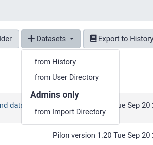
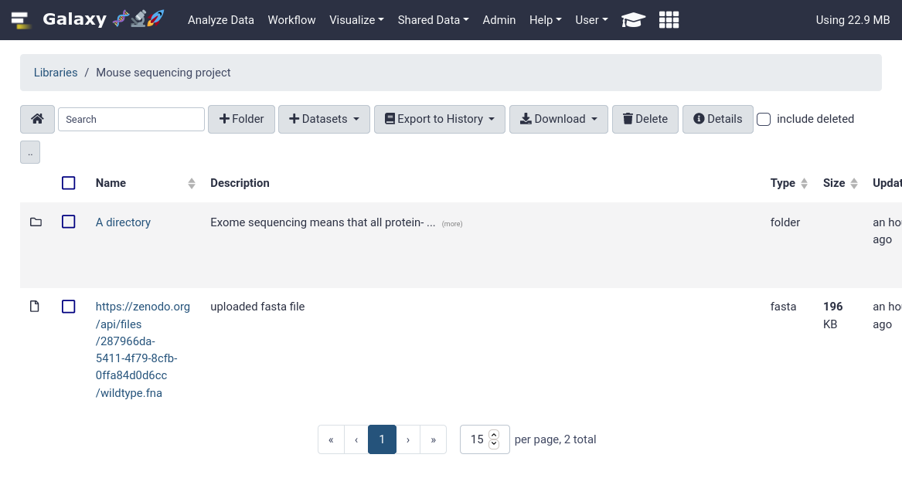
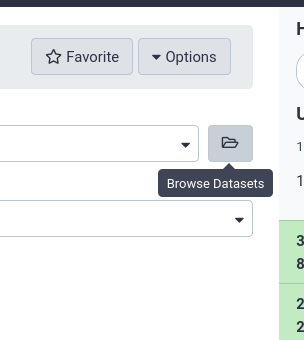
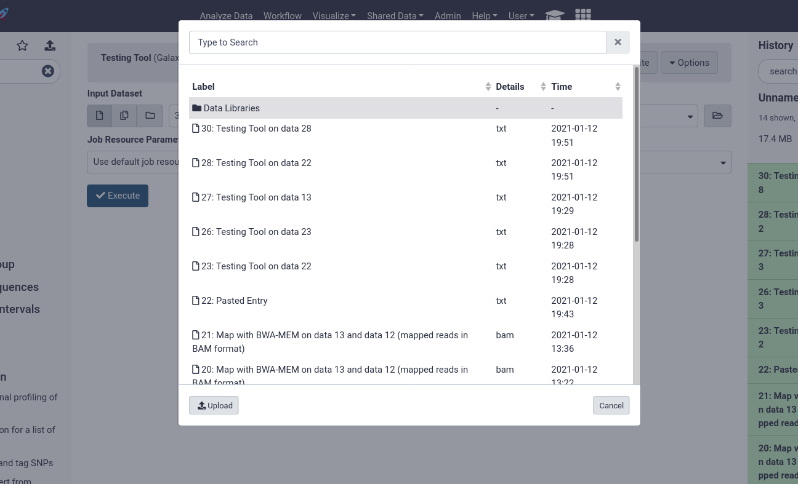
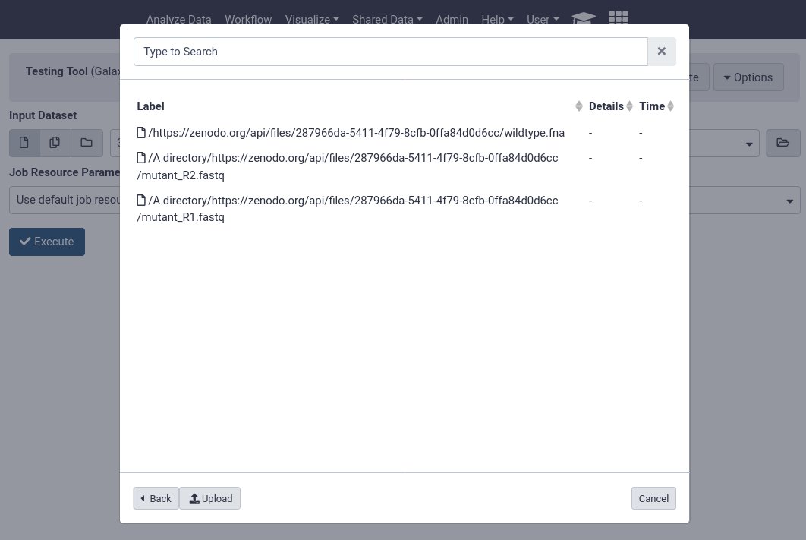

TODO: overview.

- save space for users, files don't count against quota
- great for e.g. sharing sequencing run with a bunch of people.

> ### Agenda
>
> 1. TOC
> {:toc}
>
{: .agenda}


# Adding local data

Before we can import local data, we need to configure Galaxy to permit this. Additionally we will setup an example data library which we can use for demonstrative purposes.

> ###  Hands-on: Setting up Data Libraries
>
> 1. We will add a pre-task to clone [a data repository](https://github.com/galaxyproject/galaxy-test-data) into your machine. We will use this as the source for a library dataset.
>
>    ```diff
>    --- a/galaxy.yml
>    +++ b/galaxy.yml
>    @@ -5,6 +5,9 @@
>         - name: Install Dependencies
>           package:
>             name: ['git', 'make', 'python3-psycopg2', 'virtualenv', 'tar', 'bzip2']
>    +    - git:
>    +        repo: 'https://github.com/usegalaxy-eu/libraries-training-repo'
>    +        dest: /libraries/
>       handlers:
>         - name: Restart Galaxy
>           systemd:
>    ```
>
> 4. Edit the file `group_vars/galaxyservers.yml` and set the following variables:
>
>    ```diff
>    --- a/group_vars/galaxyservers.yml
>    +++ b/group_vars/galaxyservers.yml
>    @@ -28,6 +28,9 @@ miniconda_manage_dependencies: false
>
>     galaxy_config:
>       galaxy:
>    +    library_import_dir: /libraries/admin
>    +    user_library_import_dir: /libraries/user
>         job_resource_params_file: "{{ galaxy_config_dir }}/job_resource_params_conf.xml"
>         tool_destinations_config_file: "{{ galaxy_config_dir }}/tool_destinations.yml"
>    ```
>
> 5. Run the playbook:
>
>    > ###  Input: Bash
>    > ```
>    > ansible-playbook galaxy.yml
>    > ```
>    {: .code-in}
>
{: .hands_on}

# Importing Data

There are multiple options for importing data from your server, we'll go through all of your choices below. But first, let's take a quick look at the example library structure we've provided.

> > ###  Input: Bash
> > ```bash
> > tree /libraries
> > ```
> {: .code-in}
>
> > ###  Output: Bash
> > ```
> > /libraries/
> > ├── admin
> > │   └── admin-wildtype.fna
> > ├── example-library.yaml
> > ├── README.md
> > └── user
> >     ├── admin@example.com
> >     │   └── user-wildtype.fna
> >     └── admin@example.org
> >         └── user-wildtype.fna
> >
> > 4 directories, 5 files
> > ```
> {: .code-out}
{: .code-2col}

We have a directory named `admin`, which will be available to all admin users (we set `library_import_dir: /libraries/admin` earlier.)

Additionally we have a `user` directory, below the user directory are more directories with the user's email as they directory key. Data can be placed in here, and it will become accessible to those users (we set `user_library_import_dir: /libraries/user` for this.)



## from History

This is by far the easiest and most convenient option for small datasets, or datasets that are just already in a history


You can easily select multiple files and quickly import them.

## from User Directory

If user directories are configured, as we did at the beginning of this tutorial, then users will be able to import any files under their personal directory. This can be used for a wide variety of setups, e.g. providing the output of sequencing machines to users. This can point to the same directory structure that's used by the FTP service, if you want your users to be able to import files directly from FTP.


This will enable the option for everyone, any unprivileged user with a folder in the `user_library_import_dir` directory *and* permissions on a data library can import things from their import directory.

## from import Directory (Admins only)

Similarly to the user import directories, there is the option to have an admin only import area. If one admin is responsible for creating the data libraries and importing data this can be a good option.


An important feature of data libraries importing is the ability to "link files instead of copying". If you know your data will not be deleted (e.g. sequencing data sitting on an NFS), then you can use this option to further decrease the amount of storage your Galaxy server requires. The datasets can be used as if they were normal datasets, imported by users and analysed, but not imported into the Galaxy data storage area.

# Automatically Populating a Data Library

If your data is accessible via URL, you can write a yaml file to import and setup the data library automatically.
We've included this file in the example data libraries repository we cloned at the beginning:

> ###  Input: Bash
> ```bash
> cat /libraries/example-library.yaml
> ```
{: .code-in}

> ###  Output: Bash
> ```yaml
> ---
> destination:
>   type: library
>   name: Mouse sequencing project
>   description: some data
>   synopsis: samples collected from somewhere
> items:
> - url: https://zenodo.org/api/files/287966da-5411-4f79-8cfb-0ffa84d0d6cc/wildtype.fna
>   src: url
>   ext: fasta
>   info: https://doi.org/10.5281/zenodo.582600
> - name: A directory
>   description: Exome sequencing means that all protein-coding genes in a genome are
>   items:
>   - url: https://zenodo.org/api/files/287966da-5411-4f79-8cfb-0ffa84d0d6cc/mutant_R1.fastq
>     src: url
>     ext: fastqsanger
>     info: https://doi.org/10.5281/zenodo.582600
>   - url: https://zenodo.org/api/files/287966da-5411-4f79-8cfb-0ffa84d0d6cc/mutant_R2.fastq
>     src: url
>     ext: fastqsanger
>     info: https://doi.org/10.5281/zenodo.582600
> ```
{: .code-out}

Let's try setting that up in our Galaxy!



> ###  hands-on: importing data library yaml.
>
> 1. re-activate the virtualenv you created for the [ephemeris tool management tutorial]().
>
>    > ###  input: bash
>    > ```
>    > . ~/ephemeris_venv/bin/activate
>    > ```
>    {: .code-in}
>
>    > ###  missing?
>    >
>    > then you might need to re-run the steps:
>    >
>    > ```bash
>    > virtualenv -p python3 ~/ephemeris_venv
>    > . ~/ephemeris_venv/bin/activate
>    > pip install ephemeris
>    > ```
>    {: .tip}
>
> 2. we'll use the `setup-data-libraries` command to install the data in this yaml file into a library in our galaxy.
>
>    > ###  input: bash
>    > ```
>    > setup-data-libraries -g https://your-galaxy -k <api-key> --training -i /libraries/example-library.yaml --legacy
>    > ```
>    {: .code-in}
>
>    > ###  output
>    > ```
>    > library name: mouse sequencing project
>    > ```
>    {: .code-out}
>
> 3. this command is safe to re-run. for example if you update the yaml, it will simply report that the library exists before ensuring all files exist in their appropriate location:
>
>    ```bash
>    library name: mouse sequencing project
>    library already exists! id: f597429621d6eb2b
>    ```
>
{: .hands_on}

That's it! It's quite easy. Note that we've used some special flags here, `--training` and `--legacy`. Training sets some defaults that make sense for the GTN (mostly around library descriptions / etc.)



### `--legacy`

This enables the use of legacy APIs even for newer Galaxies that should have a batch upload API enabled. Unfortunately the new batch upload API is not able to update existing data libraries in place and will always create new libraries with the same name. So currently `--legacy` is quite useful for maintaining a YAML file, and running `setup-data-libraries` regularly whenever that file has updates.

But this comes with the downside that the entire URL is used for the filename.

# GTN Data

This process scales quite well. Galaxy Europe, in their mission to support all of the GTN materials on their server setup [a shared-data repository](https://github.com/usegalaxy-eu/shared-data), a single giant YAML file with all of the data from the GTN tutorials. This was then expanded to other UseGalaxy.* servers to provide synced training libraries for all of the major servers.

Do you want the training data synced on your server? If so join the shared data repository! If you provide us with a non-admin API key and a data library to upload data into, we can sync this automatically.

# Using Data from Libraries

Users can now conveniently use datasets in libraries when they are running analyses, without having to import them first.

The tool form provides a button on the right of every dataset selector which allows users to "Browse datasets"



Users can then choose from datasets in their history, or browse through the data libraries



Here users can see every file accessible to them in the data library to begin analysing.


