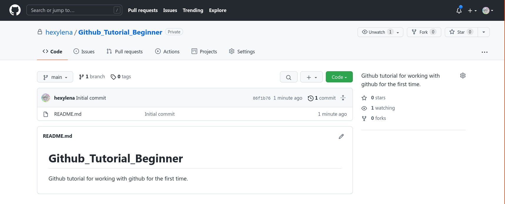
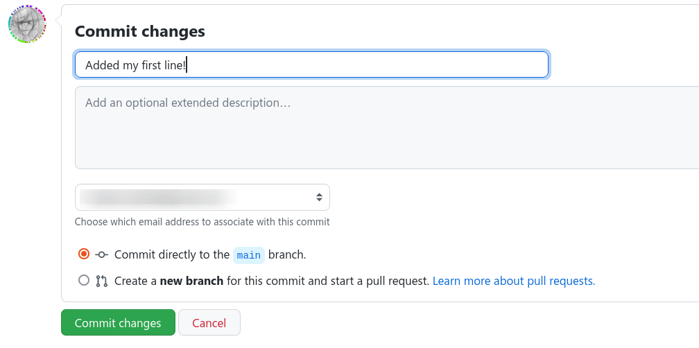
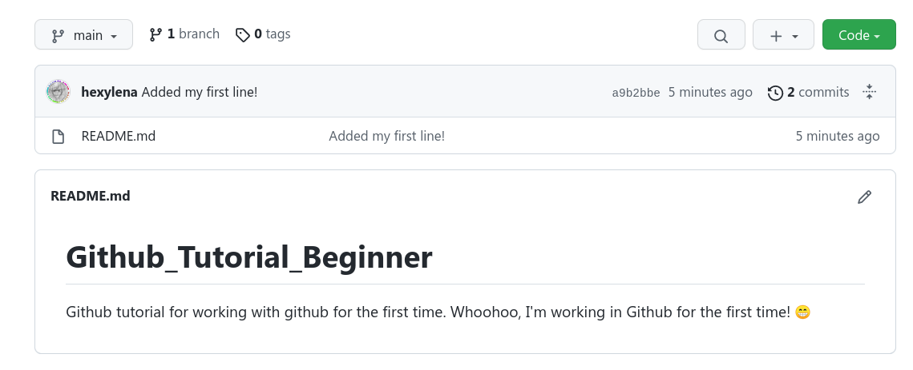
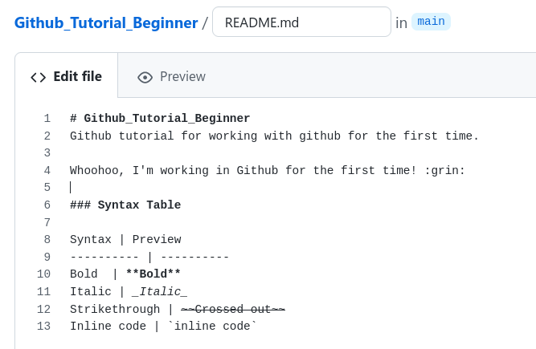
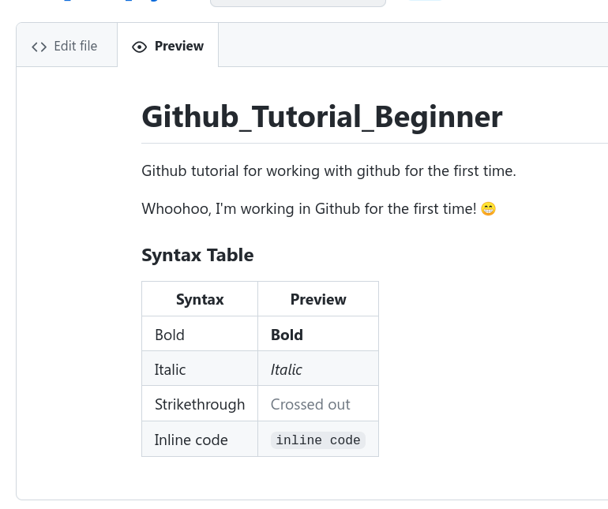
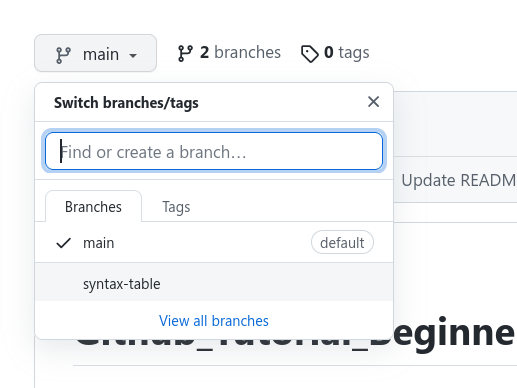
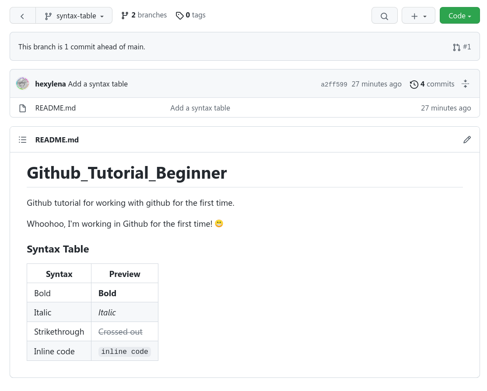
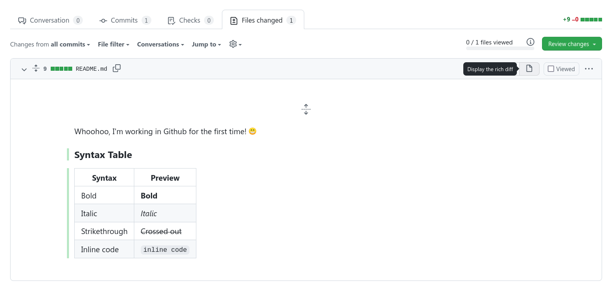

This is a short Github tutorial for working with github for the first time. Here you'll learn things like adding and changing files, creating folders, and checking the edit history.


> ### Agenda
>
> In this tutorial, we will cover:
>
> 1. TOC
> {:toc}
>
{: .agenda}

## Setup

> ###  Create a Repository
>
> 1. Go to [Github.com](https://github.com) and either sign up for GitHub or sign in if you already have an account.
>
> 2. Click on the **New Repository** button in the repository menu in the top left.
>
>    
>
> 3. Create the repository by using the following settings:
>    - *"Repository name"*: `Github_Tutorial_Beginner`
>    - *"Description"*: `Github tutorial for working with github for the first time.`
>    - *"Private or Public"*: `Private` (so it is only viewable for you, this is changed later)
>    - *Initialize this repository with*:
>         - Select `Add a README file`
>    - Press the **Create repository** button
{: .hands_on}


Your almost empty repository is made. The only information inside is the README.md file. This file contains the main information about your study/review/game/tool/or whatever you want in your github. Now it looks something like this:




## Markdown Syntax

We're going to check out some Markdown syntax, it's a very simple markup language which allows you to create text documents with bold or italic text easily from plain text documents. Importantly, Markdown is a language that can be converted into e.g. HTML, but is a lot easier to write and read than HTML is.
The markdown syntax is easy to use and you can [find a lot of cheatsheets of it online](https://guides.github.com/pdfs/markdown-cheatsheet-online.pdf).

### Text Styles

> > ###  Input: Markdown
> > ```markdown
> > **Bold Text**
> > ```
> > <kbd>cmd+b</kbd> or <kbd>cmd+b</kbd> works in the GitHub UI.
> {: .code-in}
>
> > ###  Rendered
> > **Bold Text**
> {: .code-out}
{: .code-2col}

> > ###  Input: Markdown
> > ```markdown
> > *Italic Text*
> > ```
> > <kbd>cmd+i</kbd> or <kbd>cmd+i</kbd>
> {: .code-in}
>
> > ###  Rendered
> > *Italic Text*
> {: .code-out}
{: .code-2col}

> > ###  Input: Markdown
> > ```markdown
> > [Link text goes here](https://example.com)
> > ```
> {: .code-in}
>
> > ###  Rendered
> > [Link text goes here](https://example.com)
> {: .code-out}
{: .code-2col}

### Headers And Tables

> > ###  Input: Markdown
> > ```markdown
> > # Header 1
> > ## Header 2
> > ### Header 3
> > ```
> > It is important to have a good hierarchy and make sure you never skip headers (don't go from `#` to `###`, you need to use `##` first, before you can go another level of headers deeper) as this helps people using screen readers to access your content and makes sure you don't exclude people.
> {: .code-in}
>
> > ###  Rendered
> > <h1>Header 1</h1>
> > <h2>Header 2</h2>
> > <h3>Header 3</h3>
> {: .code-out}
{: .code-2col}

> > ###  Input: Markdown
> > ```markdown
> > First Header     | Second Header
> > -------------    | --------------
> > Content cell 1   | Content cell 2
> > Content column 1 | Content column 2
> > ```
> >
> > The `|` characters do not need to be aligned, it just makes the tables easier to read in their textual format.
> {: .code-in}
>
> > ###  Rendered
> >
> >First Header     | Second Header
> >---------------- | ----------------
> >Content cell 1   | Content cell 2
> >Content column 1 | Content column 2
> >
> {: .code-out}
{: .code-2col}

### Code

> > ###  Input: Markdown
> > ```markdown
> > `code`
> > ```
> > <kbd>cmd+e</kbd> or <kbd>cmd+e</kbd>
> {: .code-in}
>
> > ###  Rendered
> > `code`
> {: .code-out}
{: .code-2col}

> > ###  Input: Markdown
> > <pre>
> > ```python
> > num = 1+1
> > print(num)
> > ```
> > </pre>
> > The use of `python` after the backticks is used to annotate what language is written, and what syntax highlighting to use if it is rendered as HTML.
> {: .code-in}
>
> > ###  Rendered
> > ```python
> > num = 1+1
> > print(num)
> > ```
> {: .code-out}
{: .code-2col}

> > ###  Input: Markdown
> > ```
> > 
> > ```
> {: .code-in}
>
> > ###  Rendered
> > 
> {: .code-out}
{: .code-2col}

## Editing a File

> ###  Editing a File
>
> 1. Click on the  pencil icon to add the README file.
>
> 2. To line 3 add the following: `Whoohoo, I'm working in Github for the first time! :grin:`
>
> 3. At the bottom of the page, in the commit changes section there are two text boxes:
>    1. The top one is the "commit message", fill this with a short description of your changes like *`Added my first line!`*
>    2. Below, the larger one is the "commit description", here you can write in detail about what change you made or why you made this change. For large changes it can be very useful to write a good description of what all you changed and why.
>
> 4. Click **Commit changes** to make the change final.
>
>    
{: .hands_on}



We can see that our senteance isn't separated by a newline, this is because Markdown will read multiple lines of text, without no blank lines between them, as part of one large paragraph. So we're going to change the file again to force the text we added to go to the next line.

> ###  Move the text down
> 1. Edit the readme again
> 2. Add a blank line between lines 2 and 3.
> 3. Commit the result.
{: .hands_on}

Then it looks correct! You can see the space between the two lines in your Readme file.

## Creating a Pull Request

Let's add a syntax table to our readme to help us remember the various formats that are available to us. And instead of committing directly to the `main` branch, we'll create something called a *Pull Request*.

> ###  What is a Pull Request?
> There are multiple ways to collaborate with Git: by committing directly to the repository (the 'shared repository model') or creating pull requests to request your changes be included (the 'fork and pull model') which are [documented in GitHub's Help pages.](https://docs.github.com/en/pull-requests/collaborating-with-pull-requests/getting-started/about-collaborative-development-models)
> A Pull Request is a way for you to ask the owner of a repository to integrate your suggested changes. They can review your suggestions and choose whether or not to *merge* the suggested changes into their repository.
> You can read more about [Pull Requests on GitHub's Help.](https://docs.github.com/en/pull-requests/collaborating-with-pull-requests/proposing-changes-to-your-work-with-pull-requests/about-pull-requests)
{: .tip}

> ###  Creating a Pull Request
>
> 1. Edit the readme again
> 2. Add the following content to the end of your readme.
>
>    ```
>    ### Syntax Table
>
>    Syntax        | Preview
>    ----------    | ----------
>    Bold          | **Bold**
>    Italic        | _Italic_
>    Strikethrough | ~~Crossed out~~
>    Inline code   | `inline code`
>    ```
>
>    You can use the Preview tab to check that the output looks correct:
>
>    > > ###  Input: Markdown
>    > > 
>    > {: .code-in}
>    >
>    > > ###  Rendered
>    > > 
>    > {: .code-out}
>    {: .code-2col}
>
> 3. Commit the changes:
>    - *"Commit Message"*: Add a syntax table
>    - *"Commit Description"*: blank
>    - *"Create a **new branch**"*: select this option and change the branch name to syntax-table
>    - Click **Propose changes**
>
>    
>
> 4. Create the Pull Request. The next screen will allow you to create the pull request. Be sure to fill out the description with a reason for why you want to make the propose changes.
>
>    
>
> 5. Click **Create Pull Request**
{: .hands_on}

If you now go back to your main repository folder (by clicking on the **Github_Tutorial_Beginner** name in the top left or the **code** tab), you'll see nothing is changed in the README.md file. But you can see you've added a new branch near the top of the screen.


The changes you've made instead live on a separate *branch*, being changed alongside the *main branch*.
Click on the button labelled `main` at the top left, it will let you switch between branches. Click `syntax-table` to switch to your new branch to see the changes:



Here you can see that your recently added table is added to the README file. At the top of the file listing you can see the commit you made with your username and "Add a syntax table". To the right of that you can see a commit ID (some letters and numbers) and the time of the commit. Every change you make in GitHub is tracked and easy to go back to later to see what you've done or why (if you've written good messages!) Above the file listing, GitHub helpfully points out that this branch, `syntax-table` is one commit ahead of the main branch. They started from the same content, then you made a branch with a single commit (the table) on it.




> ###  Merging a Pull Request
>
> A pull request can also be initiated by other members in a shared repository, or by a fork (a copy of a repository owned by someone else) to propose their changes back to the main repository.
>
> 1. To merge changes into the main branch, we need to go to the pull request tab
>
>    
>
> 2. Click on the open pull request and review it. Explore the following tabs:
>
>    - **Conversations**: Here you can discuss with other colaborators about this pull request (PR) and give comments.
>    - **Commits**: Check what was changed in the file and by whom. If you click the blue numbers you can see what was changed in each update.
>    - **Checks**: This is an advanced option that many repositories use to automatically run checks against any proposed changes to make sure they match the repository style or pass automated tests.
>    - **Files changed**: Here you can easily see what is changed in the files. Red lines with a leading `-` have been removed / Green lines with a leading `+` were added. (If you find the colours difficult, you can [change your GitHub theme in the appearance menu](https://github.com/settings/appearance) and they have support for a couple colour blind and high-contrast options.)
>
>    
>
> 3. In the Conversation Tab click the Merge and pull request button and press the green button again.
>
>    When you're done exploring you're ready to merge. Go to the **Conversation** tab and click **Merge Pull Request**
>    If you agree with the changes in this PR, you can merge the pull request.
>    For more information about the merging of pull request check [GitHub's Documentation](https://docs.github.com/en/github/collaborating-with-pull-requests/incorporating-changes-from-a-pull-request/about-pull-request-merges)
>
>    
{: .hands_on}

Now you can switch between both branches and see that they are identical now.
With these branches you can work on your repository without changing the main branch, which is important in a shared environment. Oftentimes people also like to make sure the `main` branch only has "known working code" and do their development work on many other branches. This also lets you work simultaneously on multiple different directions for your project, or to try out multiple approaches without having to constantly comment out code as you go.
By clicking the branch icon you can see an overview of all branches and are able to remove them as well.

## Adding Images

Next, we'll add a new folder with it's own README file, which will include an image of a Galaxy Workflow.

> ###  Creating a Folder
>
> Git does not actually know what a folder is, it only knows about files. If you have an empty folder in git, it will forget it exists. Conversely that means we also don't need to create a folder, we can simply create a file in a directory, and the directory will appear.
>
> First we are going to make the the new folder and README.md file
>
> 1. Download these two files: [the workflow](./Examples/my-workflow.ga) and [the image](./Examples/my-workflow.png), you will need them shortly.
> 1. Click on the "Add file" button at the top right of the repository and select "Create new file"
>     - After the Github_Tutorial_Beginner/ in the *"Name Your File"* area, write `Workflows/README.md`
>     - This will add the folder Workflows and the file README at once.
>     - In this file:
>         - Start with a header
>         - Write an explanation what is in the folder
>         - Drag and drop both files that you downloaded, onto the editor.
>         - **Commit this**
>
>    > ###  Solution
>    > Your new `README.md` file should look something like this:
>    > ```
>    > # Overview of all workflows
>    >
>    > Here all workflows are shown with a preview per workflow
>    >
>    > [Here is my workflow](my-workflow.ga), it's super cool and definitely the best assembly workflow ever.
>    >
>    > 
>    > ```
>    {: .solution}
>
>
{: .hands_on}

<!--
> 2. After you've committed, you will be in the `Workflows` folder that you created.
>     - Download these two files: [the workflow](./Examples/my-workflow.ga) and [the image](./Examples/my-workflow.png)
>     - And upload those to that folder using the **Add File** menu.

Then you'll get something like this:

-->

3. Now create a link to the workflow folder in the main README file, using: ./Workflows as link.


Now you'll have to do the same thing, without the picture, to get something like this:


4. Now add the new folder + README + python script (make sure you can make the script public) and add it all to a new branch.
In the README in the python folder, use the python code syntax to add your python code to the README file.
Only when finished with the whole folder, use the pull request to merge them.

5. Add the link to the python_scripts folder to the main README file. (use: ./python_scripts)

By using ./python_scripts you are softcoding the link. By doing this someone else can also copy your repository, with working links connecting to their copied repository. If you hardcode it your links will connect you to the original repository.

---

Finally we're going to check the history/commits to our repository.

6. By clicking the  or  icon you can see each modification of your repository/folder/file.
This can be very helpful to see what other people contributed to the repository or to seek errors in code or tools.

Now you should know enough to create your own repository and do the general modification in github.

