Here we will show Galaxy features designed to help with the analysis of large numbers of samples. When you have just a few samples - clicking through them is easy. But once you've got hundreds - it becomes very annoying. In Galaxy we have introduced **Dataset collections** that allow you to combine numerous datasets in a single entity that can be easily manipulated.

# Getting data

First, we need to upload datasets. Cut and paste the following URLs to Galaxy upload tool (see a  **Tip** on how to do this [below](#-tip-upload-fastqsanger-datasets-via-links)). 

```
https://zenodo.org/record/5119008/files/M117-bl_1.fq.gz
https://zenodo.org/record/5119008/files/M117-bl_2.fq.gz
https://zenodo.org/record/5119008/files/M117-ch_1.fq.gz
https://zenodo.org/record/5119008/files/M117-ch_2.fq.gz
https://zenodo.org/record/5119008/files/M117C1-bl_1.fq.gz
https://zenodo.org/record/5119008/files/M117C1-bl_2.fq.gz
https://zenodo.org/record/5119008/files/M117C1-ch_1.fq.gz
https://zenodo.org/record/5119008/files/M117C1-ch_2.fq.gz
```

> ###  Hands-on: Set format to `fastqsanger.gz`
> The above datasets are in `fastqsanger.gz` format. It is necessary to explicitly set format in Galaxy. The  **Tip** section below explains how to upload these data and set the correct format. There is a variety of [fastq format flavors](https://en.wikipedia.org/wiki/FASTQ_format) and it is difficult to guess them automatically.  
>
> 
{: .hands_on}

## About these datasets

These datasets represent genomic DNA (enriched for mitochondria via a long range PCR) isolated from blood (`bl`) and cheek (buccal swab, `ch`) of mother (`M117`) and her child (`M117C1`) that was sequenced on an Illumina miSeq machine as paired-read library (250-bp reads; see our [2014](http://www.pnas.org/content/111/43/15474.abstract) manuscript for **Methods**):

- `M117-bl_1` - family 117, mother, *forward* (**F**) reads from **blood**
- `M117-bl_2` - family 117, mother, *reverse* (**R**) reads from **blood**
- `M117-ch_1` - family 117, mother, *forward* (**F**) reads from **cheek**
- `M117-ch_1` - family 117, mother, *reverse* (**R**) reads from **cheek**
- `M117C1-bl_1`- family 117, child, *forward* (**F**) reads from **blood**
- `M117C1-bl_2`- family 117, child, *reverse* (**R**) reads from **blood**
- `M117C1-ch_1`- family 117, child, *forward* (**F**) reads from **cheek**
- `M117C1-ch_2`- family 117, child, *reverse* (**R**) reads from **cheek**

# Creating a paired dataset collection

You can see that there are eight datasets forming four pairs. Obviously, we can manipulate them one-by-one (e.g., start four mapping jobs, call variants four times and so on), but this will unnecessarily tedious. Moreover, imagine if you have 100s or 1,000s of pairs: it will be impossible to process them individually. 

This is exactly why we developed collections. Dataset collections allow combining multiple datasets into a single entity. Thus instead of dealing with four, a hundred, or a thousand of individual datasets you have only one item in Galaxy history to deal with. 

Because our data is *paired* we need to create a hierarchical collection called **Paired Dataset Collection** or **Paired Collection**. In such collection there are two layers. The first layer corresponds to individual samples (e.g., `M117-bl`). The second layer represent `forward` and `reverse` reads corresponding to each sample:

-----

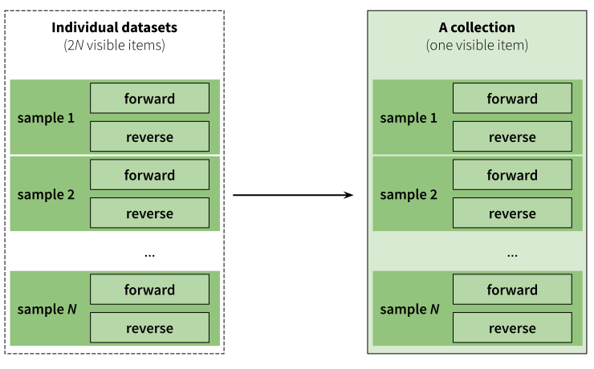

-----

To begin creating a collection we need to select datasets we would like to bundle. This is done using checkbox button of Galaxy's history menu. Fig. 2 below shows this process.

-----

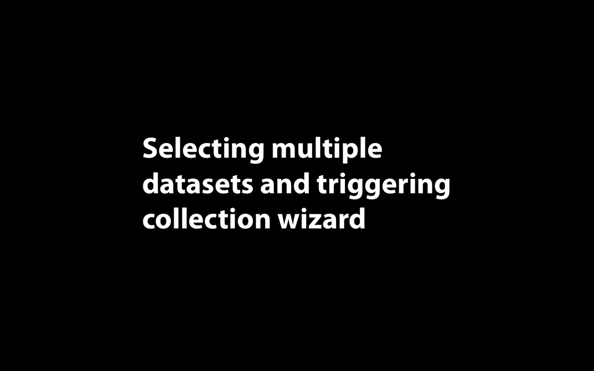

-----

The above process ended with appearance of Galaxy collection wizard. In this case Galaxy automatically assigned pairs using the `_1` and `_2` endings of dataset names. Let's however pretend that this did not happen. Click on **Unpair all** (highlighted in red in the figure above) link and then on **Filters** link (see animation in Fig. 3). The interface will change into its unpaired state.

Here datasets containing the first (forward) and the second (reverse) read are differentiated by having `_1` and `_2` in the filename. We can use this feature in dataset collection wizard to pair our datasets.  Type `_1` in the left **Filter text** text box and `_2` in the right. You will see that the dataset collection wizard will automatically filter lists on each side of the interface. Now you can either click **Auto pair** if pairs look good to you (proper combinations of datasets are listed in each line) or pair each forward/reverse group individually by pressing **Pair these datasets** button separating each pair.

Now it is time to name the collection: type `M117-collection` in **Name** text box and create the collection by clicking **Create collection**. A new item will appear in the history.

------

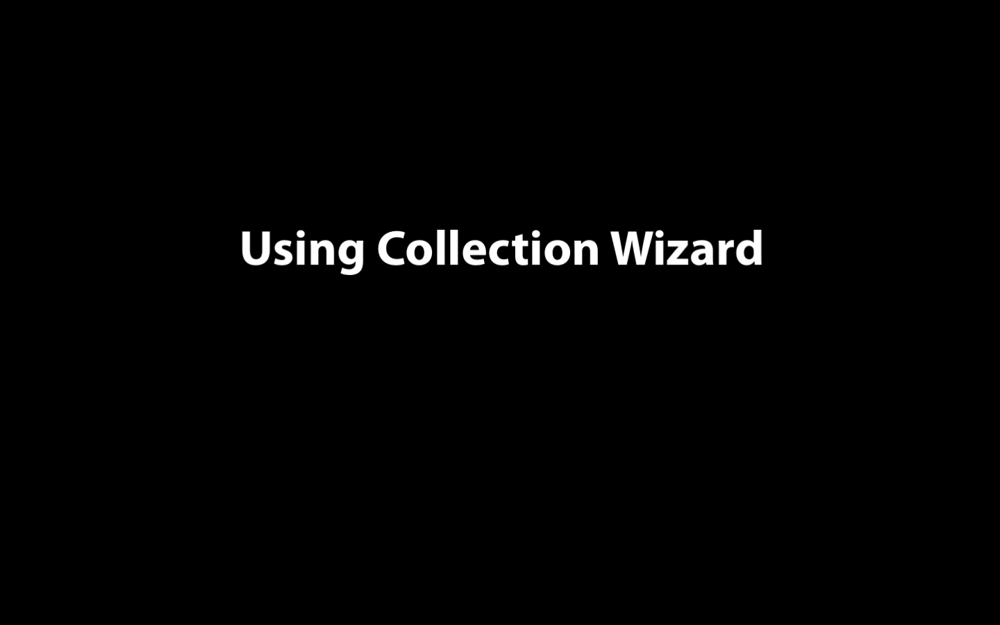

------

Clicking on collection will expand it to show four pairs it contains (panel **B**). Clicking individual pairs will expand them further to reveal **forward** and **reverse** datasets (panel **C**). Expanding these further will enable one to see individual datasets (panel **D**).

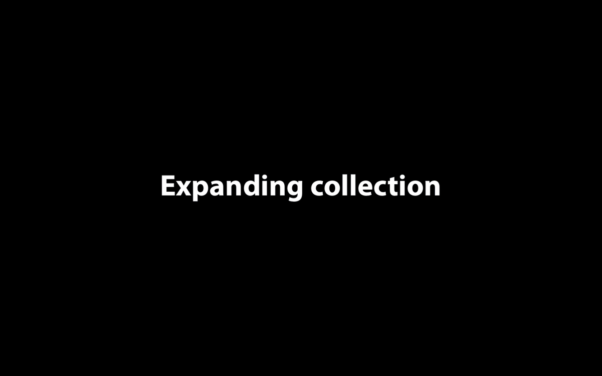

# Processing data organized as a collection

By now we see that a collection can be used to bundle a large number of items into a single history item. Galaxy tools tools take collection as input. Let's map reads contained in collection `M117-collection` against human mitochondrial genome. Before we can do this we need to upload mitochondrial genome using the following URL (see a  **Tip** on how to do this [below](#-tip-importing-via-links)):

```
https://zenodo.org/record/5119008/files/chrM.fa.gz
```

> ###  Hands-on: Set format to `fasta.gz`
> The above dataset is in `fasta.gz` format. The  **Tip** section below explains how to upload these data and set the correct format. 
>
> 
{: .hands_on}

## Mapping reads

**BWA-MEM**  is a widely used sequence aligner for short-read sequencing datasets such as those we are analysing in this tutorial. (You can find the tool by typing `BWA MEM` in the search box at the top left corner of Galaxy interface).

> ###  Hands-on: Map sequencing reads to reference genome
>
> Run {% tool [BWA-MEM](toolshed.g2.bx.psu.edu/repos/devteam/bwa/bwa_mem/0.7.17.1) %} with the following parameters:
>    - *"Will you select a reference genome from your history or use a built-in index?"*: `Use a genome from history and build index`
>        -  *"Use the following dataset as the reference sequence"*: `chrM.fa.gz` (The mitochondrial genome we just uploaded)
>    - *"Single or Paired-end reads"*: `Paired Collection`
>        -  *"Select a paired collection"*: `M117-collection` (the collection we built at the beginning of this tutorial.)
>    - *"Set read groups information?"*: `Do not set`
>    - *"Select analysis mode"*: `1.Simple Illumina mode`
>
> The interface should look like this:
>
> ------
>
> 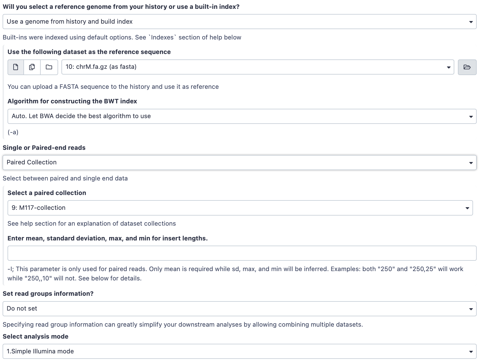
>
> ------
>
>    - Click **Execute** button
>
{: .hands_on}

You will see jobs being submitted and new datasets appearing in the history. Because our collection contains four paired datasets Galaxy will actually four separate `BWA-MEM` jobs. In the end this `BWA-MEM` run will produce a new collection containing four (4) BAM datasets. Let's look at this collection by clicking on it (panel **A** in the figure below). You can see that now this collection is no longer paired (compared to the collection we created in the beginning of this tutorial). This is because `BWA-MEM` takes forward and reverse data as input, but produces only a single BAM dataset as the output. So what we have in the result is a *list* of four dataset (BAM files; panel **B**). If you click on any of the datasets you will see that it is indeed a BAM dataset (panel **C**).

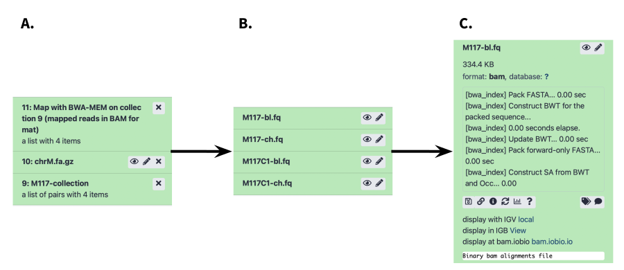

## Calling variants

After we mapped reads against the mitochondrial genome, we can now call variants. In this step a variant calling tool `lofreq` will take a collection of BAM datasets (the one produced by `BWA-MEM`), identify differences between reads and the reference, and output these differences as a collection of [VCF](https://en.wikipedia.org/wiki/Variant_Call_Format) datasets. 

> ###  Hands-on: Call variants  
>
> Run  with the following parameters:
>    -  *"Input reads in BAM format"*: `Map with BWA-MEM...` (output of **BWA-MEM** )
>    - *"Choose the source for the reference genome"*: `History`
>        -  *"Reference"*: `chrM.fa.gz (as fasta)` (Input dataset)
>    - *"Call variants across"*: `Whole reference`
>    - *"Types of variants to call"*: `SNVs and indels`
> 
> The interface should look like this:
>
> ------
>
> 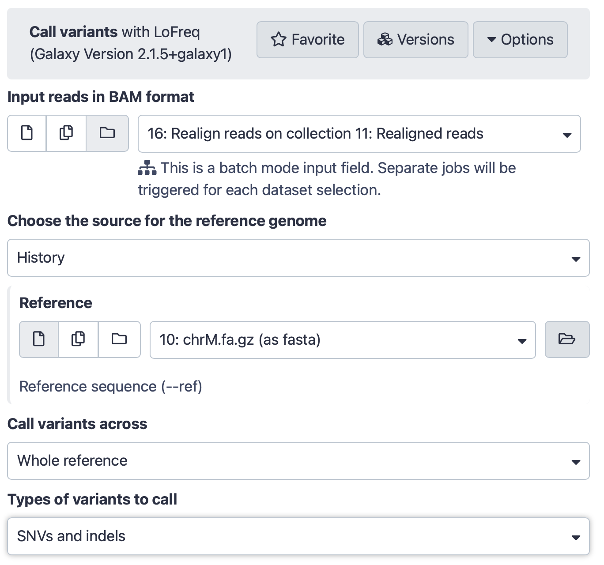
>
> ------
>
>    - Click **Execute** button
>
{: .hands_on}

## Create table of variants using **SnpSift Extract Fields**

We will now convert VCF datasets into tab delimited format as it will be easier to work with. This will be done with `SNPSift`: a tool specifically designed for manipulation of tab-delimited data. 


> ###  Hands-on: Create table of variants
>
> Run  with the following parameters:
>    -  *"Variant input file in VCF format"*: `Call variants on collection...` (output of **Call variants with lofreq** )
>    - *"Fields to extract"*: `CHROM POS REF ALT QUAL DP AF SB DP4`
>    - *"One effect per line"*: `Yes`
>
> The interface should look like this:
>
> ------
>
> 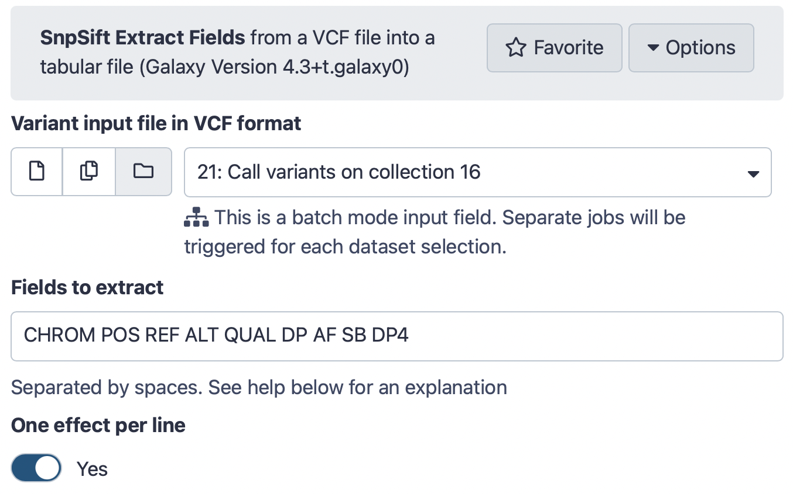
>
> ------
>
>    - Click **Execute** button
>
{: .hands_on}


As a result of this operation we now have a collection of four tab delimited files. Yet, ultimately we want to summaize these data as one final table. The next step does just that.

## Collapse data into a single dataset

We now extracted meaningful fields from VCF datasets. But they still exist as a collection. To move towards secondary analysis we need to **collapse** this collection into a single dataset. For more information about collapsing collections see this video:

<iframe width="560" height="315" src="https://www.youtube.com/embed/ypuFZ1RKMIY" frameborder="0" allow="accelerometer; autoplay; clipboard-write; encrypted-media; gyroscope; picture-in-picture" allowfullscreen></iframe>

> ###  Hands-on: Collapse a collection
>
> Run  with the following parameters:
>    -  *"Collection of files to collapse into single dataset"*: `SnpSift Extract Fields ...` (output of **SnpSift Extract Fields** )
>    - "*Keep one header line*": `Yes`
>    - "*Prepend File name*": `Yes`
>    - "*Where to add dataset name*": `Same line and each line in dataset`
>
> The interface should look like this:
>
> ------
>
> 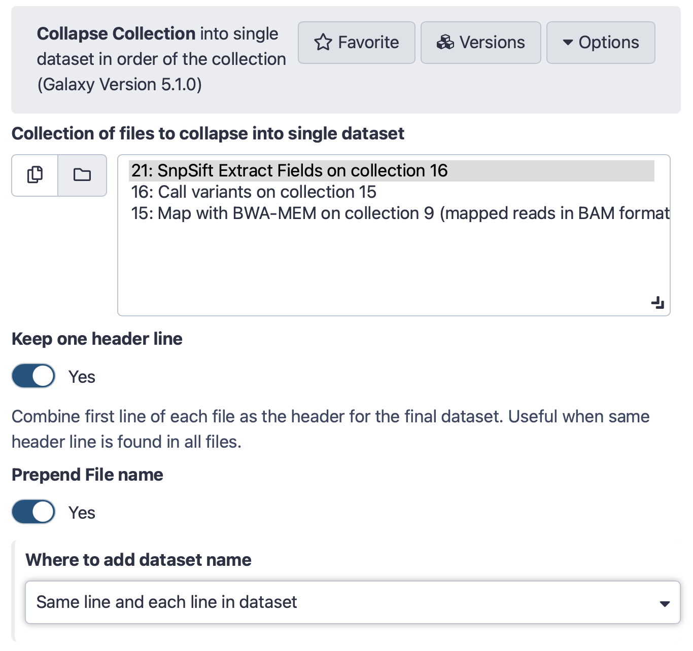
>
> ------
>
>    - Click **Execute** button
>
{: .hands_on}

You can see that this tool takes lines from all collection elements (in our case we have two), add element name as the first column, and pastes everything together. So if we have a collection as an input:

> ###  Input: A collection with two items
> A collection element named `M117-bl.fq`
>
>```
>chrM   152 T C  3707.0 1242 0.99 0 2,2,540,697
>chrM 16519 T C 35149.0 1033 0.99 0 1,1,611,420
>```
>
>A collection element named `M117-ch.fq`:
>
>```
chrM   152 T C  4098.0 1440 0.99 0 0,1,575,863
chrM 16519 T C 36574.0 1039 0.99 2 3,0,713,321
>```
>
>A collection element named `M117C1-bl.fq`:
>
>```
>chrM   152 T C  4888.0 1235 1.00 0 0,0,548,687
>chrM 16519 T C 35220.0 1042 0.99 0 0,0,598,443
>```
>
>A collection element named `M117C1-ch.fq`:
>
>```
>chrM   152 T C  2757.0 1413 0.99 0 2,2,576,833
>chrM 16455 G A    54.0  100 0.04 0 89,7,4,0
>chrM 16519 T C 36363.0 1061 0.99 6 3,4,691,362
>```
>
{: .code-in}

We will have a single dataset as the output:

> ###  Output: A single dataset
>
>then the **Collapse Collection**  will produce this:
>
>```
>M117-bl.fq   chrM   152 T C  3707.0 1242 0.99 0 2,2,540,697
>M117-bl.fq   chrM 16519 T C 35149.0 1033 0.99 0 1,1,611,420
>M117-ch.fq   chrM   152 T C  4098.0 1440 0.99 0 0,1,575,863
>M117-ch.fq   chrM 16519 T C 36574.0 1039 0.99 2 3,0,713,321
>M117C1-bl.fq chrM   152 T C  4888.0 1235 1.00 0 0,0,548,687
>M117C1-bl.fq chrM 16519 T C 35220.0 1042 0.99 0 0,0,598,443
>M117C1-ch.fq chrM   152 T C  2757.0 1413 0.99 0 2,2,576,833
>M117C1-ch.fq chrM 16455 G A    54.0  100 0.04 0 89,7,4,0
>M117C1-ch.fq chrM 16519 T C 36363.0 1061 0.99 6 3,4,691,362
>```
{: .code-out}

you can see that added a column with dataset ID taken from collection element name.

## We did not fake this:
The history described in this page is accessible directly from here:

* History [**Collections (full analysis)**](https://usegalaxy.org/u/cartman/h/collection-tutorial)

From there you can import histories to make them your own.


# Collection operations

In this brief analysis we took four paired datasets, created a collection, analyzed this collection and finally created a single report. Such "lifecycle" is shown in the figure below. Here we started with eight fastq datasets representing four paired end samples. A paired collection was reduced to a list of BAM datasets by `BWA-MEM`. Varinat calling by `lofreq` and field extraction with `SnpEff` maintained collection structure: these tools processed four individual datasets changing their formats from BAM to VCF, and from VCF to Tab-delimited. Finally, we collapsed collection by merging its content into a single dataset. 

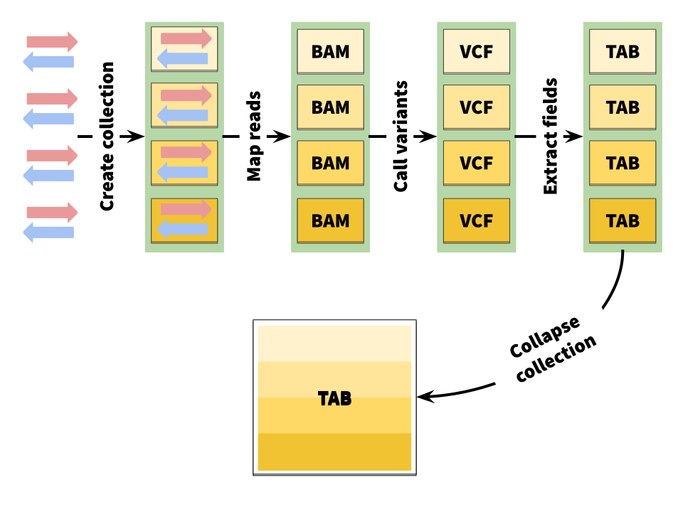

The last step of our analysis, collapsing a collection, is an example of a *collection operation*. Galaxy contains an entire section of tools designed for handling of collection data. These can be classified as:

 - Tools that manipulate elements within a collection
 - Tools that change collection structure
 - Tools that combine elements of a collection

Let's look at these categories in more detail:

## Tools that manipulate elements within a collection

### Extract dataset

 **Extract dataset** extracts datasets from a collection based on either position or identifier.

The tool allow extracting datasets based on position (**The first dataset** and **Select by index** options) or name (**Select belement identifier** option). This tool effectively collapses the inner-most collection into a dataset. For nested collections (e.g a list of lists of lists: outer:middle:inner, extracting the inner dataset element) a new list is created where the selected element takes the position of the inner-most collection (so outer:middle, where middle is not a collection but the inner dataset element).

### Filter empty

 **Filter empty** removes empty elements from a collection.

This tool takes a dataset collection and filters out (removes) empty datasets. This is useful for continuing a multi-sample analysis when downstream tools require datasets to have content.

.. image:: ${static_path}/images/tools/collection_ops/filter_empty.svg
  :width: 500
  :alt: Filtering empty datasets

### Filter failed datasets

 **Filter failed datasets** removes datasets in error (red) from a collection.

This tool takes a dataset collection and filters out (removes) datasets in the failed (red) state. This is useful for continuing a multi-sample analysis when one or more of the samples fails at some point.

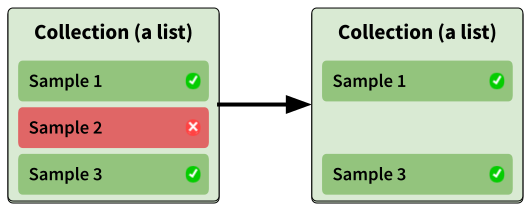

### Build list

 **Build list** creates a new list collection from individual datasets or collections.

This tool combines individual datasets or collections into a new collection. The simplest scenario is building a new colection from individual datasets (case **A** in the image below). You can merge a collection with individual dataset(s). In this case (see **B** in the image below) the individual dataset(s) will be merged with each element of the input collection to create a nested collection. Finally, two or more collection can be merged together creating a nested collection (case **C** in the image below).


### Filter collection

 **Filter collection** removes elements from a collection using a list supplied in a file.

This tools allow filtering elements from a data collection.  It takes an input collection and a text file with names (i.e. identifiers). The tool behaviour is controlled by **How should the elements to remove be determined?** drop-down. It has the following options:

**Remove if identifiers are ABSENT from file**

Given a collection:

```
 Collection: [Dataset A] 
             [Dataset B] 
             [Dataset X]
```

and a text file:

```
             A
             B
             Z
```

the tool will return two collections:


```

 (filtered):  [Dataset A]
              [Dataset B]

 (discarded): [Dataset X]
```

**Remove if identifiers are PRESENT in file**

Given a collection:

```
 Collection: [Dataset A] 
             [Dataset B] 
             [Dataset X]
```
and a text file:

```
             A
             B
             Z
```

the tool will return two collections:

```
 (filtered):  [Dataset X]

 (discarded): [Dataset A]
              [Dataset B]

```

### Relabel identifiers

  **Relabel identifiers** changes identifiers of datasets within a collection using identifiers from a supplied file. 

New identifiers can be supplied as either a simple list or a tab-delimited file mapping old identifier to the new ones. This is controlled using **How should the new identifiers be specified?** drop-down:

**Using lines in a simple text file**

Given a collection:

```
 Collection: [Dataset A] 
             [Dataset B] 
             [Dataset X]
```

and a simple text file:


```
             Alpha
             Beta
             Gamma
```

the tool will return:

```
 Collection: [Dataset Alpha] 
             [Dataset Beta] 
             [Dataset Gamma]
```

**Map original identifiers to new ones using a two column table**

Given a collection:

```
 Collection: [Dataset A] 
             [Dataset B] 
             [Dataset X]
```

and a simple text file (you can see that entries do not have to be in order here):


```
             B Beta
             X Gamma
             A Alpha
```

the tool will return:

```
 Collection: [Dataset Alpha] 
             [Dataset Beta] 
             [Dataset Gamma]
```

### Sort collection

 **Sort collection** ... well .. sorts dataset collection alphabetically, numerically, or using predetermined order from a supplied file.

**Numeric sort**

The tool sort in ascending order. When *numeric* sort is chosen, the tool ignores non-numeric characters. For example, if a collection contains the following elements:

```
 Collection: [Horse123] 
             [Donkey543] 
             [Mule176]
```

The tool will output:

```
 Collection: [Horse123]
             [Mule176] 
             [Donkey543] 
```

**Sorting from file**

Alternative, one can supply a single column text file containing elements identifiers in the desired sort order. For example, suppose there a collection:

```
 Collection: [Horse123] 
             [Donkey543] 
             [Mule176]
```

and a file specifying sort order:

```
 Donkey543
 Horse123 
 Mule176
```

the output will predictably look like this:

```
 Collection: [Donkey543] 
             [Horse123] 
             [Mule176]
```

### Tag collection

  **Tag collection** adds tags (including name: and group: tags) to collection elements.

The relationship between element names and tags is specified in a two column tab-delimited file. This file may contain less entries than elements in the collection. In that case only matching list identifiers will be tagged.

To create name: or group: tags prepend them with `#` (you can also use `name:`) or `group:`, respectively. 

More about tags

> ###  Tip: More about tags
> Galaxy allows tagging datasets to facilitate analyses. There are several types of tags including simple tags, name tags, and group tags. **Simple** tags allow you to attach an alternative label to a dataset, which will make it easier to find it later. **Name** tags allow you to track propagation of a dataset through the analyses: all datasets derived from the initial dataset labeled with a name tag will inherit it. Finally, **group** tags allow you to label group of datasets. This is useful. for example, for differential expression analysis where you can have two groups of datasets labeled as "treatment" and "control".
>
>To learn mote about tags go to [training site](https://training.galaxyproject.org/training-material/search?query=tags).
{: .tip}

## Tools that change collection structure

### Flatten collection

 **Flatten collection** collapses nested collection into a simple list.

This tool takes nested collections such as a list of lists or a list of dataset pairs and produces a flat list from the inputs. It effectively "flattens" the hierarchy. The collection identifiers are merged together (using `_` as default) to create new collection identifiers in the flattened result:

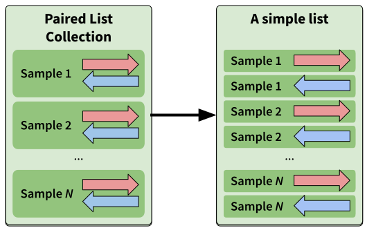

### Merge collections

  **Merge collections** takes two or more collections and creates a single collection from them. 

By default the tool assumes that collections that are being merged have unique dataset names. If it not the case only one (the first) of the datasets with a repeated name will be included in the merged collection. For example, suppose you have two collections. Each has two datasets named "A" and "B":
```
 Collection 1: [Dataset A] 
               [Dataset B] 
               [Dataset X]
 Collection 2: [Dataset A] 
               [Dataset B] 
               [Dataset Y]
```

Merging them will produce a single collection with only two datasets:

```
 Merged Collection: [Dataset A] 
                    [Dataset B] 
                    [Dataset X] 
                    [Dataset Y]
```

This behavior can be changed by clicking on "*Advanced Options*" link. The following options are available:

**Keep first instance (Default behavior)**

Input:

```
 Collection 1: [Dataset A] 
               [Dataset B] 
               [Dataset X]
 Collection 2: [Dataset A] 
               [Dataset B] 
               [Dataset Y]
```

Output:

```
 Merged Collection: [Dataset A] 
                    [Dataset B] 
                    [Dataset X] 
                    [Dataset Y]
```

Here if two collection have identical dataset names, a dataset is chosen from the *first* collection.

-----

**Keep first instance**

Input:

```
 Collection 1: [Dataset A] 
               [Dataset B] 
               [Dataset X]
 Collection 2: [Dataset A] 
               [Dataset B] 
               [Dataset Y]
```

Output:

```
 Merged Collection: [Dataset A] 
                    [Dataset B] 
                    [Dataset X] 
                    [Dataset Y]
```

Here if two collection have identical dataset names, a dataset is chosen from the *last* collection.

-----

**Append suffix to conflicted element identifiers**

Input:

```
 Collection 1: [Dataset A] 
               [Dataset B] 
               [Dataset X]
 Collection 2: [Dataset A] 
               [Dataset B] 
               [Dataset Y]
```

Output:

```
 Merged Collection: [Dataset A_1] 
                    [Dataset B_1]
                    [Dataset A_2] 
                    [Dataset B_2]  
                    [Dataset X] 
                    [Dataset Y]
```


**Append suffix to conflicted element identifiers after first on encountered**

Input:

```

 Collection 1: [Dataset A] 
               [Dataset B] 
               [Dataset X]
 Collection 2: [Dataset A] 
               [Dataset B] 
               [Dataset Y]
```

Output:

```
 Merged Collection: [Dataset A] 
                    [Dataset B]
                    [Dataset A_2] 
                    [Dataset B_2]  
                    [Dataset X] 
                    [Dataset Y]
```

**Append suffix to every element identifier**

Input:

```
 Collection 1: [Dataset A] 
               [Dataset B] 
               [Dataset X]
 Collection 2: [Dataset A] 
               [Dataset B] 
               [Dataset Y]
```

Output:

```
 Merged Collection: [Dataset A_1] 
                    [Dataset B_2]
                    [Dataset A_2] 
                    [Dataset B_2]  
                    [Dataset X_1] 
                    [Dataset Y_2]
```

**Fail collection creation**

This option will simply trigger an error.

### Zip collection

 **Zip collection** takes two collections and creates a paired collection from them. 

If you have one collection containing only forward reads and one containing only reverse, this tools will "zip" them together into a simple paired collection. For example, given two collections with `forward` and `reverse` reads they can be "zipped" into a single paired collection:

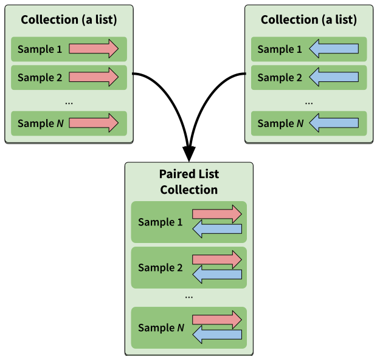

### Unzip collection

 **Unzip collection** takes a paired collection and "unzips" it into two simple dataset collections (lists of datasets). 

Given a paired collection of forward and reverse reads this tool will "unzip" it into two collections containing forward and reverse reads, respectively:

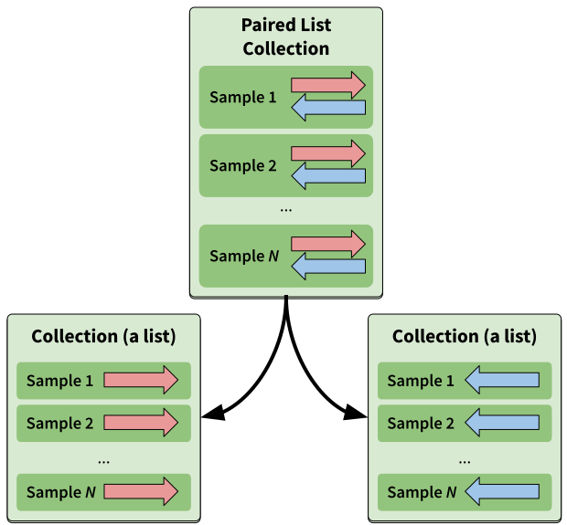

## Tools that combine elements of a collection

### Column join

 **Column join** merges elements of a collection on a given column. 

If you have a collection with three elements (image below), merging it on the first column will first produce a union on values found in the first column of each elements and then paste elements having the same value side-by-side:

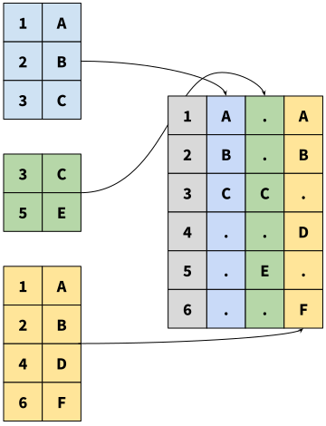

### Collapse collection 

 **Collapse collection** merges elements together (head-to-tail) in the order of the collection. Its power comes from the ability to add identifiers when it performs the merge. Identifiers can be added in variety of ways specified by the **Prepend File name** option as shown in the figure below (we used option **A** in the last step of this tutorial). **A** = `Same line and each line in dataset`; **B** = `Same line and only once per dataset`; **C** =  `Line above`

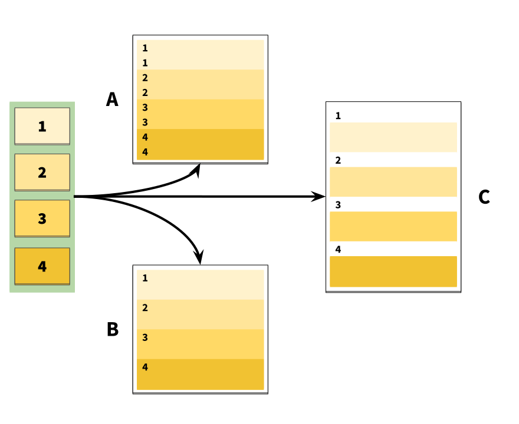

