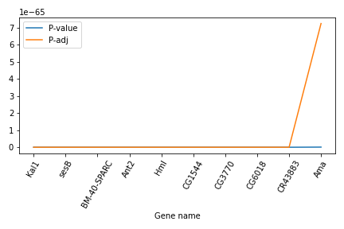
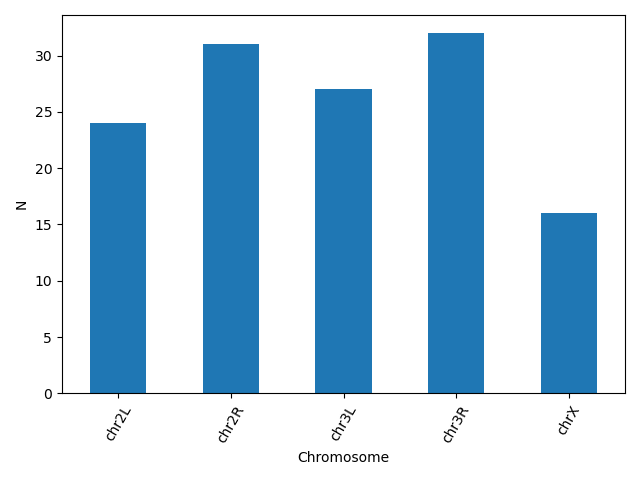
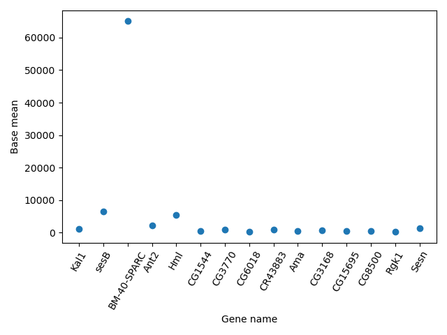

# Introduction

## Comment 
This tutorial is significantly based on the Carpentries courses [Programming with Python](https://swcarpentry.github.io/python-novice-inflammation/) and [Plotting and Programming in Python](https://swcarpentry.github.io/python-novice-gapminder/). 

## Overview
In this lesson, we will be using Python 3 with some of its most popular scientific libraries. This tutorial assumes that the reader is familiar with the fundamentals of data analysis using the Python programming language, as well as, how to run Python programs using Galaxy. Otherwise, it is advised to follow the "Introduction to Python" and "Advanced Python" tutorials available in the same platform. We will be using JupyterNotebook, a Python interpreter that comes with everything we need for the lesson. Please note:  JupyterNotebook is only currently available on the [usegalaxy.eu](https://usegalaxy.eu/) and [usegalaxy.org](https://usegalaxy.org/) sites. 


# Plot data using matplotlib

For the purposes of this tutorial, we will use a file with the annotated differentially expressed genes that was produced in the [Reference-based RNA-Seq data analysis](https://training.galaxyproject.org/training-material/topics/transcriptomics/tutorials/ref-based/tutorial.html) tutorial.

Firstly, we read the file with the data.

```python
data = pd.read_csv("https://zenodo.org/record/3477564/files/annotatedDEgenes.tabular", sep = "\t", index_col = 'GeneID')
print(data)
```


```output
                Base mean  log2(FC)    StdErr  Wald-Stats        P-value  \
GeneID                                                                     
FBgn0039155   1086.974295 -4.148450  0.134949  -30.740913  1.617357e-207   
FBgn0003360   6409.577128 -2.999777  0.104345  -28.748637  9.419922e-182   
FBgn0026562  65114.840564 -2.380164  0.084327  -28.225437  2.850430e-175   
FBgn0025111   2192.322369  2.699939  0.097945   27.565978  2.847517e-167   
FBgn0029167   5430.067277 -2.105062  0.092547  -22.745964  1.573284e-114   
...                   ...       ...       ...         ...            ...   
FBgn0035710     26.161771  1.048979  0.232922    4.503559   6.682473e-06   
FBgn0035523     70.998197  1.004819  0.223763    4.490561   7.103599e-06   
FBgn0038261     44.270577  1.006264  0.224124    4.489756   7.130487e-06   
FBgn0039178     23.550056  1.040917  0.232626    4.474631   7.654328e-06   
FBgn0034636     24.770519 -1.028531  0.232168   -4.430118   9.418135e-06   

                     P-adj Chromosome     Start       End Strand  \
GeneID                                                             
FBgn0039155  1.387207e-203      chr3R  24141394  24147490      +   
FBgn0003360  4.039734e-178       chrX  10780892  10786958      -   
FBgn0026562  8.149380e-172      chr3R  26869237  26871995      -   
FBgn0025111  6.105789e-164       chrX  10778953  10786907      -   
FBgn0029167  2.698811e-111      chr3L  13846053  13860001      +   
...                    ...        ...       ...       ...    ...   
FBgn0035710   1.436480e-04      chr3L   6689326   6703521      -   
FBgn0035523   1.523189e-04      chr3L   4277961   4281585      +   
FBgn0038261   1.525142e-04      chr3R  14798985  14801163      +   
FBgn0039178   1.629061e-04      chr3R  24283954  24288617      +   
FBgn0034636   1.951192e-04      chr2R  21560245  21576035      -   

                    Feature    Gene name  
GeneID                                    
FBgn0039155  protein_coding         Kal1  
FBgn0003360  protein_coding         sesB  
FBgn0026562  protein_coding  BM-40-SPARC  
FBgn0025111  protein_coding         Ant2  
FBgn0029167  protein_coding          Hml  
...                     ...          ...  
FBgn0035710  protein_coding       SP1173  
FBgn0035523  protein_coding       CG1311  
FBgn0038261  protein_coding      CG14856  
FBgn0039178  protein_coding       CG6356  
FBgn0034636  protein_coding      CG10440  

[130 rows x 12 columns]
```
We can now use the `DataFrame.info()` method to find out more about a dataframe.

```python
data.info()
```
```output
<class 'pandas.core.frame.DataFrame'>
Index: 130 entries, FBgn0039155 to FBgn0034636
Data columns (total 12 columns):
 #   Column      Non-Null Count  Dtype  
---  ------      --------------  -----  
 0   Base mean   130 non-null    float64
 1   log2(FC)    130 non-null    float64
 2   StdErr      130 non-null    float64
 3   Wald-Stats  130 non-null    float64
 4   P-value     130 non-null    float64
 5   P-adj       130 non-null    float64
 6   Chromosome  130 non-null    object 
 7   Start       130 non-null    int64  
 8   End         130 non-null    int64  
 9   Strand      130 non-null    object 
 10  Feature     130 non-null    object 
 11  Gene name   130 non-null    object 
dtypes: float64(6), int64(2), object(4)
memory usage: 13.2+ KB
```


We learn that this is a DataFrame. It consists of 130 rows and 12 columns. None of the columns contains any missing values. 6 columns contain 64-bit floating point `float64` values, 2 contain 64-bit integer `int64` values and 4 contain character `object` values. It uses 13.2KB of memory.

We now have a basic understanding of the dataset and we can move on to creating a few plots and further explore the data. `matplotlib` is the most widely used scientific plotting library in Python, especially the `matplotlib.pyplot` module.

```python
import matplotlib.pyplot as plt
```
Simple plots are then (fairly) simple to create. You can use the `plot()` method and simply specify the data to be displayed in the x and y axis, by passing the data as the first and second argument. In the following example, we select a subset of the dataset and plot the P-value of each gene, using a lineplot.  

```python
subset = data.iloc[121:, :]

x = subset['P-value']
y = subset['Gene name']

plt.plot(x, y)
plt.xlabel('P-value')
plt.ylabel('Gene name')
```


We use Jupyter Notebook and so running the cell generates the figure directly below the code. The figure is also included in the Notebook document for future viewing. However, other Python environments like an interactive Python session started from a terminal or a Python script executed via the command line require an additional command to display the figure.

Instruct matplotlib to show a figure:

```python
plt.show()
```
This command can also be used within a Notebook - for instance, to display multiple figures if several are created by a single cell.

If you want to save and download the image to your local machine, you can use the `plt.savefig()` command with the name of the file (png, pdf etc) as the argument. The file is saved in the Jupyter Notebook session and then you can download it. For example:

```python
plt.tight_layout()
plt.savefig('foo.png')
```

`plt.tight_layout()` is used to make sure that no part of the image is cut off during saving.

When using dataframes, data is often generated and plotted to screen in one line, and `plt.savefig()` seems not to be a possible approach. One possibility to save the figure to file is then to save a reference to the current figure in a local variable (with `plt.gcf()`) and then call the savefig class method from that variable. For example, the previous plot:

```python
subset = data.iloc[121:, :]

x = subset['P-value']
y = subset['Gene name']

fig = plt.gcf() 
plt.plot(x, y)
fig.savefig('my_figure.png')
```


## More about plots

You can use the `plot()` method directly on a dataframe. You can plot multiple lines in the same plot. Just specify more columns in the x or y axis argument. For example:

```python
new_subset = data.iloc[0:10, :]
new_subset.loc[:, ['P-value', 'P-adj']].plot()
plt.xticks(range(0,len(new_subset.index)), new_subset['Gene name'], rotation=60)
plt.xlabel('Gene name')
```



In this example, we select a new subset of the dataset, but plot only the two columns `P-value` and `P-adj`. Then we use the `plt.xticks()` method to change the text and the rotation of the x axis.

Another useful plot type is the barplot. In the following example we plot the number of genes that belong to the different chromosomes of the dataset. 

```python
bar_data = data.groupby('Chromosome').size()
bar_data.plot(kind='bar')
plt.xticks(rotation=60)
plt.ylabel('N')
```


`matplotlib` supports also different plot styles from ather popular plotting libraries such as ggplot and seaborn. For example, the previous plot in ggplot style.

```python
plt.style.use('ggplot')
bar_data = data.groupby('Chromosome').size()
bar_data.plot(kind='bar')
plt.xticks(rotation=60)
plt.ylabel('N')
```


You can also change different parameters and customize the plot. 

```python
plt.style.use('default')
bar_data = data.groupby('Chromosome').size()
bar_data.plot(kind='bar', color = 'red', edgecolor = 'black')
plt.xticks(rotation=60)
plt.ylabel('N')
```


Another useful type of plot is a scatter plot. In the following example we plot the Base mean of a subset of genes.

```python
scatter_data = data[['Base mean', 'Gene name']].head(n = 15)

plt.scatter(scatter_data['Gene name'], scatter_data['Base mean'])
plt.xticks(rotation = 60)
plt.ylabel('Base mean')
plt.xlabel('Gene name')
```



### Exercise
1. Using the same dataset, create a scatterplot of the average P-value for every chromosome for the "+" and the "-" strand. 

### Solution
1. First find the data and save it in a new dataframe. Then create the scatterplot. You can even go one step further and assign different colors for the different strands.Note the use of the `map` method that assigns the different colors using a dictionary as an input.

    ```python
    exercise_data = data.groupby(['Chromosome', 'Strand']).agg(mean_pvalue = ('P-value', 'mean')).reset_index()
    
    colors = {'+':'red', '-':'blue'}
    plt.scatter(x = exercise_data['Chromosome'], y = exercise_data['mean_pvalue'], c = exercise_data['Strand'].map(colors))
    plt.ylabel('Average P-value')
    plt.xlabel('Chromosome')
    ```


## Making your plots accessible
Whenever you are generating plots to go into a paper or a presentation, there are a few things you can do to make sure that everyone can understand your plots.

Always make sure your text is large enough to read. Use the `fontsize` parameter in `xlabel`, `ylabel`, `title`, and `legend`, and `tick_params` with `labelsize` to increase the text size of the numbers on your axes.
Similarly, you should make your graph elements easy to see. Use `s` to increase the size of your scatterplot markers and `linewidth` to increase the sizes of your plot lines.
Using `color` (and nothing else) to distinguish between different plot elements will make your plots unreadable to anyone who is colorblind, or who happens to have a black-and-white office printer. For lines, the `linestyle` parameter lets you use different types of lines. For scatterplots, `marker` lets you change the shape of your points.


# Conclusion

This tutorial aims to serve as an introduction to plotting using the Python programming language.

## Key points

* Python has many libraries offering a variety of capabilities, which makes it popular for beginners, as well as, more experienced users

* You can use scientific libraries like Matplotlib to perform exploratory data analysis.


# References

1. Wendi Bacon, Mehmet Tekman, 2021, Trajectory Analysis using Python (Jupyter Notebook) in Galaxy (Galaxy Training Materials). https://training.galaxyproject.org/training-material/topics/transcriptomics/tutorials/scrna-JUPYTER-trajectories/tutorial.html Online; accessed Wed Sep 01 2021
2. Batut et al., 2018, Community-Driven Data Analysis Training for Biology Cell Systems [10.1016/j.cels.2018.05.012
3.  Azalee Bostroem, Trevor Bekolay, and Valentina Staneva (eds): "Software Carpentry: Programming with Python."  Version 2016.06, June
2016, https://github.com/swcarpentry/python-novice-inflammation, 10.5281/zenodo.57492.
4. Allen Lee, Nathan Moore, Sourav Singh, Olav Vahtras (eds). Software Carpentry: Plotting and Programming in Python. http://github.com/swcarpentry/python-novice-plotting, 2018.
5. Bérénice Batut, Mallory Freeberg, Mo Heydarian, Anika Erxleben, Pavankumar Videm, Clemens Blank, Maria Doyle, Nicola Soranzo, Peter van Heusden, 2021 Reference-based RNA-Seq data analysis (Galaxy Training Materials). https://training.galaxyproject.org/training-material/topics/transcriptomics/tutorials/ref-based/tutorial.html Online; accessed Wed Sep 01 2021

