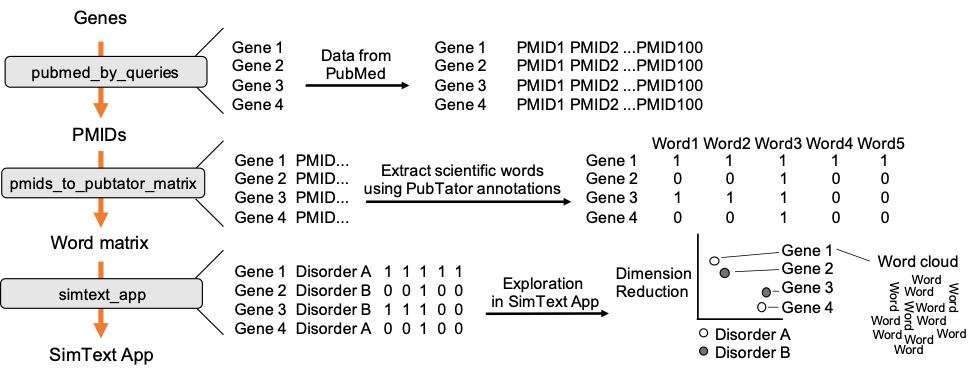
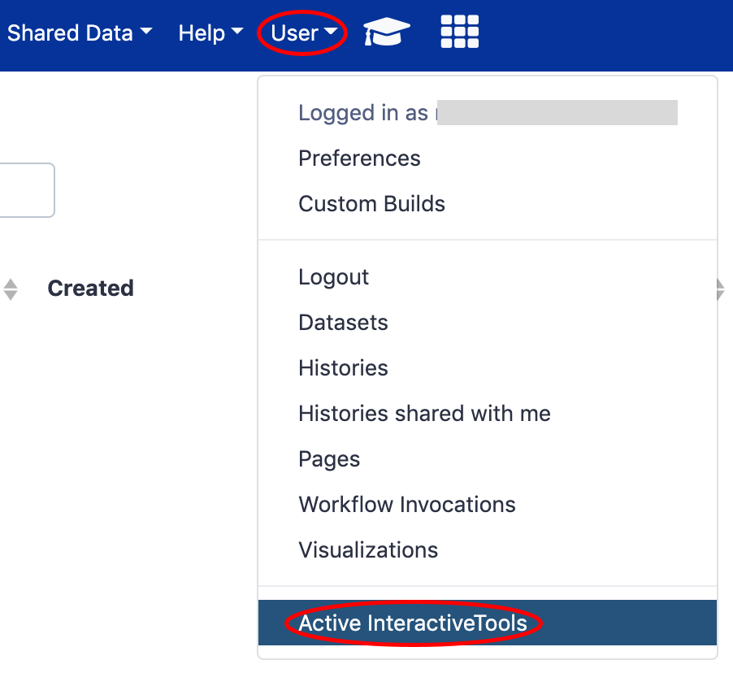

# Introduction
{:.no_toc}

Literature exploration in PubMed on a large number of biomedical entities (e.g., genes, diseases, or experiments) can be time-consuming and challenging, especially when assessing associations between entities. Here, we use SimText, a toolset for literature research that allows you to collect text from PubMed for any given set of biomedical entities, extract associated terms, and analyze similarities among them and their key characteristics in an interactive tool.

This tutorial is based on the example given in . We are going to analyze similarities among 95 genes based on their associated biomedical terms in the literature, and compare their pre-existing disorder categories to their grouping based on the literature.

The workflow combines 3 main steps, starting with the retrievel of PubMed data for each of the genes. We then use the PubMed data from each gene to extract related scientific terms that are all combined in one large binary matrix. Finally, we explore the generated data in an interactive tool that performs different unsupervised machine-learning algorithms to analyze the similarities/ grouping among the genes based on their extracted terms from the literature.



> ### Agenda
>
> In this tutorial, we will cover:
>
> 1. TOC
> {:toc}
>
{: .agenda}

# Input data

## Input data

The input data is a simple table with the genes we want to analyze as well as their pre-existing grouping (the grouping is required later on to compare it to our text-based gene grouping). In order for the tools to recognize the column with the biomedical entities of interest, our 95 genes, the column name should start with "ID_", and for the grouping variable with "GROUPING_".

> ###  Hands-on: Data upload
>
> 1. Create a new history for this tutorial
>
>	
>
> 2. Import the input file from [Zenodo](https://zenodo.org/api/files/b7b2b1d8-bb18-423d-9fe4-3bce858265ac/clingen_data)
>
>    ```
>    https://zenodo.org/api/files/b7b2b1d8-bb18-423d-9fe4-3bce858265ac/clingen_data
>    ```
>    
>
{: .hands_on}

# 1. Retrieval of PubMed data

In the first step we collect PubMed data for each of the genes. Here, the genes are used as search queries to download a defined number of PMIDs, here up to 500, from PubMed. The PMIDs are saved in additional columns of our input data.

> ###  NCBI API key (optional)
>
> To speed up the the download of PubMed data users can obtain an API key from the Settings page of their NCBI account (to create an account, visit http://www.ncbi.nlm.nih.gov/account/) and add it to the Galaxy user-preferences (User/ Preferences/ Manage Information).
>
{: .details}

> ###  Hands-on: Step 1: PubMed query tool
>
> 1. Run  with the following parameters:
>    -  *"Input file with query terms"*: Input dataset
>    - *"Number of PMIDs (or abstracts) to save per ID"*: `500`
>
>    > ###  Comment
>    >
>    > The tool is also able to save the abstracts as text instead of PMIDs. This feature is used for another type of analysis. 
>    {: .comment}
>
{: .hands_on}

# 2. Extraction of biomedical terms from PubMed abstracts

Next, we extract the 100 most frequent 'Disease' and 'Gene' terms (PubTator annotations) from the PubMed data. Each gene with its 100 associated terms are then combined in one large binary matrix. Each row represents a gene and each column one of the extracted terms. This matrix is later used to find similar genes, i.e. genes that have many common terms associated with them.

> ###  Hands-on: Extraction of PubTator annotations
>
> 1. Run  with the following parameters:
>    -  *"Input file with PMID IDs"*: output of **PubMed query** 
>    - *"categories"*: `Genes Diseases`
>    - *"Number of most frequent terms/IDs to extract."*: `100`
>
>    > ###  PubTator
>    > PubTator annotates terms of the following categories: Gene, Disease, Mutation, Species and Chemical. 
>    > In this example we chose to only extract Gene and Disease terms but you can also select other categories if you are interested in those.
>    > 
>    {: .comment}
>
{: .hands_on}


# 3. Exploration of data in interactive tool

After generating the large binary matrix, we can explore the similarities/ the grouping among the genes in the interactive SimText tool.
The following features are generated:

1. word clouds for each gene
2. dimension reduction and hierarchical clustering of the binary matrix
3. calculation of the adjusted rand index (similarity of the grouping based on literature and the pre-existing disorder categories)
4. table with terms and their frequency among the genes


> ###  Hands-on: Explore data interactively
>
> 1. Run  with the following parameters:
>    -  *"Input file"*: initial input file with genes and pre-existing grouping
>    -  *"Matrix file"*: output of **PMIDs to PubTator** 
>
> 2. Open interactive tool 
>    - Go to User > Active InteractiveTools
>    
>    - Click on "SimText App"
>
{: .hands_on}

# Conclusion
{:.no_toc}
