# Introduction
{:.no_toc}

In recent years, RNA sequencing (in short RNA-Seq) has become a very widely used technology to analyze the continuously changing cellular transcriptome, i.e. the set of all RNA molecules in one cell or a population of cells. One of the most common aims of RNA-Seq is the profiling of gene expression by identifying genes or molecular pathways that are differentially expressed (DE) between two or more biological conditions. This tutorial demonstrates a computational workflow for the detection of DE genes and pathways from RNA-Seq data by providing a complete analysis of an RNA-Seq experiment profiling *Drosophila* cells after the depletion of a regulatory gene.

In the study of , the authors identified genes and pathways regulated by the *Pasilla* gene (the *Drosophila* homologue of the mammalian splicing regulators Nova-1 and Nova-2 proteins) using RNA-Seq data. They depleted the *Pasilla* (*PS*) gene in *Drosophila melanogaster* by RNA interference (RNAi). Total RNA was then isolated and used to prepare both single-end and paired-end RNA-Seq libraries for treated (PS depleted) and untreated samples. These libraries were sequenced to obtain RNA-Seq reads for each sample. The RNA-Seq data for the treated and the untreated samples can be compared to identify the effects of *Pasilla* gene depletion on gene expression.

In this tutorial, we illustrate the analysis of the gene expression data step by step using 7 of the original datasets:

- 4 untreated samples: [GSM461176](https://www.ncbi.nlm.nih.gov/geo/query/acc.cgi?acc=GSM461176), [GSM461177](https://www.ncbi.nlm.nih.gov/geo/query/acc.cgi?acc=GSM461177), [GSM461178](https://www.ncbi.nlm.nih.gov/geo/query/acc.cgi?acc=GSM461178), [GSM461182](https://www.ncbi.nlm.nih.gov/geo/query/acc.cgi?acc=GSM461182)
- 3 treated samples (*Pasilla* gene depleted by RNAi): [GSM461179](https://www.ncbi.nlm.nih.gov/geo/query/acc.cgi?acc=GSM461179), [GSM461180](https://www.ncbi.nlm.nih.gov/geo/query/acc.cgi?acc=GSM461180), [GSM461181](https://www.ncbi.nlm.nih.gov/geo/query/acc.cgi?acc=GSM461181)

Each sample constitutes a separate biological replicate of the corresponding condition (treated or untreated). Moreover, two of the treated and two of the untreated samples are from a paired-end sequencing assay, while the remaining samples are from a single-end sequencing experiment.

> ###  Full data
> The original data are available at NCBI Gene Expression Omnibus (GEO) under accession number [GSE18508](https://www.ncbi.nlm.nih.gov/geo/query/acc.cgi?acc=GSE18508). The raw RNA-Seq reads have been extracted from the Sequence Read Archive (SRA) files and converted into FASTQ files.
{: .comment}

> ### Agenda
>
> In this tutorial, we will deal with:
>
> 1. TOC
> {:toc}
>
{: .agenda}

# Data upload

In the first part of this tutorial we will use the files for 2 out of the 7 samples to demonstrate how to calculate read counts (a measure of the gene expression) from FASTQ files (quality control, mapping, read counting). We provide the FASTQ files for the other 5 samples if you want to reproduce the whole analysis later.

In the second part of the tutorial, read counts of all 7 samples are used to identify and visualize the DE genes, gene families and molecular pathways due to the depletion of the *PS* gene.

> ###  Hands-on: Data upload
>
> 1. Create a new history for this RNA-Seq exercise
>
>    
>
> 2. Import the FASTQ file pairs from [Zenodo]({{ page.zenodo_link }}) or a data library:
>    - `GSM461177` (untreated): `GSM461177_1` and `GSM461177_2`
>    - `GSM461180` (treated): `GSM461180_1` and `GSM461180_2`
>
>    ```
>    {{ page.zenodo_link }}/files/GSM461177_1.fastqsanger
>    {{ page.zenodo_link }}/files/GSM461177_2.fastqsanger
>    {{ page.zenodo_link }}/files/GSM461180_1.fastqsanger
>    {{ page.zenodo_link }}/files/GSM461180_2.fastqsanger
>    ```
>
>    
>    
>
>    > ###  Comment
>    > Note that these are the full files for the samples and ~1.5Gb each so it may take some minutes to import.
>    >
>    > For a quicker run-through of the FASTQ steps a small subset of each FASTQ file (~5Mb) can be found here on [Zenodo]({{ page.zenodo_link }}):
>    >
>    > ```
>    > {{ page.zenodo_link }}/files/GSM461177_1_subsampled.fastqsanger
>    > {{ page.zenodo_link }}/files/GSM461177_2_subsampled.fastqsanger
>    > {{ page.zenodo_link }}/files/GSM461180_1_subsampled.fastqsanger
>    > {{ page.zenodo_link }}/files/GSM461180_2_subsampled.fastqsanger
>    > ```
>    {: .comment}
>
> 3. Rename each dataset according to the sample id (e.g. `GSM461177_1`)
>
>    
>
> 4. Check that the datatype is `fastqsanger` (e.g. **not** `fastq`). If it is not, please change the datatype to `fastqsanger`.
>
>    
>
> 5. Add to each dataset a tag corresponding to the name of the sample (`#GSM461177` or `#GSM461180`)
>
>    
>
{: .hands_on}



The reads are raw data from the sequencing machine without any pretreatments. They need to be assessed for their quality.

# Quality control

During sequencing, errors are introduced, such as incorrect nucleotides being called. These are due to the technical limitations of each sequencing platform. Sequencing errors might bias the analysis and can lead to a misinterpretation of the data. Adapters may also be present if the reads are longer than the fragments sequenced and trimming these may improve the number of reads mapped.

Sequence quality control is therefore an essential first step in your analysis. We will use similar tools as described in the ["Quality control" tutorial](): [FastQC](https://www.bioinformatics.babraham.ac.uk/projects/fastqc/) to create a report of sequence quality, [MultiQC](https://multiqc.info/) () to aggregate generated reports and [Cutadapt](https://cutadapt.readthedocs.io/en/stable/guide.html) () to improve the quality of sequences via trimming and filtering.

> ###  Hands-on: Quality control
>
> 1. **FastQC**  with the following parameters:
>    -  *"Short read data from your current history"*: input datasets selected with **Multiple datasets**
>
>    
>
> 2. Inspect the webpage output of **FastQC**  for the `GSM461177` sample
>
>    > ###  Questions
>    >
>    > What is the read length?
>    >
>    > > ###  Solution
>    > >
>    > > The read length is 37 bp.
>    > >
>    > {: .solution}
>    >
>    {: .question}
>
> 3. **MultiQC**  with the following parameters to aggregate the FastQC reports:
>     - In *"Results"*
>       - *"Which tool was used generate logs?"*: `FastQC`
>       - In *"FastQC output"*
>         - *"Type of FastQC output?"*: `Raw data`
>         -  *"FastQC output"*: `Raw data` files (output of **FastQC** )
>
> 4. Inspect the webpage output from MultiQC for each FASTQ
>
>    > ###  Questions
>    >
>    > 1. What do you think of the quality of the sequences?
>    > 2. What should we do?
>    >
>    > > ###  Solution
>    > >
>    > > 1. Everything seems good for 3 of the files. The `GSM461177` have 10.3 millions of sequences and `GSM461180` 12.3 millions of sequences. But in `GSM461180_2` (reverse reads of GSM461180) the quality decreases quite a lot at the end of the sequences.
>    > >
>    > >    All files except `GSM461180_2` have a high proportion of duplicated reads (expected in RNA-Seq data)
>    > >
>    > >    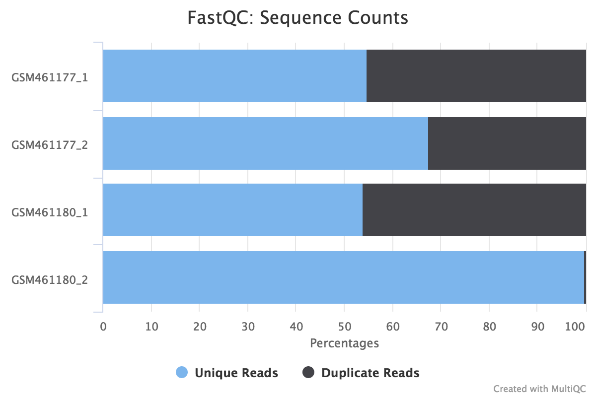
>    > >
>    > >    The "Per base sequence quality" is globally good with a slight decrease at the end of the sequences. For `GSM461180_2`, the decrease is quite large.
>    > >
>    > >    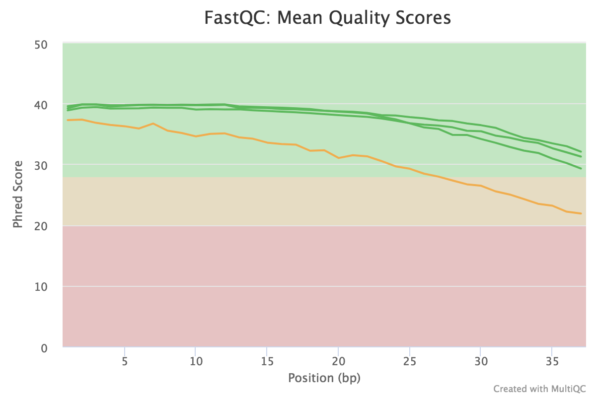
>    > >
>    > >    The mean quality score over the reads is quite high, but the distribution is slightly different for `GSM461180_2`
>    > >
>    > >    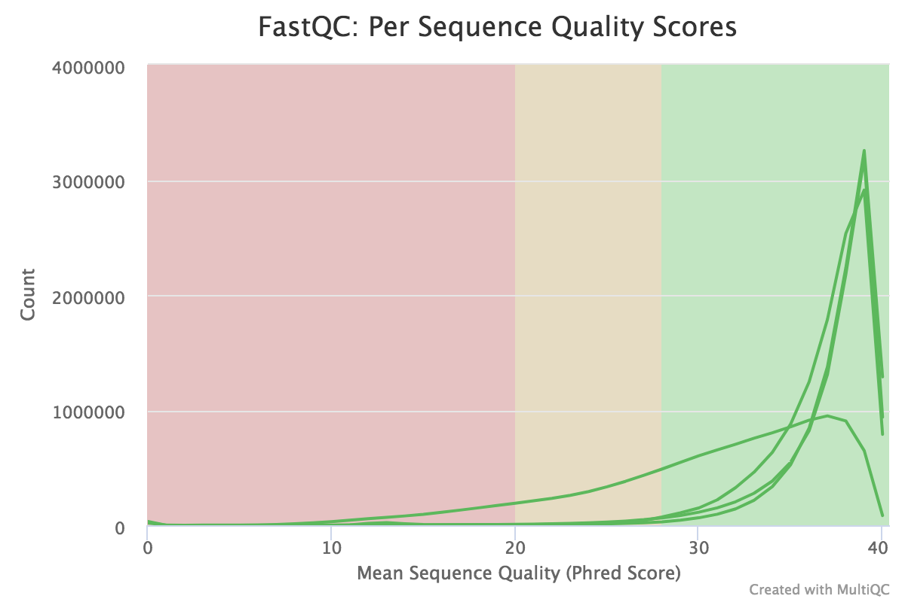
>    > >
>    > >    Reads are not really following a normal distribution of GC content, except `GSM461180_2`
>    > >
>    > >    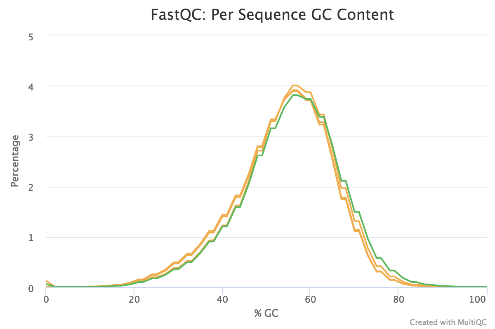
>    > >
>    > >    Few N in the reads
>    > >
>    > >    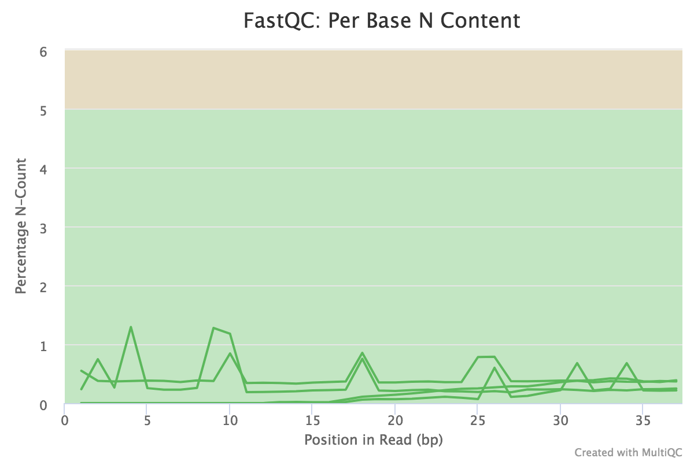
>    > >
>    > >    Duplicated sequences: >10 to >500
>    > >
>    > >    
>    > >
>    > >    Almost no known adapters and overrepresented sequences
>    > >
>    > > 2. If the quality of the reads is not good, we should:
>    > >    1. Check what is wrong and think about it: it may come from the type of sequencing or what we sequenced (high quantity of overrepresented sequences in transcriptomics data, biaised percentage of bases in HiC data)
>    > >    2. Ask the sequencing facility about it
>    > >    3. Perform some quality treatment (in a reasonable way to not lose too much information) with some trimming or removal of bad reads
>    > >
>    > {: .solution}
>    {: .question}
>
{: .hands_on}

We should trim the reads to get rid of bases that were sequenced with high uncertainty (i.e. low quality bases) at the read ends, and also remove the reads of overall bad quality.



> ###  Hands-on: Quality control
>
> 1. **Cutadapt**  with the following parameters to trim low quality sequences:
>    - *"Single-end or Paired-end reads?"*: `Paired-end`
>       -  *"FASTQ/A file #1"*: both `_1` fastqsanger datasets (multiple datasets)
>       -  *"FASTQ/A file #2"*: both `_2` fastqsanger datasets (multiple datasets)
>
>      The order is important here!
>
>    - In *"Filter Options"*
>       - *"Minimum length"*: `20`
>    - In *"Read Modification Options"*
>       - *"Quality cutoff"*: `20`
>    - In *"Output Options"*
>       - *"Report"*: `Yes`
>
>      
>
> 2. Inspect the generated txt files (`Report`)
>
>    > ###  Questions
>    >
>    > 1. How many basepairs has been removed from the forwards reads because of bad quality? And from the reverse reads?
>    > 2. How many sequence pairs have been removed because at least one read was shorter than the length cutoff?
>    >
>    > > ###  Solution
>    > > 1. For `GSM461177`, 5,072,810 bp has been trimmed for the forward reads (read 1) and 8,648,619 bp on the reverse (read 2) because of quality. For `GSM461180`, 10,224,537 bp on forward and 51,746,850 bp on the reverse. It is not a surprise: we saw that at the end of the reads the quality was dropping more for the reverse reads than for the forward reads, especially for `GSM461180`.
>    > > 2. 147,810 (1.4%) reads were too short for `GSM461177` and 1,101,875 (9%) for `GSM461180`.
>    > {: .solution }
>    {: .question}
{: .hands_on}

# Mapping

To make sense of the reads, we need to first figure out where the sequences originated from in the genome, so we can then determine to which genes they belong. When a reference genome for the organism is available, this process is known as aligning or "mapping" the reads to the reference. This is equivalent to solving a jigsaw puzzle, but unfortunately, not all pieces are unique.

> ###  Comment
>
> Do you want to learn more about the principles behind mapping? Follow our [training]().
{: .comment}

In this study, the authors used *Drosophila melanogaster* cells. We should then map the quality-controlled sequences to the reference genome of *Drosophila melanogaster*.



With eukaryotic transcriptomes most reads originate from processed mRNAs lacking introns:

: reads that mapped entirely within an exon (in red), reads spanning over 2 exons (in blue), read spanning over more than 2 exons (in purple)")

Therefore they cannot be simply mapped back to the genome as we normally do for DNA data. Spliced-awared mappers have been developed to efficiently map transcript-derived reads against a reference genome:

 identification of the reads spanning a single exon, (2) identification of the splicing junctions on the unmapped reads")

> ###  More details on the different spliced mappers
>
> Several spliced mappers have been developed over the past years to process the explosion of RNA-Seq data.
>
> [**TopHat**](https://ccb.jhu.edu/software/tophat/index.shtml) () was one of the first tools designed specifically to address this problem. In **TopHat** reads are mapped against the genome and are separated into two categories: (1) those that map, and (2) those that are initially unmapped (IUM). "Piles" of reads representing potential exons are extended in search of potential donor/acceptor splice sites and potential splice junctions are reconstructed. IUMs are then mapped to these junctions.
>
>    ")
>
> **TopHat** has been subsequently improved with the development of **TopHat2** ():
>
>    ")
>
> To further optimize and speed up spliced read alignment, [**HISAT2**](https://ccb.jhu.edu/software/hisat2/index.shtml) () was developed. It uses a hierarchical graph [FM](https://en.wikipedia.org/wiki/FM-index) (HGFM) index, representing the entire genome and eventual variants, together with overlapping local indexes (each spanning ~57 kb) that collectively cover the genome and its variants. This allows to find initial seed locations for potential read alignments in the genome using global index and to rapidly refine these alignments using a corresponding local index:
>
>    ")
>
> A part of the read (blue arrow) is first mapped to the genome using the global FM index. **HISAT2** then tries to extend the alignment directly utilizing the genome sequence (violet arrow). In (**a**) it succeeds and this read is aligned as it completely resides within an exon. In (**b**) the extension hits a mismatch. Now **HISAT2** takes advantage of the local FM index overlapping this location to find the appropriate mapping for the remainder of this read (green arrow). The (**c**) shows a combination these two strategies: the beginning of the read is mapped using global FM index (blue arrow), extended until it reaches the end of the exon (violet arrow), mapped using local FM index (green arrow) and extended again (violet arrow).
>
> [**STAR** aligner](https://github.com/alexdobin/STAR) () is a fast alternative for mapping RNA-Seq reads against a reference genome utilizing an uncompressed [suffix array](https://en.wikipedia.org/wiki/Suffix_array). It operates in two stages. In the first stage it performs a seed search:
>
>    ")
>
> Here a read is split between two consecutive exons. **STAR** starts to look for a maximum mappable prefix (MMP) from the beginning of the read until it can no longer match continuously. After this point it start to look for a MMP for the unmatched portion of the read (**a**). In the case of mismatches (**b**) and unalignable regions (**c**) MMPs serve as anchors from which to extend alignments.
>
> At the second stage **STAR** stitches MMPs to generate read-level alignments that (contrary to MMPs) can contain mismatches and indels. A scoring scheme is used to evaluate and prioritize stitching combinations and to evaluate reads that map to multiple locations. **STAR** is extremely fast but requires a substantial amount of RAM to run efficiently.
>
{: .details}

## Mapping

We will map our reads to the *Drosophila melanogaster* genome using **STAR** ().

> ###  Hands-on: Spliced mapping
>
> 1. Import the Ensembl gene annotation for *Drosophila melanogaster* (`Drosophila_melanogaster.BDGP6.87.gtf`) from the Shared Data library if available or from [Zenodo]({{ page.zenodo_link }}/files/Drosophila_melanogaster.BDGP6.87.gtf) into your current Galaxy history
>
>    ```
>    {{ page.zenodo_link }}/files/Drosophila_melanogaster.BDGP6.87.gtf
>    ```
>
>    1. Rename the dataset if necessary
>    2. Verify that the datatype is `gtf` and not `gff`, and that the database is `dm6`
>
>    > ###  How to get annotation file?
>    >
>    > Annotation files from model organisms may be available on the Shared Data library (the path to them will change from one Galaxy server to the other). You could also retrieve the annotation file from UCSC (using **UCSC Main** tool).
>    >
>    >
>    {: .comment}
>
> 2. **RNA STAR**  with the following parameters to map your reads on the reference genome:
>    - *"Single-end or paired-end reads"*: `Paired-end (as individual datasets)`
>       -  *"RNA-Seq FASTQ/FASTA file, forward reads"*: the `Read 1 Output` (outputs of **Cutadapt** )
>       -  *"RNA-Seq FASTQ/FASTA file, reverse reads"*: the `Read 2 Output` (outputs of **Cutadapt** )
>    - *"Custom or built-in reference genome"*: `Use a built-in index`
>       - *"Reference genome with or without an annotation"*: `use genome reference without builtin gene-model`
>           - *"Select reference genome"*: `Fly (Drosophila Melanogaster): dm6 Full`
>           -  *"Gene model (gff3,gtf) file for splice junctions"*: the imported `Drosophila_melanogaster.BDGP6.87.gtf`
>           - *"Length of the genomic sequence around annotated junctions"*: `36`
>
>               This parameter should be length of reads - 1
>
> 3. **MultiQC**  to aggregate the STAR logs:
>      - In *"Results"*
>        - *"Which tool was used generate logs?"*: `STAR`
>        - In *"STAR output"*
>           - *"Type of STAR output?"*: `Log`
>           -  *"STAR output"*: `log` files (output of **RNA STAR** )
>
>    > ###  Question
>    >
>    > 1. What percentage of reads mapped exactly once for both samples?
>    > 2. What are the other available statistics?
>    >
>    > > ###  Solution
>    > >
>    > > 1. More than 83% for GSM461177 and more than 79% for GSM461180. We can proceed with the analysis since only percentages below 70% should be investigated for potential contamination.
>    > > 2. We also have access to the number and percentage of reads that are mapped at several location, mapped at too many different location, not mapped because too short.
>    > >
>    > >    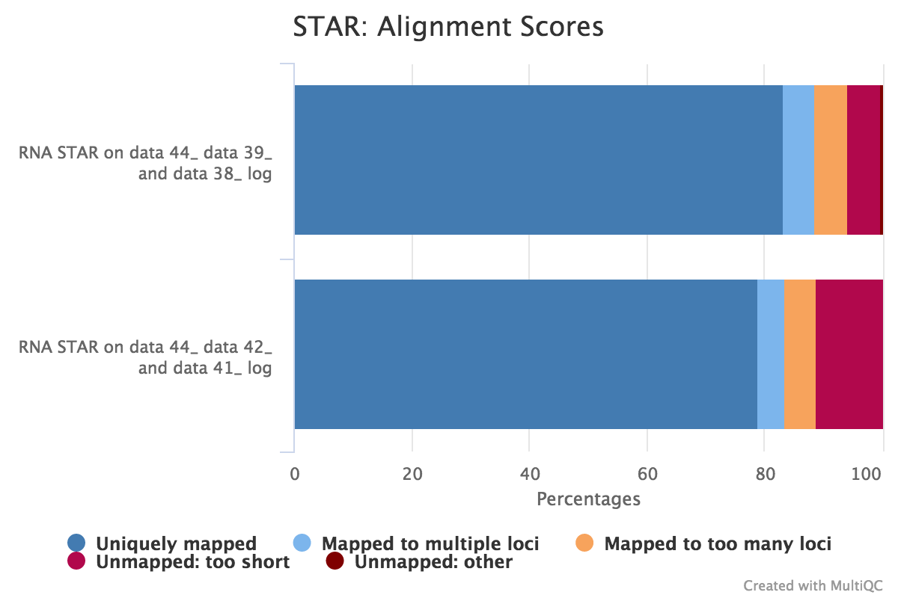
>    > >
>    > >    We could have been probably more strict in the minimal read length to avoid these unmapped reads because of length.
>    > {: .solution}
>    >
>    {: .question}
{: .hands_on}

According to the **MultiQC** report, more than 80% of reads for both samples are mapped exactly once to the reference genome. We can proceed with the analysis since only percentages below 70% should be investigated for potential contamination. Both samples have a low (less than 10%) percentage of reads that mapped to multiple locations on the reference genome. This is in the normal range for Illumina short-read sequencing, but may be lower for newer long-read sequencing datasets that can span larger repeated regions in the reference genome.

The main output of **STAR** is a BAM file.



## Inspection of the mapping results

The BAM file contains information for all our reads, making it difficult to inspect and explore in text format. A powerful tool to visualize the content of BAM files is the Integrative Genomics Viewer (**IGV**, ).

> ###  Hands-on: Inspection of mapping results
>
> 1. Install [IGV](https://software.broadinstitute.org/software/igv/download) (if not already installed)
> 2. Start IGV locally
> 3. Expand the  `mapped.bam` file (output of **RNA STAR** ) for `GSM461177`
> 4. Click on the `local` in `display with IGV local D. melanogaster (dm6)` to load the reads into the IGV browser
>
>    > ###  Comments
>    >
>    > In order for this step to work, you will need to have either IGV or [Java web start](https://www.java.com/en/download/faq/java_webstart.xml)
>    > installed on your machine. However, the questions in this section can also be answered by inspecting the IGV screenshots below.
>    >
>    > Check the [IGV documentation](https://software.broadinstitute.org/software/igv/AlignmentData) for more information.
>    >
>    {: .comment}
>
> 2. **IGV** : Zoom to `chr4:540,000-560,000` (Chromosome 4 between 540 kb to 560 kb)
>
>    > ###  Question
>    >
>    > 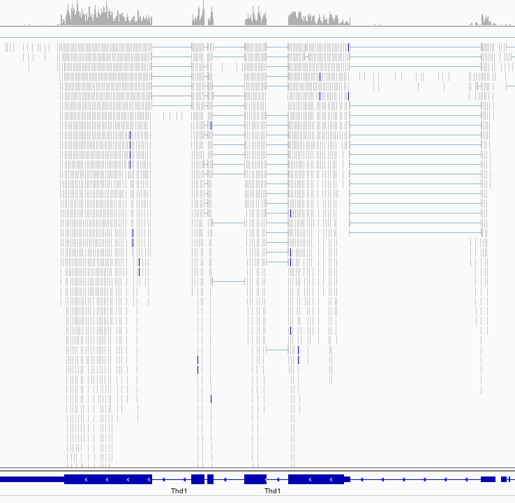
>    >
>    > 1. What information appears at the top as grey peaks?
>    > 2. What do the connecting lines between some of the aligned reads indicate?
>    >
>    > > ###  Solution
>    > >
>    > > 1. The coverage plot: the sum of mapped reads at each position
>    > > 2. They indicate junction events (or splice sites), *i.e.* reads that are mapped across an intron
>    > >
>    > {: .solution}
>    {: .question}
>
> 3. **IGV** : Inspect the splice junctions using a **Sashimi plot**
>
>    > ###  Creation of a Sashimi plot
>    >
>    > * Right click on the BAM file (in IGV)
>    > * Select **Sashimi Plot** from the menu
>    {: .comment}
>
>    > ###  Question
>    >
>    > 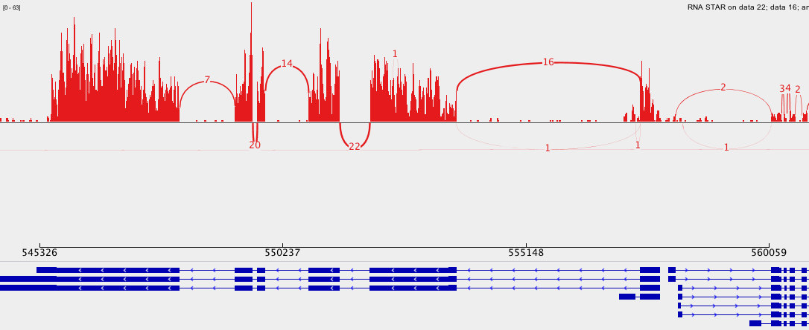
>    >
>    > 1. What does the vertical red bar graph represent? And the arcs with numbers?
>    > 2. What do the numbers on the arcs mean?
>    > 3. Why do we observe different stacked groups of blue linked boxes at the bottom?
>    >
>    > > ###  Solution
>    > >
>    > > 1. The coverage for each alignment track is plotted as a red bar graph. Arcs represent observed splice junctions, *i.e.*, reads spanning introns
>    > > 2. The numbers refer to the number of observed junction reads.
>    > > 3. The different groups of linked boxes on the bottom represent the different transcripts from the genes at this location, that are present in the GTF file.
>    > >
>    > {: .solution}
>    {: .question}
>
>    > ###  Comment
>    >
>    > Check the [IGV documentation on Sashimi plots](https://software.broadinstitute.org/software/igv/Sashimi) to find some clues
>    {: .comment}
>
{: .hands_on}

> ###  Further check for the quality of the data
>
> The quality of the data and mapping can be checked further, e.g. by inspecting read duplication level, number of reads mapped to each chromosome, gene body coverage, and read distribution across features.
>
> *These steps have been inspired by the ones provided in the [great "RNA-Seq reads to counts" tutorial]() and adapted to our datasets.*
>
> #### Duplicate reads
>
> In the FastQC report, we saw that some reads are duplicated:
>
> 
>
> Duplicate reads can come from highly-expressed genes, therefore they are usually kept in RNA-Seq differential expression analysis. But a high percentage of duplicates may indicate an issue, e.g. over amplification during PCR of low complexity library.
>
> **MarkDuplicates** from [Picard suite](http://broadinstitute.github.io/picard/) examines aligned records from a BAM file to locate duplicate reads, i.e. reads mapping to the same location (based on the start position of the mapping).
>
> > ###  Hands-on: Check duplicate reads
> >
> > 1. **MarkDuplicates** :
> >    -  *"Select SAM/BAM dataset or dataset collection"*: `mapped.bam` files (outputs of **RNA STAR** )
> >
> > 2. **MultiQC**  to aggregate the MarkDuplicates logs:
> >    - In *"Results"*
> >      - *"Which tool was used generate logs?"*: `Picard`
> >      - In *"Picard output"*
> >         - *"Type of Picard output?"*: `Markdups`
> >         -  *"Picard output"*: `MarkDuplicate metrics` files (output of **MarkDuplicates** )
> >
> >    > ###  Question
> >    >
> >    > What are the percentages of duplicate reads for each sample?
> >    >
> >    > > ###  Solution
> >    > > The sample `GSM461177` has 27.8% of duplicated reads while `GSM461180` has 25.9%.
> >    > {: .solution}
> >    {: .question}
> {: .hands_on}
>
> In general, up to 50% of duplication can be consider normal to obtain. So both our samples are good.
>
> #### Number of reads mapped to each chromosome
>
> To assess the sample quality (e.g. excess of mitochondrial contamination), check the sex of samples, or see if any chromosome have highly expressed genes, we can check the numbers of reads mapped to each chromosome using **IdxStats** from the **Samtools** suite.
>
> > ###  Hands-on: Check the number of reads mapped to each chromosome
> >
> > 1. **Samtools idxstats** :
> >    -  *"BAM file"*: `mapped.bam` files (outputs of **RNA STAR** )
> >
> > 2. **MultiQC**  to aggregate the idxstats logs:
> >    - In *"Results"*
> >      - *"Which tool was used generate logs?"*: `Samtools`
> >      - In *"Samtools output"*
> >         - *"Type of Samtools output?"*: `idxstats`
> >         -  *"Samtools output"*: `Samtools idxstats` files
> >
> >    > ###  Questions
> >    >
> >    > 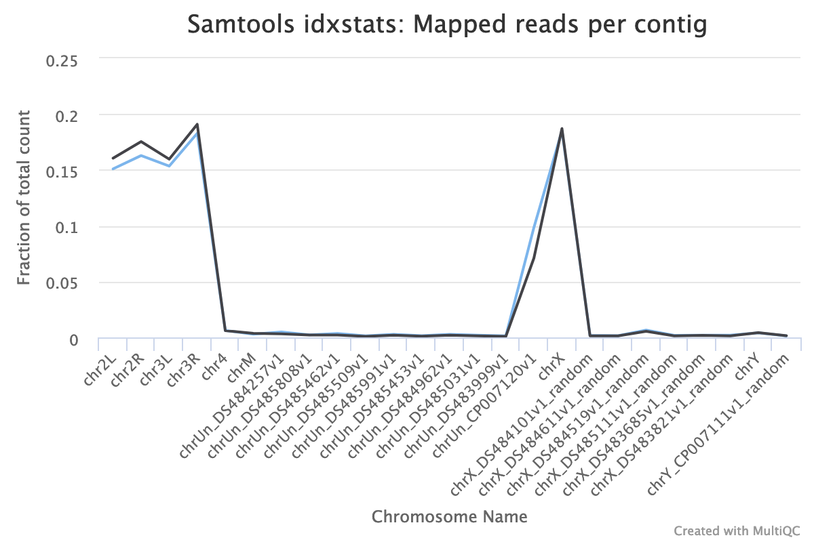
> >    >
> >    > 1. How many chromosomes does the *Drosophila* genome have?
> >    > 2. Where did the reads mostly map?
> >    > 3. Can we determine the sex of the sample?
> >    >
> >    > > ###  Solution
> >    > > 1. The genome of *Drosophila* has 4 pairs of chromosomes: X/Y, 2, 3, and 4.
> >    > > 2. The reads mapped mostly to chromosome 2 (chr2L and chr2R), 3 (chr3L and chr3R) and X. Only some reads mapped to chromosome 4, which is expected given this chromosome is very small.
> >    > > 3. From the percentage of X+Y reads, most of the reads map to X and only few to Y. So only few genes may be on Y. So the samples are probably both female.
> >    > >
> >    > >    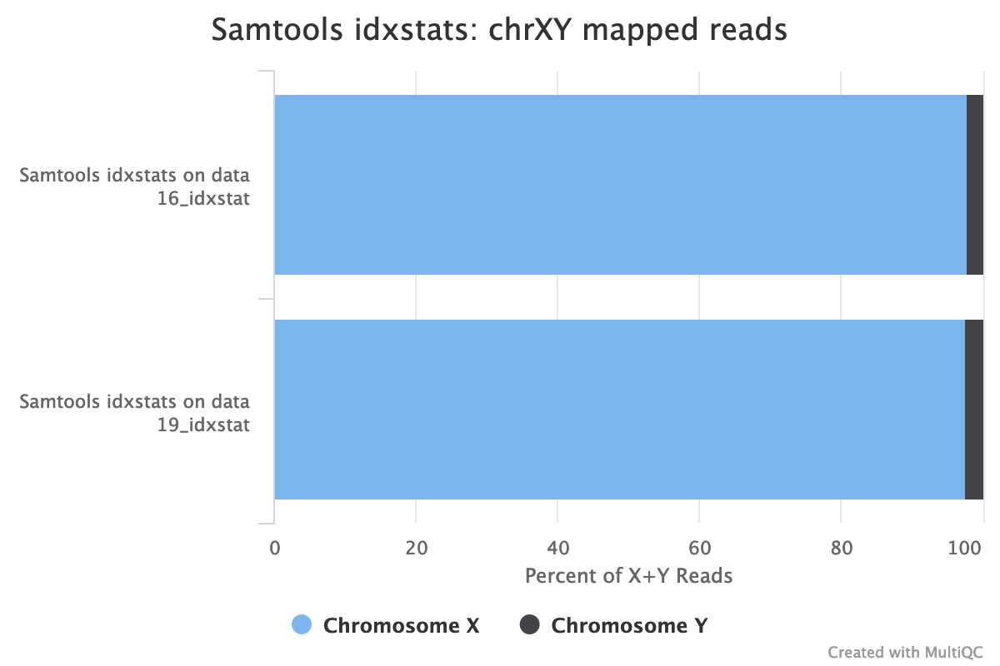
> >    > {: .solution}
> >    {: .question}
> {: .hands_on}
>
> #### Gene body coverage
>
> The gene body is the different regions of a gene. It is important to check if reads coverage is uniform over gene body or if there is any 5'/3' bias. For example, a bias towards the 5' end of genes could indicate degradation of the RNA. Alternatively, a 3' bias could indicate that the data is from a 3' assay. To assess this, we can use the **Gene Body Coverage** tool from the RSeQC () tool suite. This tool scales all transcripts to 100 nucleotides (using a provided annotation file) and calculates the number of reads covering each nucleotide position.
>
> > ###  Hands-on: Check gene body coverage
> >
> > 1. **Convert GTF to BED12**  to convert the GTF file to BED:
> >    -  *"GTF File to convert"*: `Drosophila_melanogaster.BDGP6.87.gtf`
> >
> > 2. **Gene Body Coverage (BAM)** :
> >    - *"Run each sample separately, or combine mutiple samples into one plot"*: `Run each sample separately`
> >      -  *"Input .bam file"*: `mapped.bam` files (outputs of **RNA STAR** )
> >    - *"Reference gene model"*: BED12 file (output **Convert GTF to BED12** )
> >
> > 3. **MultiQC**  to aggregate the idxstats logs:
> >    - In *"Results"*
> >      - *"Which tool was used generate logs?"*: `RSeQC`
> >      - In *"RSeQC output"*
> >         - *"Type of RSeQC output?"*: `gene_body_coverage`
> >         -  *"RSeQC gene_body_coverage output"*: `(text)` files (outputs of **Gene Body Coverage (BAM)** )
> >
> >    > ###  Question
> >    >
> >    > 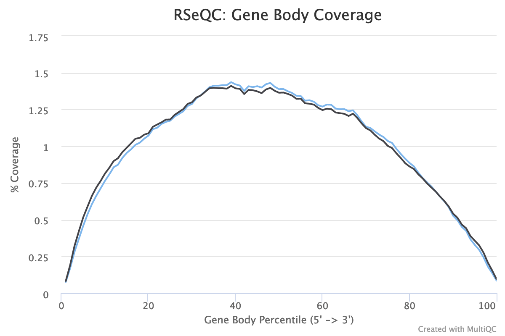
> >    >
> >    > How are the coverage across gene bodies? Are the samples biased in 3' or 5'?
> >    >
> >    > > ###  Solution
> >    > >
> >    > > For both samples there is a pretty even coverage from 5' to 3' ends (despite some noise in the middle). So no obvious bias in both samples.
> >    > {: .solution}
> >    {: .question}
> {: .hands_on}
>
> #### Read distribution across features
>
> With RNA-Seq data, we expect most reads to map to exons rather than introns or intergenic regions. Before going further in counting and differential expression analysis, it may be interesting to check the distribution of reads across known gene features (exons, CDS, 5' UTR, 3' UTR, introns, intergenic regions). For example, a high number of reads mapping to intergenic regions may indicate the presence of DNA contamination.
>
> Here we will use the **Read Distribution** tool from the RSeQC () tool suite, which uses the annotation file to identify the position of the different gene features.
>
> > ###  Hands-on: Check the number of reads mapped to each chromosome
> >
> > 1. **Read Distribution** :
> >    -  *"Input .bam/.sam file"*: `mapped.bam` files (outputs of **RNA STAR** )
> >    - *"Reference gene model"*: BED12 file (output **Convert GTF to BED12** )
> >
> > 2. **MultiQC**  to aggregate the idxstats logs:
> >    - In *"Results"*
> >      - *"Which tool was used generate logs?"*: `RSeQC`
> >      - In *"RSeQC output"*
> >         - *"Type of RSeQC output?"*: `read_distribution`
> >         -  *"RSeQC read_distribution output"*: outputs of **Read Distribution** )
> >
> >    > ###  Question
> >    >
> >    > 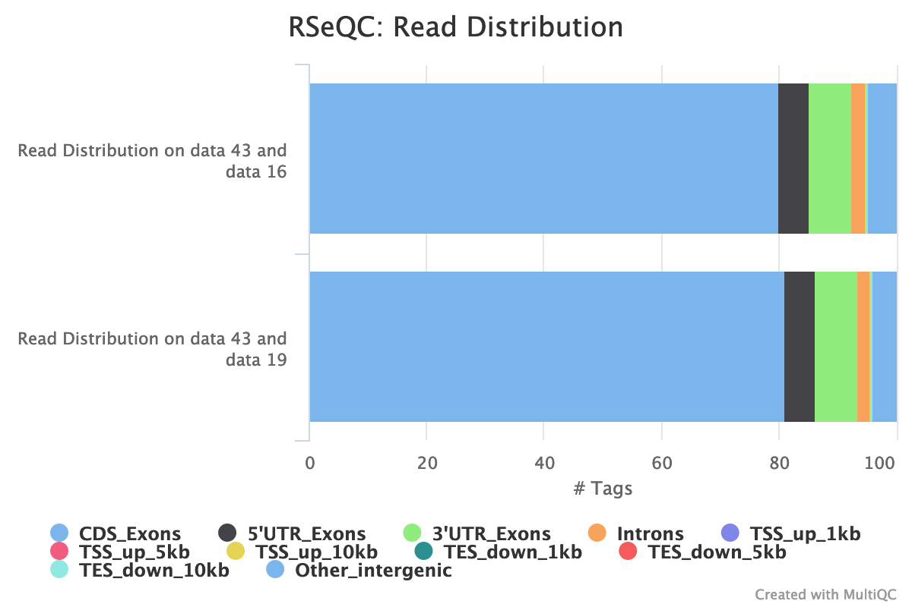
> >    >
> >    > What do you think of the read distribution?
> >    >
> >    > > ###  Solution
> >    > >
> >    > > Most of the reads are mapped to exons (>80%), only ~2% to introns and ~5% to intergenic regions. It confirms that our data are RNA-Seq data and that mapping worked.
> >    > {: .solution}
> >    {: .question}
> {: .hands_on}
>
> Now that we have checked the results of the read mapping, we can proceed to the next phase of the analysis.
{: .details}

After the mapping, we have now the information on where the reads are located on the reference genome and how well they were mapped. The next step in RNA-Seq data analysis is quantification of the number of reads mapped to genomic features (genes, transcripts, exons, ...).

> ###  Comment
>
> The quantification depends on both the reference genome (the FASTA file) and its associated annotations (the GTF file). It is extremely important to use an annotation file that corresponds to the same version of the reference genome you used for the mapping (e.g. `dm6` here), as the chromosomal coordinates of genes are usually different amongst different reference genome versions.
{: .comment}

Here we will focus on the genes as we would like to identify the ones that are differentially expressed because of the Pasilla gene knockdown.

# Counting the number of reads per annotated gene

To compare the expression of single genes between different conditions (*e.g.* with or without PS depletion), an essential first step is to quantify the number of reads per gene, or more specifically the number of reads mapping to the exons of each gene.


> ###  Question
>
> In the previous image,
>
> 1. How many reads are found for the different exons?
> 2. How many reads are found for the different genes?
>
> > ###  Solution
> >
> > 1. Number of reads per exons
> >
> >     Exon | Number of reads
> >     --- | ---
> >     gene1 - exon1 | 3
> >     gene1 - exon2 | 2
> >     gene2 - exon1 | 3
> >     gene2 - exon2 | 4
> >     gene2 - exon3 | 3
> >
> > 2. The gene1 has 4 reads, not 5 (gene1 - exon1 + gene1 - exon2) because of the splicing of the last read. Gene2: 6 (3 spliced reads)
> {: .solution}
{: .question}

Two main tools could be used for that: [**HTSeq-count**](http://htseq.readthedocs.io/en/release_0.9.1/count.html) () or **featureCounts** (). **featureCounts** is considerably faster and requires far less computational resources, so we will use it here.

In principle, the counting of reads overlapping with genomic features is a fairly simple task. But there are some details that need to be given to **featureCounts**, e.g. the strandness.

## Estimation of the strandness

RNAs that are typically targeted in RNA-Seq experiments are single stranded (*e.g.*, mRNAs) and thus have polarity (5' and 3' ends that are functionally distinct). During a typical RNA-Seq experiment the information about strandness is lost after both strands of cDNA are synthesized, size selected, and converted into a sequencing library. However, this information can be quite useful for the read counting step, especially for reads located on the overlap of 2 genes that are on different strands.

 or gene2 (reverse strand) depending if the strandness information is conserved.")

Some library preparation protocols create so called *stranded* RNA-Seq libraries that preserve the strand information (an excellent overview in ). In practice, with Illumina paired-end RNA-Seq protocols you are unlikely to encounter many of these possibilities. You will most likely deal with either:

- Unstranded RNA-Seq data
- Stranded RNA-Seq data generated by the use of specialized RNA isolation kits during sample preparation

> ###  More details about strandness
>
> 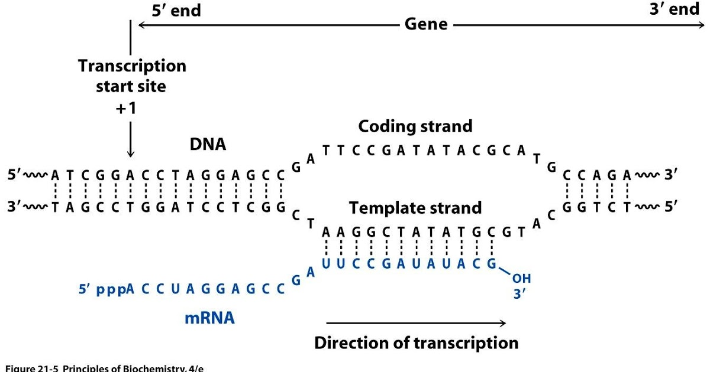
>
> The implication of stranded RNA-Seq is that you can distinguish whether the reads are derived from forward or reverse-encoded transcripts:
>
> ")
>
> Depending on the approach, and whether one performs single-end or paired-end sequencing, there are multiple possibilities on how to interpret the results of the mapping of these reads to the genome:
>
> ")
{: .details}

This information should be provided with your FASTQ files, ask your sequencing facility! If not, try to find it on the site where you downloaded the data or in the corresponding publication.

Another option is to estimate these parameters with a tool called **Infer Experiment** from the RSeQC () tool suite. This tool takes the BAM files from the mapping, selects a subsample of the reads and compares their genome coordinates and strands with those of the reference gene model (from an annotation file). Based on the strand of the genes, it can gauge whether sequencing is strand-specific, and if so, how reads are stranded (forward or reverse):

. With stranded reverse library, reads map mostly on genes on the reverse strand (here gene2). With unstranded library, reads maps on genes on both strands.")

> ###  Hands-on: Determining the library strandness
>
> 1. **Convert GTF to BED12**  to convert the GTF file to BED:
>    -  *"GTF File to convert"*: `Drosophila_melanogaster.BDGP6.87.gtf`
>
> 2. **Infer Experiment**  to determine the library strandness with:
>    -  *"Input .bam file"*: `mapped.bam` files (outputs of **RNA STAR** )
>    -  *"Reference gene model"*: BED12 file (output **Convert GTF to BED12** )
>    - *"Number of reads sampled from SAM/BAM file (default = 200000)"*: `200000`
>
{: .hands_on}

**Infer Experiment**  tool generates one file with information on:

- Paired-end or single-end library
- Fraction of reads failed to determine
- 2 lines
    - For single-end
        - `Fraction of reads explained by "++,--"`: the fraction of reads that assigned to forward strand
        - `Fraction of reads explained by "+-,-+"`: the fraction of reads that assigned to reverse strand
    - For paired-end
        - `Fraction of reads explained by "1++,1--,2+-,2-+"`: the fraction of reads that assigned to forward strand
        - `Fraction of reads explained by "1+-,1-+,2++,2--"`: the fraction of reads that assigned to reverse strand

If the two "Fraction of reads explained by" numbers are close to each other, we conclude that the library is not a strand-specific dataset (or unstranded).

> ###  Question
>
> 1. What are the "Fraction of the reads explained by" results for `GSM461177`?
> 2. Do you think the library type of the 2 samples is stranded or unstranded?
>
> > ###  Solution
> >
> > 1. Results for `GSM46177`:
> >
> >    ```
> >    This is PairEnd Data
> >    Fraction of reads failed to determine: 0.0963
> >    Fraction of reads explained by "1++,1--,2+-,2-+": 0.4649
> >    Fraction of reads explained by "1+-,1-+,2++,2--": 0.4388
> >    ```
> >
> >    so 46.46% of the reads are assigned to the forward strand and 43.88% to the reverse strand.
> >
> > 2. Similar statistics are found for `GSM461180`, so the library seems to be of the type unstranded for both samples.
> {: .solution}
{: .question}

> ###  Strandness and software settings
> As it is sometimes quite difficult to find out which settings correspond to those of other programs, the following table might be helpful to identify the library type:
>
> Library type | **Infer Experiment** | **TopHat** | **HISAT2** | **HTSeq-count** | **featureCounts**
> --- | --- | --- | --- | --- | ---
> Paired-End (PE) - SF | 1++,1--,2+-,2-+ | FR Second Strand | Second Strand F/FR | yes | Forward (1)
> PE - SR | 1+-,1-+,2++,2-- | FR First Strand | First Strand R/RF | reverse | Reverse (2)
> Single-End (SE) - SF | ++,-- | FR Second Strand | Second Strand F/FR | yes | Forward (1)
> SE - SR | +-,-+ | FR First Strand | First Strand R/RF | reverse | Reverse (2)
> PE, SE - U | undecided | FR Unstranded | default | no | Unstranded (0)
>
{: .details}

## Counting reads per genes

We now run **featureCounts** to count the number of reads per annotated gene.

> ###  Hands-on: Counting the number of reads per annotated gene
>
> 1. **featureCounts**  to count the number of reads per gene:
>    -  *"Alignment file"*: `mapped.bam` files (outputs of **RNA STAR** )
>    - *"Specify strand information"*: `Unstranded`
>    - *"Gene annotation file"*: `in your history`
>       -  *"Gene annotation file"*: `Drosophila_melanogaster.BDGP6.87.gtf`
>    - *"Output format"*: `Gene-ID "\t" read-count (MultiQC/DESeq2/edgeR/limma-voom compatible)`
>    - *"Create gene-length file"*: `Yes`
>    - In *"Options for paired-end reads"*:
>       - *"Count fragments instead of reads"*: `Enabled; fragments (or templates) will be counted instead of reads`
>    - In *"Advanced options"*:
>       - *"GFF feature type filter"*: `exon`
>       - *"GFF gene identifier"*: `gene_id`
>       - *"Allow read to contribute to multiple features"*: `No`
>       - *"Count multi-mapping reads/fragments"*: `Disabled; multi-mapping reads are excluded (default)`
>       - *"Minimum mapping quality per read"*: `10`
>
> 2. **MultiQC**  to aggregate the report:
>     - In *"Results"*:
>       - *"Which tool was used generate logs?"*: `featureCounts`
>           -  *"Output of FeatureCounts"*: `summary` files (outputs of **featureCounts** )
>
>    > ###  Question
>    >
>    > 1. How many reads have been assigned to a gene?
>    > 2. When should we be worried about the assignment rate? What should we do?
>    >
>    > > ###  Solution
>    > >
>    > > 1. Around 70% of the reads have been assigned to genes: this quantity is good enough.
>    > >
>    > >    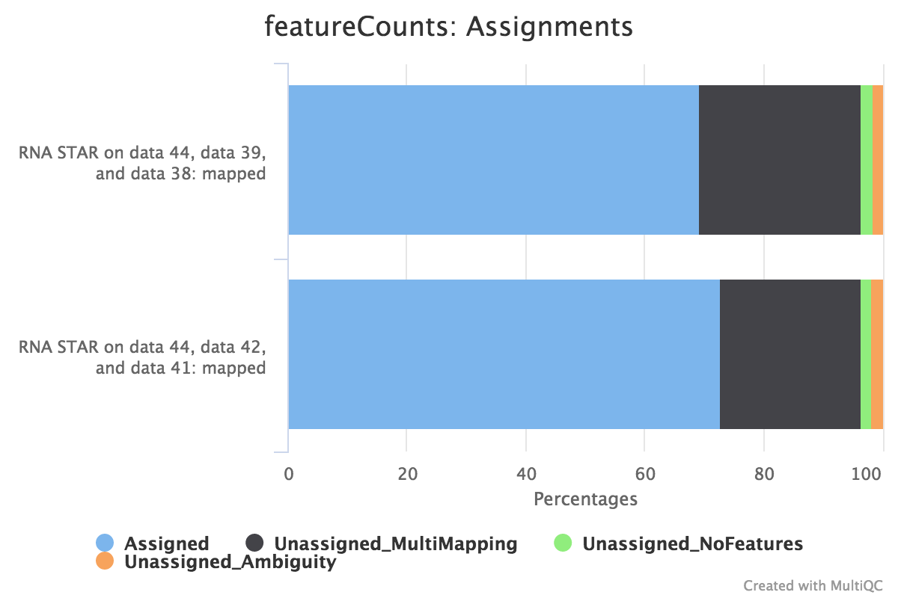
>    > >
>    > >    Some reads are not assigned because multi-mapped and other assigned to no features or ambiguous ones.
>    > >
>    > > 2. If the percentage is below 50%, you should investigate where your reads are mapping (inside genes or not, with IGV) and check that the annotation corresponds to the correct reference genome version.
>    > >
>    > {: .solution}
>    {: .question}
>
{: .hands_on}

The main output of **featureCounts** is a table with the counts, i.e. the number of reads (or fragments in the case of paired-end reads) mapped to each gene (in rows, with their ID in the first column) in the provided annotation. **FeatureCount** generates also the **feature length** output datasets. We will need this file later on when we will run the **goseq** tool.

> ###  Question
>
> Which feature has the most counts for both samples? (Hint: Use the Sort tool)
>
> > ###  Solution
> >
> > To display the most abundantly detected feature, we need to sort the table of counts. This can be done using the **Sort**  tool:
> >    -  *"Sort Query"*: count file, output of by **featureCounts**
> >    - *"Number of header"*: `1`
> >    - In *"1: Column selections"*:
> >      - *"on column"*: `2`
> >
> >        This column contains the number of reads = counts
> >
> >      - *"in"*: `Descending order`
> >
> >    The result of sorting the table on column 2 reveals that FBgn0000556 is the feature with the most counts (around 128,741 in `GSM461177` and 127,416 in `GSM461180`).
> >
> >    Comparing different output files is easier if we can view more than one dataset simultaneously. The Scratchbook function allows us to build up a collection of datasets that will be shown on the screen together.
> >
> >    > ###  (Optional) View the sorted featureCounts using the Scratchbook
> >    >
> >    > 1. The **Scratchbook** is enabled by clicking the nine-blocks icon seen on the right of the Galaxy top menubar:
> >    >
> >    >    
> >    >
> >    > 2. When the Scratchbook is **enabled** datasets being viewed (by clicking the eye-icon) are added to the Scratchbook view:
> >    >
> >    >    
> >    >
> >    > 3. Click the  (eye) icon to view one of the **sorted featureCounts** files. Instead of occupying the entire middle bar the dataset view is now shown an overlay:
> >    >
> >    >    
> >    >
> >    > 4. When a dataset is shown **click in the main interface** to prepare to select another dataset. The interface now shows that there is one saved view in the Scratchbook:
> >    >
> >    >    
> >    >
> >    > 5. Next click the  (eye) icon on the **second sorted featureCounts** file. The two datasets can now be seen side by side:
> >    >
> >    >    
> >    >
> >    > 6. To **leave** Scratchbook selection mode, click on the **Scratchbook icon** again. Your saved view will still remain for future viewing:
> >    >
> >    >    
> >    >
> >    {: .hands_on}
> >
> {: .solution}
{: .question}

Here we counted reads mapped to genes for two samples. It is really interesting to redo the same procedure on the other datasets, especially to check how parameters differ given the different type of data (single-end versus paired-end).

> ###  (Optional) Hands-on: Re-run on the other datasets
>
> You can do the same process on the other sequence files available on [Zenodo]({{ page.zenodo_link }}) and on the data library
>
> - Paired-end data
>     - `GSM461178_1` and `GSM461178_2`
>     - `GSM461181_1` and `GSM461181_2`
> - Single-end data
>     - `GSM461176`
>     - `GSM461179`
>     - `GSM461182`
>
> The links to these files are below:
>
> ```
> {{ page.zenodo_link }}/files/GSM461178_1.fastqsanger
> {{ page.zenodo_link }}/files/GSM461178_2.fastqsanger
> {{ page.zenodo_link }}/files/GSM461181_1.fastqsanger
> {{ page.zenodo_link }}/files/GSM461181_2.fastqsanger
> {{ page.zenodo_link }}/files/GSM461176.fastqsanger
> {{ page.zenodo_link }}/files/GSM461179.fastqsanger
> {{ page.zenodo_link }}/files/GSM461182.fastqsanger
> ```
>
{: .hands_on}

# Analysis of the differential gene expression

## Identification of the differentially expressed features

To be able to identify differential gene expression induced by PS depletion, all datasets (3 treated and 4 untreated) must be analyzed following the same procedure. To save time, we have run the previous steps for you. We then obtain 7 files with the counts for each gene of *Drosophila* for each sample.

> ###  Hands-on: Import all count files
>
> 1. Create a new empty history
> 2. Import the seven count files from [Zenodo]({{ page.zenodo_link }}) or the Shared Data library:
>
>    - `GSM461176_untreat_single.counts`
>    - `GSM461177_untreat_paired.counts`
>    - `GSM461178_untreat_paired.counts`
>    - `GSM461179_treat_single.counts`
>    - `GSM461180_treat_paired.counts`
>    - `GSM461181_treat_paired.counts`
>    - `GSM461182_untreat_single.counts`
>
>    ```
>    {{ page.zenodo_link }}/files/GSM461176_untreat_single.counts
>    {{ page.zenodo_link }}/files/GSM461177_untreat_paired.counts
>    {{ page.zenodo_link }}/files/GSM461178_untreat_paired.counts
>    {{ page.zenodo_link }}/files/GSM461179_treat_single.counts
>    {{ page.zenodo_link }}/files/GSM461180_treat_paired.counts
>    {{ page.zenodo_link }}/files/GSM461181_treat_paired.counts
>    {{ page.zenodo_link }}/files/GSM461182_untreat_single.counts
>    ```
>
> 3. Rename the datasets
{: .hands_on}

We could compare the files directly and calculate the extent of differential gene expression. But it is not so simple.

Let's imagine we have RNA-Seq counts from 3 samples for a genome with 4 genes:

Gene | Sample 1 Counts | Sample 2 Counts | Sample 3 Counts
--- | --- | --- | ---
A (2kb) | 10 | 12 | 30
B (4kb) | 20 | 25 | 60
C (1kb) | 5 | 8 | 15
D (10kb) | 0 | 0 | 1

Sample 3 has more reads than the other replicates, regardless of the gene. It has a higher sequencing depth than the other replicates. Gene B is twice as long as gene A: it might explain why it has twice as many reads, regardless of replicates

The number of sequenced reads mapped to a gene depends then on:

- The **sequencing depth** of the samples

    Samples sequenced with more depth will have more reads mapping to each genes

- The **length of the gene**

    Longer genes will have more reads mapping to them

To compare samples or gene expressions, the gene counts need to be normalized. We could use TPM (Transcripts Per Kilobase Million).

> ###  RPKM, FPKM and TPM?
>
> These three metrics are used to normalize count tables for:
> - sequencing depth (the "Million" part)
> - gene length (the "Kilobase" part)
>
> Let's use the previous example to explain RPK, FPKM and TPM.
>
> For **RPKM** (Reads Per Kilobase Million),
> 1. Compute the "per million" scaling factor: sum up the total reads in a sample and divide that number by 1,000,000
>
>    Gene | Sample 1 Counts | Sample 2 Counts | Sample 3 Counts
>    --- | --- | --- | ---
>    A (2kb) | 10 | 12 | 30
>    B (4kb) | 20 | 25 | 60
>    C (1kb) | 5 | 8 | 15
>    D (10kb) | 0 | 0 | 1
>    **Total reads** | 35 | 45 | 106
>    **Scaling factor** | 3.5 | 4.5 | 10.6
>
>    *Because of the small values in the example, we are scoring using a factor of 10.*
>
> 2. Divide the read counts by the "per million" scaling factor
>
>    This normalizes for sequencing depth, giving reads per million (RPM)
>
>    Gene | Sample 1 RPM | Sample 2 RPM | Sample 3 RPM
>    --- | --- | --- | ---
>    A (2kb) | 2.86 | 2.67 | 2.83
>    B (4kb) | 5.71 | 5.56 | 5.66
>    C (1kb) | 1.43 | 1.78 | 1.43
>    D (10kb) | 0 | 0 | 0.09
>
> 3. Divide the RPM values by the length of the gene, in kilobases
>
>    Gene | Sample 1 RPKM | Sample 2 RPKM | Sample 3 RPKM
>    --- | --- | --- | ---
>    A (2kb) | 1.43 | 1.33 | 1.42
>    B (4kb) | 1.43 | 1.39 | 1.42
>    C (1kb) | 1.43 | 1.78 | 1.42
>    D (10kb) | 0 | 0 | 0.009
>
> **FPKM** (Fragments Per Kilobase Million) is very similar to RPKM. RPKM is for single-end RNA-seq and FPKM for paired-end RNA-seq. With single-end, every read corresponds to a single fragment that was sequenced. With paired-end RNA-seq, two reads of a pair are mapped from a single fragment, or if one read in the pair did not map, one read can correspond to a single fragment (in case we decided to keep these). FPKM keeps tracks of fragments so that one fragment with 2 reads is counted only once.
>
>
> **TPM** (Transcripts Per Kilobase Million) is very similar to RPKM and FPKM, except the order of the operation
>
> 1. Divide the read counts by the length of each gene in kilobases
>
>    This gives the reads per kilobase (RPK).
>
>    Gene | Sample 1 RPK | Sample 2 RPK | Sample 3 RPK
>    --- | --- | --- | ---
>    A (2kb) | 5 | 6 | 15
>    B (4kb) | 5 | 6.25 | 15
>    C (1kb) | 5 | 8 | 15
>    D (10kb) | 0 | 0 | 0.1
>
> 2. Compute the "per million" scaling factor: sum up all the RPK values in a sample and divide this number by 1,000,000
>
>    Gene | Sample 1 RPK | Sample 2 RPK | Sample 3 RPK
>    --- | --- | --- | ---
>    A (2kb) | 5 | 6 | 15
>    B (4kb) | 5 | 6.25 | 15
>    C (1kb) | 5 | 8 | 15
>    D (10kb) | 0 | 0 | 0.1
>    **Total RPK** | 15 | 20.25 | 45.1
>    **Scaling factor** | 1.5 | 2.03 | 4.51
>
>    *As above, because of the small values in the example, we are scoring using a factor of 10.*
>
> 3. Divide the RPK values by the "per million" scaling factor
>
>    Gene | Sample 1 TPM | Sample 2 TPM | Sample 3 TPM
>    --- | --- | --- | ---
>    A (2kb) | 3.33 | 2.96 | 3.33
>    B (4kb) | 3.33 | 3.09 | 3.33
>    C (1kb) | 3.33 | 3.95 | 3.33
>    D (10kb) | 0 | 0 | 0.1
>
>
> Contrary to RPKM and FPKM, when calculating TPM, we normalize for gene length first, and then normalize for sequencing depth second. However, the effects of this difference are quite profound, as we could already see with the example.
>
> The sums of each colum are very different:
>
>    Gene | Sample 1 RPKM | Sample 2 RPKM | Sample 3 RPKM
>    --- | --- | --- | ---
>    A (2kb) | 1.43 | 1.33 | 1.42
>    B (4kb) | 1.43 | 1.39 | 1.42
>    C (1kb) | 1.43 | 1.78 | 1.42
>    D (10kb) | 0 | 0 | 0.009
>    **Total** | 4.29 | 4.5 | 4.25
>
>    Gene | Sample 1 TPM | Sample 2 TPM | Sample 3 TPM
>    --- | --- | --- | ---
>    A (2kb) | 3.33 | 2.96 | 3.33
>    B (4kb) | 3.33 | 3.09 | 3.33
>    C (1kb) | 3.33 | 3.95 | 3.33
>    D (10kb) | 0 | 0 | 0.1
>    **Total** | 10 | 10 | 10
>
> The sum of all TPMs in each sample are the same. This makes it easier to compare the proportion of reads that mapped to a gene in each sample. In contrast, with RPKM and FPKM, the sum of the normalized reads in each sample may be different, and this makes it harder to compare samples directly.
>
> In the example, TPM for gene A in Sample 1 is 3.33 and in sample 2 is 3.33. The same proportion of total reads maps then to gene A in both samples (0.33 here). Indeed, the sum of the TPMs in both samples adds up to the same number (10 here), the denominator required to calculate the proportions is then the same regardless of the sample, and so the proportion of reads for gene A (3.33/10 = 0.33) for both sample.
>
> With RPKM or FPKM, it is harder to compare the proportion of total reads because the sum of normalized reads in each sample can be different (4.29 for Sample 1 and 4.25 for Sample 2). Thus, if RPKM for gene A in Sample 1 is 1.43 and in Sample B is 1.43, we do not know if the same proportion of reads in Sample 1 mapped to gene A as in Sample 2.
>
> Since RNA-Seq is all about comparing relative proportion of reads, TPM seems more appropriate than RPKM/FPKM.
{: .details}

RNA-Seq is often used to compare one tissue type to another. For example, muscle vs epithelial tissue. And it could be that there are a lot of muscle specific genes transcribed in muscle but not in the epithelial tissue. We call that a **difference in library composition**.

It is also possible to see a difference in library composition in the same tissue type after the knock out of a transcription factor.

Let's imagine we have RNA-Seq counts from 2 samples (same library size: 635 reads), for a genome with 6 genes. The genes have the same expression in both sample, except one: only Sample 1 transcribe gene D, at a high level (563 reads). This means that the 563 reads used by D in Sample 1 will be distributed to other genes in Sample 2.

Gene | Sample 1 | Sample 2
--- | --- | --- | ---
A | 30 | 235
B | 24 | 188
C | 0 | 0
D | 563 | 0
E | 5 | 39
F | 13 | 102
**Total** | 635 | 635

The read count for all genes except for gene C and D is really high in Sample 2. But the only differentially expressed gene is gene D.

TPM, RPKM or FPKM do not deal with these differences in library composition in normalization, but more complex tools, like DESeq2, do.

[**DESeq2**](https://bioconductor.org/packages/release/bioc/html/DESeq2.html) () is a great tool for dealing with RNA-seq data and running Differential Gene Expression (DGE) analysis. It takes read count files from different samples, combines them into a big table (with genes in the rows and samples in the columns) and applies normalization for **sequencing depth** and **library composition**. Gene length normalization does not need to be accounted for because we are comparing the counts between sample groups for the same gene.

> ###  Normalization in DESeq2
>
> Let's take an example to illustrate how DESeq2 scales the different samples:
>
> Gene | Sample 1 | Sample 2 | Sample 3
> A | 0 | 10 | 4
> B | 2 | 6 | 12
> C | 33 | 55 | 200
>
> The goal is to calculate a scaling factor for each sample, that takes read depth and library composition into account.
>
> 1. Take the log$$_e$$ of all the values
>
>     Gene | log(Sample 1) | log(Sample 2) | log(Sample 3)
>     A | -Inf | 2.3 | 1.4
>     B | 0.7 | 1.8 | 2.5
>     C | 3.5 | 4.0 | 5.3
>
> 2. Average each row
>
>     Gene | Average of log values
>     A | -Inf
>     B | 1.7
>     C | 4.3
>
>     Average of log values (also call geometric average) is used here because it is not easily impacted by outliers (e.g. gene C with its outlier for Sample 3)
>
> 3. Filter out genes with infinity
>
>     Gene | Average of log values
>      |
>     B | 1.7
>     C | 4.3
>
>     It filters out genes with no read counts in at least 1 sample, e.g. genes only transcribed in one tissue as gene D in the previous example. It helps to focus the scaling factors on genes transcribed at similar levels regardless of the condition.
>
> 4. Substract the average log value from the log counts
>
>     Gene | log(Sample 1) | log(Sample 2) | log(Sample 3)
>      |  |  |
>     B | -1.0 | 0.1 | 0.8
>     C | -0.8 | -0.3 | 1.0
>
>     $$log(\textrm{counts for gene X}) - average(\textrm{log values for counts for gene X}) = log(\frac{\textrm{counts for gene X}}{\textrm{average for gene X}})$$
>
>     This step compares the ratio of the counts in each sample to the average across all samples.
>
> 5. Calculate the median of the ratios for each sample
>
>     Gene | log(Sample 1) | log(Sample 2) | log(Sample 3)
>      |  |  |
>     B | -1.0 | 0.1 | 0.8
>     C | -0.8 | -0.3 | 1.0
>     **Median** | -0.9 | -0.1 | 0.9
>
>     The median is used here to avoid extreme genes (most likely rare ones) from swaying the value too much in one direction. It helps to put more emphasis on moderately expressed genes.
>
> 6. Compute the scaling factor by taking the exponential of the medians
>
>     Gene | Sample 1 | Sample 2 | Sample 3
>     **Median** | -0.9 | -0.1 | 0.9
>     **Scaling factors** | 0.4 | 0.9 | 2.5
>
> 7. Compute the normalized counts: divide the original counts by the scaling factors
>
>     Gene | Sample 1 | Sample 2 | Sample 3
>     A | 0 | 11.11 | 1.6
>     B | 5 | 6.67 | 4.8
>     C | 83 | 61.11 | 80
>
> *This explanation is a transcription and adaptation of the [StatQuest video explaining Library Normalization in DESEq2](https://www.youtube.com/watch?v=UFB993xufUU&t=35s)*
>
{: .details}

DESeq2 runs also the Differential Gene Expression (DGE) analysis, whose two basic tasks are:

- Estimate the biological variance using the replicates for each condition
- Estimate the significance of expression differences between any two conditions

This expression analysis is estimated from read counts and attempts are made to correct for variability in measurements using replicates, that are absolutely essential for accurate results. For your own analysis, we advise you to use at least 3, but preferably 5 biological replicates per condition. It is possible to have different numbers of replicates per condition.

> ###  Technical vs biological replicates
>
> A technical replicate is an experiment which is performed once but measured several times (e.g. multiple sequencing of the same library). A biological replicate is an experiment performed (and also measured) several times.
>
> In our data, we have 4 biological replicates (here called samples) without treatment and 3 biological replicates with treatment (*Pasilla* gene depleted by RNAi).
>
> We recommend to combine the count tables for different technical replicates (but not for biological replicates) before a differential expression analysis (see [DESeq2 documentation](http://bioconductor.org/packages/devel/bioc/vignettes/DESeq2/inst/doc/DESeq2.html#collapsing-technical-replicates))
{: .details}

Multiple factors with several levels can then be incorporated in the analysis describing known sources of variation (e.g. treatment, tissue type, gender, batches), with several levels representing the conditions for one factor. After normalization we can compare the response of the expression of any gene to the presence of different levels of a factor in a statistically reliable way.

In our example, we have samples with two varying factors that can contribute to differences in gene expression:

- Treatment (either treated or untreated)
- Sequencing type (paired-end or single-end)

Here, treatment is the primary factor that we are interested in. The sequencing type is further information we know about the data that might affect the analysis. Multi-factor analysis allows us to assess the effect of the treatment, while taking the sequencing type into account too.

> ###  Comment
>
> We recommend that you add all factors you think may affect gene expression in your experiment. It can be the sequencing type like here, but it can also be the manipulation (if different persons are involved in the library preparation), other batch effects, etc...
{: .comment}

> ###  Hands-on: Determine differentially expressed features
>
> 1. **DESeq2**  with the following parameters:
>    - *"how"*: `Select datasets per level`
>      - In "1: Factor"
>        - *"Specify a factor name"*: `Treatment`
>        - In *"1: Factor level"*:
>          - *"Specify a factor level"*: `treated`
>          -  *"Counts file(s)"*: the 3 gene count files with `treat` in their name
>        - In *"2: Factor level"*:
>          - *"Specify a factor level"*: `untreated`
>          -  *"Counts file(s)"*: the 4 gene count files with `untreat` in their name
>      - Click on  *"Insert Factor"* (not on "Insert Factor level")
>      - In "2: Factor"
>        - "Specify a factor name" to `Sequencing`
>        - In *"1: Factor level"*:
>          - *"Specify a factor level"*: `PE`
>          -  *"Counts file(s)"*: the 4 gene count files with `paired` in their name
>        - In *"2: Factor level"*:
>          - *"Specify a factor level"*: `SE`
>          -  *"Counts file(s)"*: the 3 gene count files with `single` in their name
>    - *"Files have header?"*: `No`
>    - *"Visualising the analysis results"*: `Yes`
>    - *"Output normalized counts table"*: `Yes`
>
>    
>
>    > ###  Comment: Using group tags for large sample sets
>    >
>    > If you have a large number of samples, or a complex experimental design, manually selecting files for each factor level
>    > may be a lot of work. In these situations, **group tags** can make your life a lot easier.
>    >
>    > For more information about setting and using group tags, please see [this tutorial]()
>    {: .comment}
>
{: .hands_on}

**DESeq2** generated 3 outputs

- A table with the normalized counts for each gene (rows) in the samples (columns)
- A graphical summary of the results, useful to evaluate the quality of the experiment:

    1. Plot with the first 2 dimensions from a principal component analysis ([PCA](https://en.wikipedia.org/wiki/Principal_component_analysis)) run on the normalized counts of the samples

        > ###  What is a PCA?
        >
        > Let's imagine we have some beer bottles standing here on the table. We can describe each beer by its colour,its foam, by how strong it is, and so on. We can compose a whole list of different characteristics of each beer in a beer shop. But many of them will measure related properties and so will be redundant. If so, we should be able to summarize each beer with fewer characteristics. This is what PCA or principal component analysis does.
        >
        > With PCA, we do not just select some interesting characteristics and discard the others. Instead, we construct some new characteristics that summarize our list of beers well. These new characteristics are constructed using the old ones. For example, a new characteristic might be computed, e.g. foam size minus beer pH. They are linear combinations.
        >
        > In fact, PCA finds the best possible characteristics, the ones that summarize the list of beers. These characteristics can be used to find similarities between beers and group them.
        >
        > Going back to read counts, the PCA is run on the normalized counts for all the samples. Here, we would like to describe the samples based on the expression of the genes. So the characteristics are the number of reads mapped on each genes. We use them and linear combinations of them to represent the samples and their similarities.
        >
        > *The beer analogy has been adapted from [an answer on StackExchange](https://stats.stackexchange.com/questions/2691/making-sense-of-principal-component-analysis-eigenvectors-eigenvalues)*
        >
        {: .details}

        It shows the samples in the 2D plane spanned by their first two principal components. Each replicate is plotted as an individual data point. This type of plot is useful for visualizing the overall effect of experimental covariates and batch effects.

        > ###  Questions
        >
        > 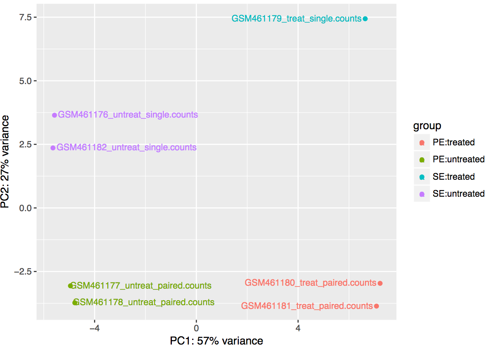
        >
        > 1. What is the first dimension (PC1) separating?
        > 2. And the second dimension (PC2)?
        > 3. What can we conclude about the DESeq design (factors, levels) we choose?
        >
        > > ###  Solution
        > >
        > > 1. The first dimension is separating the treated samples from the untreated sample
        > > 2. The second dimension is separating the single-end datasets from the paired-end datasets
        > > 3. The datasets are grouped following the levels of the two factors. No hidden effect seems to be present on the data. If there is unwanted variation present in the data (e.g. batch effects) it is always recommend to correct for this, which can be accommodated in DESeq2 by including in the design any known batch variables
        > {: .solution}
        {: .question}

    2. Heatmap of the sample-to-sample distance matrix (with clustering) based on the normalized counts

        The heatmap gives an overview of similarities and dissimilarities between samples: the color represents the distance between the samples. Dark blue means shorter distance, i.e. closer samples given the normalized counts.

        > ###  Questions
        >
        > 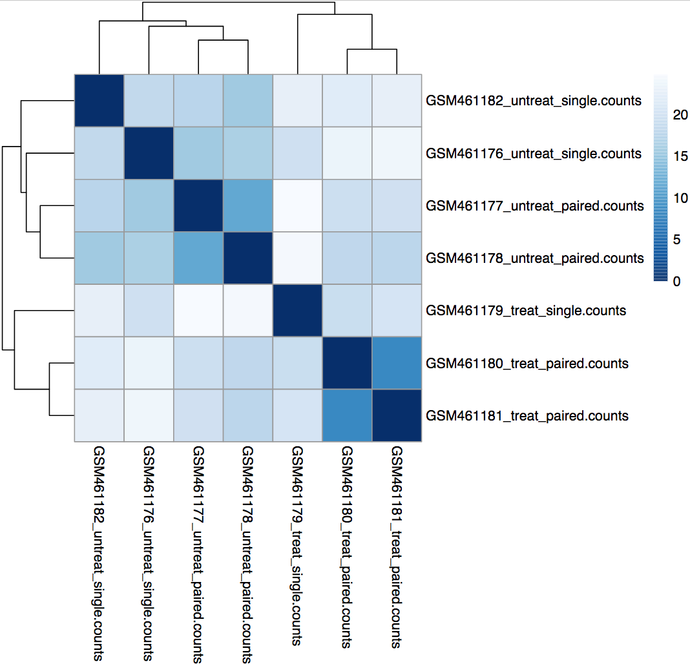
        >
        > How are the samples grouped?
        >
        > > ###  Solution
        > > They are first grouped by the treatment (the first factor) and secondly by the library type (the second factor), as in the PCA plot.
        > >
        > {: .solution}
        {: .question}

    3. Dispersion estimates: gene-wise estimates (black), the fitted values (red), and the final maximum a posteriori estimates used in testing (blue)

        This dispersion plot is typical, with the final estimates shrunk from the gene-wise estimates towards the fitted estimates. Some gene-wise estimates are flagged as outliers and not shrunk towards the fitted value. The amount of shrinkage can be more or less than seen here, depending on the sample size, the number of coefficients, the row mean and the variability of the gene-wise estimates.

    4. Histogram of *p*-values for the genes in the comparison between the 2 levels of the 1st factor

    5. [MA plot](https://en.wikipedia.org/wiki/MA_plot)

        It displays the global view of the relationship between the expression change of conditions (log ratios, M), the average expression strength of the genes (average mean, A), and the ability of the algorithm to detect differential gene expression. The genes that passed the significance threshold (adjusted p-value < 0.1) are colored in red.

- A summary file with the following values for each gene

    1.  Gene identifiers
    2.  Mean normalized counts, averaged over all samples from both conditions
    3.  Fold change in log2 (logarithm base 2)

        The log2 fold changes are based on the primary factor level 1 vs factor level 2, hence the input order of factor levels is important. Here, DESeq2 computes fold changes of 'treated' samples against 'untreated' from the first factor 'Treatment', *i.e.* the values correspond to up- or downregulation of genes in treated samples.

    4.  Standard error estimate for the log2 fold change estimate
    5.  [Wald](https://en.wikipedia.org/wiki/Wald_test) statistic
    6.  *p*-value for the statistical significance of this change
    7.  *p*-value adjusted for multiple testing with the Benjamini-Hochberg procedure, which controls false discovery rate ([FDR](https://en.wikipedia.org/wiki/False_discovery_rate))

For more information about **DESeq2** and its outputs, you can have a look at [**DESeq2** documentation](https://www.bioconductor.org/packages/release/bioc/manuals/DESeq2/man/DESeq2.pdf).

> ###  Questions
>
> 1. Is the FBgn0003360 gene differentially expressed because of the treatment? If yes, how much?
> 2. We could also hypothetically be interested in the effect of the sequencing (or other secondary factors in other cases). How would we know the differentially expressed genes because of sequencing type?
> 3. We would like to analyze the interaction between the treatment and the sequencing.
>
> > ###  Solution
> >
> > 1. FBgn0003360 is differentially expressed because of the treatment: it has a significant adjusted p-value ($$4.0 \cdot 10^{-178} << 0.05$$). It is less expressed (`-` in the log2FC column) in treated samples compared to untreated samples, by a factor ~8 ($$2^{log2FC} = 2^{2.99977727873544}$$).
> > 2. DESeq2 in Galaxy returns the comparison between the different levels for the 1st factor, after
correction for the variability due to the 2nd factor. In our current case, treated against untreated for any sequencing type. To compare both sequencing types, we should run again DESeq2 by switching
both factors: factor 1 (treatment) becomes factor 2 and factor 2 (sequencing) becomes factor 1.
> > 3. To add the interaction between two factors (e.g. treated for paired-end data vs untreated for single-end), we should run DESeq2 another time but with only one factor with the following 4 levels:
> >    - treated-PE
> >    - untreated-PE
> >    - treated-SE
> >    - untreated-SE
> >
> >    By selection *"Output all levels vs all levels of primary factor (use when you have >2 levels for primary factor)"* to `Yes`, we can then compare treated-PE vs untreated-SE.
> >
> {: .solution}
{: .question}

## Extraction and annotation of differentially expressed genes

Now we would like to extract the most differentially expressed genes due to the treatment and with an absolute fold change > 2.

> ###  Hands-on: Extract the most differentially expressed genes
>
> 1. **Filter data on any column using simple expressions**  to extract genes with a significant change in gene expression (adjusted *p*-value below 0.05) between treated and untreated samples:
>    -  *"Filter"*: the `DESeq2 result file`
>    - *"With following condition"*: `c7<0.05`
>
> 2. Rename the output `Genes with significant adj p-value`
>
>    > ###  Question
>    >
>    > How many genes have a significant change in gene expression between these conditions?
>    >
>    > > ###  Solution
>    > >
>    > > We get 1,091 genes (6.21%) with a significant change in gene expression between treated and untreated samples.
>    > >
>    > {: .solution}
>    {: .question}
>
>    > ###  Comment
>    >
>    > The file with the independent filtered results can be used for further downstream analysis as it excludes genes with only few read counts as these genes will not be considered as significantly differentially expressed.
>    {: .comment}
>
>    We will now select only the genes with an absolute fold change (FC) > 2
>
> 3. **Filter**  to extract genes with an $$abs(log_{2} FC) > 1$$:
>    -  *"Filter"*: `Genes with significant adj p-value`
>    - *"With following condition"*: `abs(c3)>1`
>
>    > ###  Question
>    >
>    > How many genes have been conserved?
>    >
>    > > ###  Solution
>    > >
>    > > 130, the 11.92% of the significantly differentially expressed genes.
>    > >
>    > {: .solution}
>    {: .question}
>
{: .hands_on}

We now have a table with 130 lines corresponding to the most differentially expressed genes. For each gene, we have its ID, its mean normalized counts (averaged over all samples from both conditions), its $$log_{2} FC$$ and other information.

The ID for each gene is something like FBgn0003360, which is an ID from the corresponding database, here Flybase (). These IDs are unique but sometimes we prefer to have the gene names, even if they may not reference an unique gene (e.g. duplicated after re-annotation). But gene names may hint already to a function or they help you to search for desired candidates. We would also like to display the location of these genes within the genome. We can extract such information from the annotation file which we used for mapping and counting.

> ###  Hands-on: Annotation of the differentially expressed genes
>
> 1. Import the Ensembl gene annotation for *Drosophila melanogaster* (`Drosophila_melanogaster.BDGP6.87.gtf`) from the previous history, or from the Shared Data library or from Zenodo:
>
>    ```
>    {{ page.zenodo_link }}/files/Drosophila_melanogaster.BDGP6.87.gtf
>    ```
>
> 2. **Annotate DESeq2/DEXSeq output tables**  with:
>    -  *"Tabular output of DESeq2/edgeR/limma/DEXSeq"*: output of the last **Filter**
>    - *"Input file type"*: `DESeq2/edgeR/limma`
>    -  *"Reference annotation in GFF/GTF format"*: imported GTF file
>
{: .hands_on}

The generated output is an extension of the previous file:

1. Gene identifiers
2. Mean normalized counts over all samples
3. Log2 fold change
4. Standard error estimate for the log2 fold change estimate
5. Wald statistic
6. *p*-value for the Wald statistic
7. *p*-value adjusted for multiple testing with the Benjamini-Hochberg procedure for the Wald statistic
8. Chromosome
9. Start
10. End
11. Strand
12. Feature
13. Gene name

> ###  Questions
>
> 1. Where is the most over-expressed gene located?
> 2. What is the name of the gene?
>
> > ###  Solution
> >
> > 1. FBgn0025111 (the top-ranked gene with the highest positive log2FC value) is located on the reverse strand of chromosome X, between 10,778,953 bp and 10,786,907 bp.
> > 2. From the table, we got the gene symbol: Ant2. After some search on the [online biological databases](https://www.ncbi.nlm.nih.gov/gene/32008), we can found that Ant2 corresponds to adenine nucleotide translocase 2.
> {: .solution}
{: .question}

The column names may not be precise so we would like to add them before going further.

> ###  Hands-on: Add column names
>
> 1. Create a new file from the following (header line of the DESeq2 output)
>
>    ```
>    GeneID	Base mean	log2(FC)	StdErr	Wald-Stats	P-value	P-adj	Chromosome	Start	End	Strand	Feature	Gene name
>    ```
>
>    
>
> 2. **Concatenate datasets**  to add this header line to the **Annotate** output:
>    -  *"Concatenate Dataset"*: `Pasted entry` dataset
>    - *"Dataset"*
>       - Click on  *"Insert Dataset"*
>         -  *"select"*: output of **Annotate**
>
> 3. Rename the output to `Genes with significant adj p-value & abs(FC) > 2`
{: .hands_on}


## Visualization of the expression of the differentially expressed genes

We could plot the $$log_{2} FC$$ for the extracted genes, but here we would like to look at a heatmap of expression for these genes in the different samples. So we need to extract the normalized counts for these genes.

We proceed in several steps:

- Extract and plot the normalized counts for these genes for each sample with a heatmap, using the normalized count file generated by DESeq2
- Compute, extract and plot the Z-score of the normalized counts

> ###  Advanced tutorials on visualization
>
> In this tutorial, we will quickly explain some possible visualization. For more details, please have a look in the extra tutorials on visualization of RNA-Seq results:
> - [Visualization of RNA-Seq results with heatmap2]()
> - [Visualization of RNA-Seq results with Volcano Plot]()
{: .comment}

### Visualization of the normalized counts

To extract the normalized counts for the interesting genes, we join the normalized count table generated by DESeq2 with the table we just generated. We will then keep only the lines corresponding to the most differentially expressed genes.

> ###  Hands-on: Extract the normalized counts of the most differentially expressed genes
> 1. **Join two Datasets**  with the following parameters:
>    -  *"Join"*: the `Normalized counts` file (output of **DESeq2** )
>    - *"using column"*: `Column: 1`
>    -  *"with"*: `Genes with significant adj p-value & abs(FC) > 2`
>    - *"and column"*: `Column: 1`
>    - *"Keep lines of first input that do not join with second input"*: `No`
>    - *"Keep the header lines"*: `Yes`
>
>    The generated file has more columns than we need for the heatmap: mean normalized counts, $$log_{2} FC$$ and other annotation information. We need to remove the extra columns.
>
> 2. **Cut**  to extract the columns with the gene IDs and normalized counts:
>    - *"Cut columns"*: `c1-c8`
>    - *"Delimited by"*: `Tab`
>    -  *"From"*: the joined dataset (output of **Join two Datasets** )
>
> 5. Rename the output to `Normalized counts for the most differentially expressed genes`
{: .hands_on}

We now have a table with 130 lines (the most differentially expressed genes) and the normalized counts for these genes across the 7 samples.

> ###  Hands-on: Plot the heatmap of the normalized counts of these genes for the samples
>
> 1. **heatmap2**  to plot the heatmap:
>    -  *"Input should have column headers"*: `Normalized counts for the most differentially expressed genes`
>    - *"Advanced - log transformation"*/*"Data transformation"*: `Log2(value) transform my data`
>    - *"Enable data clustering"*: `Yes`
>    - *"Labeling columns and rows"*: `Label columns and not rows`
>    - *"Coloring groups"*: `Blue to white to red`
>
{: .hands_on}

You should obtain something similar to:

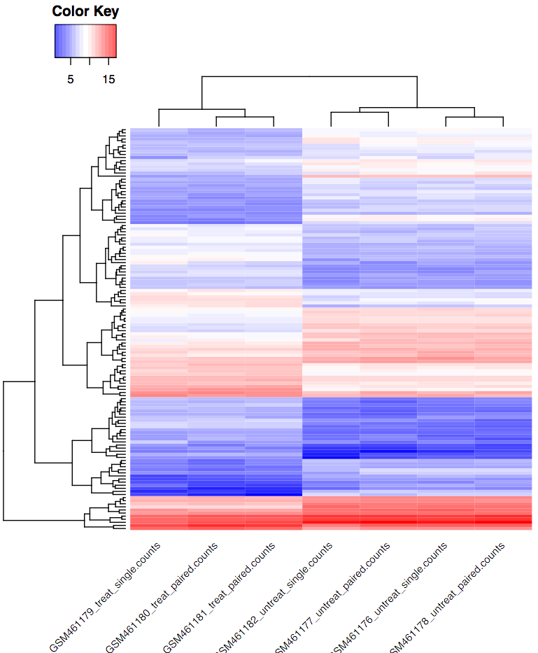

> ###  Questions
>
> 1. Do you observe anything in the clustering of the samples and the genes?
> 2. What changes if you regenerate the heatmap and select `Plot the data as it is` in *"Advanced - log transformation"*/*"Data transformation"*?
> 3. How could you generate a heatmap of normalized counts for all up-regulated genes with absolute fold change > 2?
>
> > ###  Solution
> >
> > 1. The samples are clustering by treatment.
> > 2. The scale changes and the differences between the genes are not visible anymore.
> > 3. Extract the genes with $$log_{2} FC$$ > 1 (filter for genes with `c3>1` on the summary of the differentially expressed genes) and run **heatmap2**  on the generated table.
> {: .solution}
{: .question}

### Computation and visualization of the Z-score

To compare the gene expression over samples, we could also use the Z-score, which is often represented in publications.

The Z-score gives the number of standard-deviations that a value is away from the mean of all the values in the same group, here the same gene. A Z-score of -2 for the gene X in sample A means that this value is 2 standard-deviations lower than the mean of the values for gene X in all the samples (A, B, C, etc).

The Z-score $$z_{i,j}$$ for a gene $$i$$ in a sample $$j$$ given the normalized count $$x_{i,j}$$ is computed as $$z_{i,j} = \frac{x_{i,j}- \overline{x_i}}{s_i}$$ with $$\overline{x_i}$$ the mean and $$s_i$$ the standard deviation of the normalized counts for the gene $$i$$ over all samples.

> ###  Compute the Z-score for all genes
>
> To save time in this tutorial, we will compute the Z-score directly on the normalized count of the most differentially expressed genes. In a standard analysis, we would compute the Z-score on all the genes (`Normalized count` file from **DESeq**) and then filter for the interesting genes as we did in the previous step.
{: .comment}

To compute the Z-score, we break the process into 2 steps:

1. Substract each value by the mean of values in the row (i.e. $$x_{i,j}- \overline{x_i}$$) using the normalized count table
2. Divide the previous values by the standard deviation of values of row, using 2 tables (the normalized counts and the table computed in the previous step)

> ###  Hands-on: Compute and extract the Z-score of the most differentially expressed genes
> 1. **Table Compute**  with the following parameters to first substract the mean values per row
>    - *"Input Single or Multiple Tables"*: `Single Table`
>      -  *"Table"*: `Normalized counts for the most differentially expressed genes`
>      - *"Type of table operation"*: `Perform a full table operation`
>        - *"Operation"*: `Custom`
>          - *"Custom expression on 'table', along 'axis' (0 or 1)"*: `table.sub(table.mean(1), 0)`
>
>            The `table.mean(1)` expression computes the mean for each row (here the genes) and `table.sub(table.mean(1), 0)` substracts each value by the mean of the row (computed with `table.mean(1)`)
>
> 1. **Table Compute**  with the following parameters:
>    - *"Input Single or Multiple Tables"*: `Multiple Table`
>      - In *"1: Tables"*:
>        -  *"Table"*: `Normalized counts for the most differentially expressed genes`
>      - Click on  *"Insert Tables"*
>      - In *"2: Tables"*:
>        -  *"Table"*: output of the first **Table Compute**
>      - *"Custom expression on 'tableN'"*: `table2.div(table1.std(1),0)`
>
>        The `table1.std(1)` expression computes the standard deviations of each row on the 1st table (normalized counts) and `table2.div` divides the values of 2nd table (previously computed) by these standard deviations.
>
> 2. Rename the output to `Z-scores for the most differentially expressed genes`
> 3. Inspect the output file
{: .hands_on}

We now have a table with the Z-score for the most differentially expressed genes in the 7 samples.

> ###  Questions
>
> 1. What is the range for the Z-score?
> 2. What can we say about the Z-scores for the differentially expressed genes?
> 3. Can we use the Z-score to estimate the strength of the differential expression of a gene?
>
> > ###  Solution
> >
> > 1. The Z-score ranges from -3 standard deviations up to +3 standard deviations. It can be placed on a normal distribution curve: -3 being the far left of the normal distribution curve and +3 the far right of the normal distribution curve
> > 2. When a gene is differentially expressed between two groups (here treated and untreated), the Z-scores for this gene will be (mostly) positive for the samples in one group and (mostly) negative for the samples in the other group.
> > 3. The Z-score is a signal-to-noise ratio. Large absolute Z-scores, i.e. large positive or negative values, is not a direct estimate of the effect, i.e. the strength of the differential expression. A same large Z-score can have different meanings, depending on the noise:
> >    - with large noise: a very large effect
> >    - with some noise: a rather large effect
> >    - with only little noise: a rather small effect
> >    - with almost no noise: a tiny effect
> >
> >    The problem is that "noise" here is not only noise from the measure. It can also be linked to the "tightness" of the gene regulation control. Not tightly controlled genes, i.e. whose expression may vary in a wide range over samples, can be considerably induced or repressed. Their absolute Z-score will be small as the variations over samples is big. In contrast, genes that are tightly controlled may have only very small changes in their expression, without any biological impact. The absolute Z-score will be large for these genes.
> >
> {: .solution}
{: .question}

We would like now to plot a heatmap for the Z-scores:

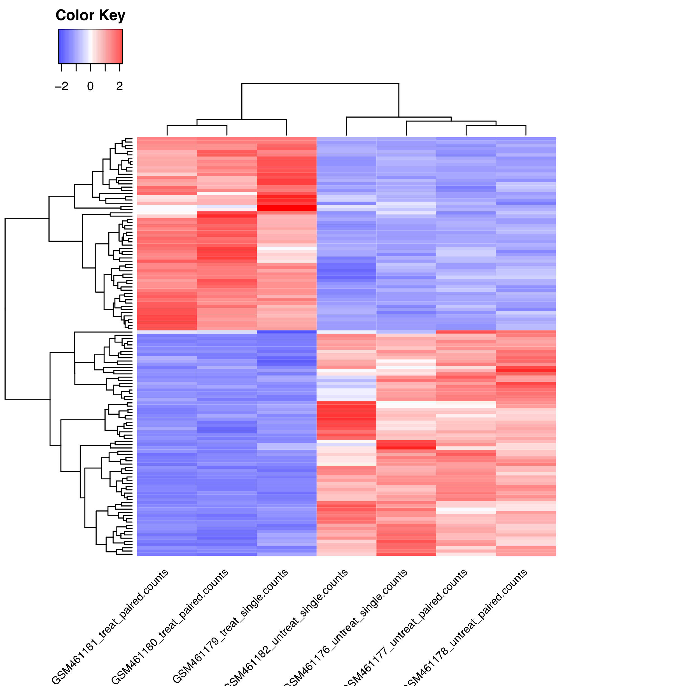

> ###  Hands-on: Plot the Z-score of the most differentially expressed genes
> 1. **heatmap2**  to plot the heatmap:
>    -  *"Input should have column headers"*: `Z-scores for the most differentially expressed genes`
>    - *"Advanced - log transformation"*/*"Data transformation"*: `Plot the data as it is`
>    - *"Enable data clustering"*: `Yes`
>    - *"Labeling columns and rows"*: `Label columns and not rows`
>    - *"Coloring groups"*: `Blue to white to red`
{: .hands_on}

# Functional enrichment analysis of the DE genes

We have extracted genes that are differentially expressed in treated (PS gene-depleted) samples compared to untreated samples. Now, we would like to know if the differentially expressed genes are enriched transcripts of genes which belong to more common or specific categories in order to identify biological functions that might be impacted.

## Gene Ontology analysis

[Gene Ontology (GO)](http://www.geneontology.org/) analysis is widely used to reduce complexity and highlight biological processes in genome-wide expression studies. However, standard methods give biased results on RNA-Seq data due to over-detection of differential expression for long and highly-expressed transcripts.

[**goseq**](https://bioconductor.org/packages/release/bioc/vignettes/goseq/inst/doc/goseq.pdf) () provides methods for performing GO analysis of RNA-Seq data while taking length bias into account. **goseq** could also be applied to other category based tests of RNA-Seq data, such as KEGG pathway analysis, as discussed in a further section.

**goseq** needs 2 files as inputs:

- A tabular file with the differentially expressed genes from all genes assayed in the RNA-Seq experiment with 2 columns:
    - the Gene IDs (unique within the file), in uppercase letters
    - a boolean indicating whether the gene is differentially expressed or not (`True` if differentially expressed or `False` if not)
- A file with information about the length of a gene to correct for potential length bias in differentially expressed genes

> ###  Hands-on: Prepare the datasets for goseq
>
> 1. **Compute**  with
>    - *"Add expression"*: `bool(c7<0.05)`
>    -  *"as a new column to"*: the `DESeq2 result file`
>
> 2. **Cut**  with
>    - *"Cut columns"*: `c1,c8`
>    - *"Delimited by"*: `Tab`
>    -  *"From"*: the output of the **Compute** 
>
> 3. **Change Case**  with
>    -  *"From"*: the output of the previous **Cut** 
>    - *"Change case of columns"*: `c1`
>    - *"Delimited by"*: `Tab`
>    - *"To"*: `Upper case`
>
> 4. Rename the output to `Gene IDs and differentially expression`
>
>    We just generated the first input for **goseq**. As second input for **goseq** we need the gene lengths. We can use here the gene lengths generated by **featureCounts**  and format the gene IDs.
>
> 5. Drag and drop one of the gene length file generated by **featureCounts**  into this history using the  **View all histories**
>
> 6. **Change Case**  with
>    -  *"From"*: the `feature lengths` (output of **featureCounts** )
>    - *"Change case of columns"*: `c1`
>    - *"Delimited by"*: `Tab`
>    - *"To"*: `Upper case`
>
> 7. Rename the output to `Gene IDs and length`
{: .hands_on}

We have now the two required input files for goseq.

> ###  Hands-on: Perform GO analysis
>
> 1. **goseq**  with
>    - *"Differentially expressed genes file"*: `Gene IDs and differentially expression`
>    - *"Gene lengths file"*: `Gene IDs and length`
>    - *"Gene categories"*: `Get categories`
>       - *"Select a genome to use"*: `Fruit fly (dm6)`
>       - *"Select Gene ID format"*: `Ensembl Gene ID`
>       - *"Select one or more categories"*: `GO: Cellular Component`, `GO: Biological Process`, `GO: Molecular Function`
>    - In *"Output Options"*
>      - *"Output Top GO terms plot?"*: `Yes`
>      - *"Extract the DE genes for the categories (GO/KEGG terms)?"*: `Yes`
>
{: .hands_on}

**goseq** generates with these parameters 3 outputs:

1. A table (`Ranked category list - Wallenius method`) with the following columns for each GO term:

    1. `category`: GO category
    2. `over_rep_pval`: *p*-value for over-representation of the term in the differentially expressed genes
    3. `under_rep_pval`: *p*-value for under-representation of the term in the differentially expressed genes
    4. `numDEInCat`: number of differentially expressed genes in this category
    5. `numInCat`: number of genes in this category
    6. `term`: detail of the term
    7. `ontology`: MF (Molecular Function - molecular activities of gene products), CC (Cellular Component - where gene products are active), BP (Biological Process - pathways and larger processes made up of the activities of multiple gene products)
    8. `p.adjust.over_represented`: *p*-value for over-representation of the term in the differentially expressed genes, adjusted for multiple testing with the Benjamini-Hochberg procedure
    9. `p.adjust.under_represented`: *p*-value for over-representation of the term in the differentially expressed genes, adjusted for multiple testing with the Benjamini-Hochberg procedure

    To identify categories significantly enriched/unenriched below some p-value cutoff, it is necessary to use the adjusted *p*-value.

    > ###  Questions
    >
    > 1. How many GO terms are over-represented with an adjusted P-value < 0.05? Under-represented?
    > 2. How are the over-represented GO terms divided into MF, CC and BP? And for under-represented GO terms?
    >
    > > ###  Solution
    > >
    > > 1. 31 GO terms (0.27%) are over-represented and 83 (0.72%) under-represented
    > >
    > >    **Filter**  on c8 (adjusted p-value for over-represented GO terms) and c9 (adjusted p-value for under-represented GO terms)
    > >
    > > 2. For over-represented, 20 BP, 3 CC and 8 MF and for under-represented, 49 BP, 29 CC and 5 MF
    > >
    > >    **Group data**  on column 7 (category) and count on column 1 (IDs)
    > >
    > {: .solution}
    {: .question}

2. A graph with the top 10 over-represented GO terms

    > ###  Questions
    >
    > 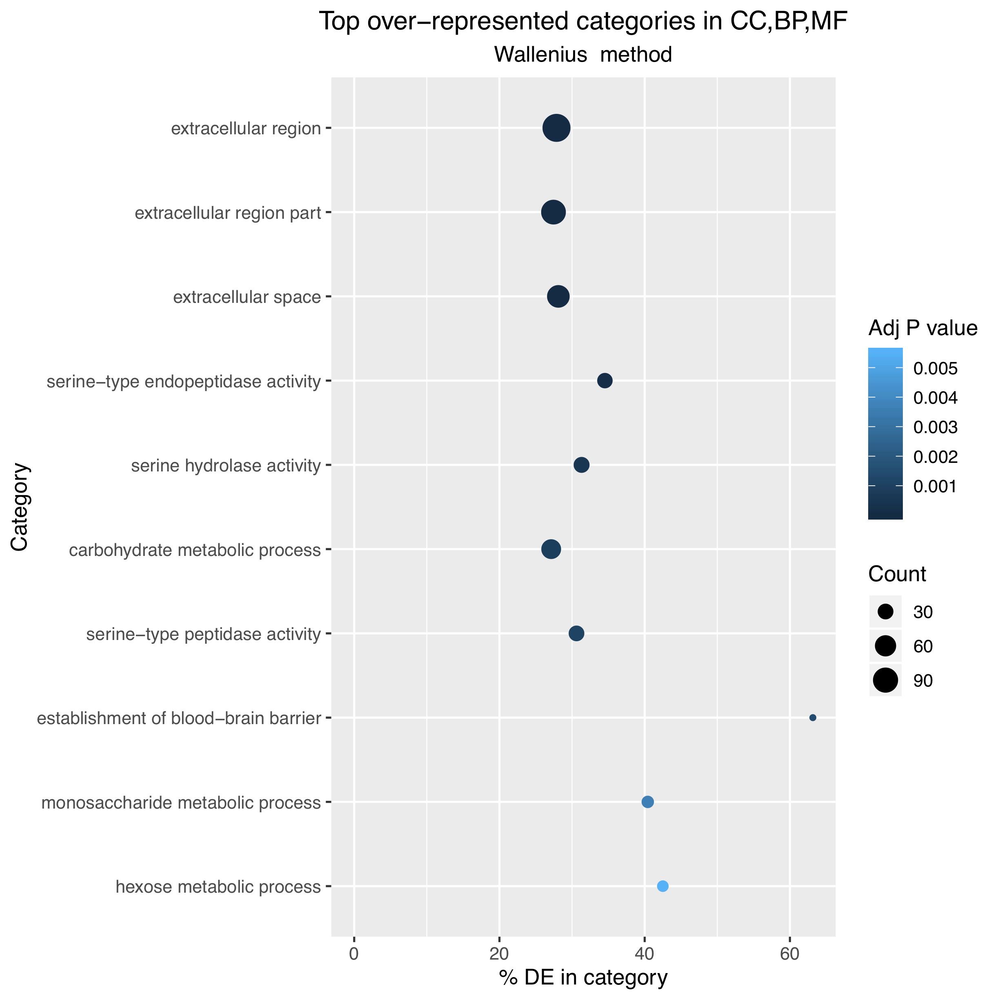
    >
    > What is the x-axis? How is it computed?
    >
    > > ###  Solution
    > >
    > > The x-axis is the percentage of genes in the category that have been identified as differentially expressed: $$100 x \frac{numDEInCat}{numInCat}$$
    > >
    > {: .solution}
    {: .question}

3. A table with the differentially expressed genes (from the list we provided) associated to the GO terms (`DE genes for categories (GO/KEGG terms)`)

> ###  Advanced tutorial on enrichment analysis
>
> In this tutorial, we covered GO enrichment analysis with **goseq**. To learn other gene set enrichment analysis, please have a look at the ["RNA-Seq genes to pathways"]() tutorial.
{: .comment}

## KEGG pathways analysis

**goseq** can also be used to identify interesting KEGG pathways. The KEGG pathway database is a collection of pathway maps representing the current knowledge on the molecular interaction, reaction and relation networks. A map can integrate many entities including genes, proteins, RNAs, chemical compounds, glycans, and chemical reactions, as well as disease genes and drug targets.

For example, the pathway `dme00010` represents the Glycolysis process (conversion of glucose into pyruvate with generation of small amounts of ATP and NADH) for Drosophila melanogaster:


> ###  Hands-on: Perform GO analysis
>
> 1. **goseq**  with
>    - *"Differentially expressed genes file"*: `Gene IDs and differentially expression`
>    - *"Gene lengths file"*: `Gene IDs and length`
>    - *"Gene categories"*: `Get categories`
>       - *"Select a genome to use"*: `Fruit fly (dm6)`
>       - *"Select Gene ID format"*: `Ensembl Gene ID`
>       - *"Select one or more categories"*: `KEGG`
>    - In *"Output Options"*
>      - *"Output Top GO terms plot?"*: `No`
>      - *"Extract the DE genes for the categories (GO/KEGG terms)?"*: `Yes`
>
{: .hands_on}

As for the GO terms, 2 files are generated:

1. A big table with the KEGG terms and some statistics

    > ###  Questions
    >
    > 1. How many KEGG pathways terms have been identified?
    > 2. How many KEGG pathways terms are over-represented with an adjusted P value < 0.05?
    > 3. What are the over-represented KEGG pathways terms?
    > 4. How many KEGG pathways terms are under-represented with an adjusted P value < 0.05?
    >
    > > ###  Solution
    > >
    > > 1. The file has 127 lines including an header, so 126 KEGG pathways have been identified.
    > > 2. 2 KEGG pathways (1.57%) are over-represented, using **Filter**  on c6 (adjusted p-value for over-represented KEGG pathways)
    > > 3. The first 2 KEGG pathways are `01100` and `00010`. By searching on the [KEGG database](https://www.genome.jp/kegg/kegg2.html) for them, we can find more information about these pathways: `01100` corresponds to all metabolic pathways and `00010` to pathway for Glycolysis / Gluconeogenesis.
    > > 4. 1 KEGG pathways (0.79%) is under-represented, using **Filter**  on c7 (adjusted p-value for under-represented KEGG pathways): `03040`, Spliceosome
    > {: .solution}
    {: .question}

2. A table with the differentially expressed genes (from the list we provided) associated to the KEGG pathways (`DE genes for categories (GO/KEGG terms)`)

We could investigate which genes are involved in which pathways by looking at the second file generated by **goseq**. But it can be cumbersome and we would like to see the pathways as represented in the previous image. **Pathview** () can help to generate automatically similar images as the previous one but also add extra information about the genes (e.g. expression) in our study.

This tool needs 2 main information as inputs:

- Pathway ID(s) to plot, either as just one ID or as a file with one column with the pathway IDs
- A tabular file with the genes in the RNA-Seq experiment with 2 (or more) columns:
    - the gene IDs (unique within the file)
    - some information about the genes

      It can be for example a p-value or a fold change. This information will be added to the pathway plot: the node of the corresponding gene will be colored given the value. If there are different columns, the different information will be plotted side by side on the node.

Here we would like to visualize the 2 KEGG pathways: the over-represented `00010` (Glycolysis / Gluconeogenesis) and the under-represented `03040` (Spliceosome). We would like that the gene nodes are colored by Log2 Fold Change for the differentially expressed genes because of the treatment.

> ###  Hands-on: Perform KEGG enrichment analysis
>
> 1. **Cut**  with
>    - *"Cut columns"*: `c1,c3`
>    - *"Delimited by"*: `Tab`
>    -  *"From"*: `Genes with significant adj p-value`
>
> 2. Rename to `Genes with significant adj p-value and their Log2 FC`
>
>    We extracted the ID and Log2 Fold Change for the genes that have a significant adjusted p-value.
>
> 3. Create a new tabular file from the following (IDs of the pathways to plot)
>
>    ```
>    00010
>    03040
>    ```
>
> 4. Rename to `KEGG pathways to plot`
>
> 5. **Pathview**  with
>    - *"Number of pathways to plot"*: `Multiple`
>      -  *"KEGG pathways"*: `KEGG pathways to plot`
>      - *"Does the file have header (a first line with column names)?"*: `No`
>    - *"Species to use"*: `Fly`
>    - *"Provide a gene data file?"*: `Yes`
>      -  *"Gene data"*: `Genes with significant adj p-value and their Log2 FC`
>      - *"Does the file have header (a first line with column names)?"*: `No`
>      - *"Format for gene data"*: `Ensembl Gene ID`
>    - *"Provide a compound data file?"*: `No`
>    - In *"Output Options"*
>      - *"Output for pathway"*: `KEGG native`
>        - *"Plot on same layer?"*: `Yes`
{: .hands_on}

**Pathview** generates a collection with the KEGG visualization: one file per pathway.

> ###  Questions
>
> `dme00010` KEGG pathway from **Pathview**
>
> 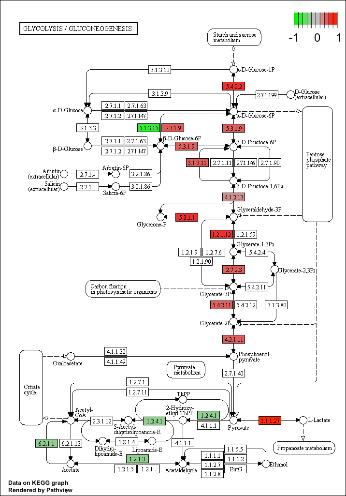
>
> 1. What are the colored boxes?
> 2. What is the color code?
>
> > ###  Solution
> >
> > 1. The colored boxes are genes in the pathway that are differentially expressed
> > 2. Pay attention that the color code is counterintuitive: green is for value below 0, it means for genes with a log2FC < 0 and red for genes with a log2FC > 0.
> >
> {: .solution}
{: .question}



# Inference of the differential exon usage

Next, we would like to know the differential exon usage between treated (PS depleted) and untreated samples using RNA-Seq exon counts. We will rework the mapping results we generated previously.

We will use [DEXSeq](https://www.bioconductor.org/packages/release/bioc/html/DEXSeq.html). DEXSeq detects high sensitivity genes, and in many cases exons, that are subject to differential exon usage. But first, as for the differential gene expression, we need to count the number of reads mapping to the exons.

## Count the number of reads per exon

This step is similar to the step of [counting the number of reads per annotated gene](#count-the-number-of-reads-per-annotated-gene) except that, instead of HTSeq-count, we are using DEXSeq-Count.

> ###  Hands-on: Counting the number of reads per exon
>
> 1. **DEXSeq-Count** : Use the **DEXSeq-Count** to prepare the *Drosophila* annotations to extract only exons with corresponding gene ids
>     - *"Mode of operation"*: `Prepare annotation`
>       -  *"GTF file"*: `Drosophila_melanogaster.BDGP6.87.gtf`
>
>    The output is again a GTF file that is ready to be used for counting
>
> 2. **DEXSeq-Count** : Count reads using **DEXSeq-Count** with
>     - *"Mode of operation"*: `Count reads`
>       -  *"Input bam file"*: the `BAM` files generated by **RNA STAR** 
>       -  *"DEXSeq compatible GTF file"*: the GTF file generated by **DEXSeq-Count** 
>       - *"Is library paired end?"*: `Yes`
>       - *"Is library strand specific?*: `No`
>       - *"Skip all reads with alignment quality lower than the given minimum value"*:  `10`
>
{: .hands_on}

DEXSeq generates a count table similar to the one generated by featureCounts, but with counts for exons.

> ###  Question
>
> 1. Which exon has the most reads mapped to it for both samples?
> 2. Which gene does this exon belong to?
> 3. Is there a connection to the previous result obtained with featureCounts?
>
> > ###  Solution
> >
> > FBgn0000556:005 is the exon with the most reads mapped to it for both samples. It is part of FBgn0000556, the feature with the most reads mapped on it (from featureCounts).
> >
> {: .solution}
>
{: .question}

## Differential exon usage

DEXSeq usage is similar to DESeq2. It uses similar statistics to find differentially used exons.

As for DESeq2, in the previous step, we counted only reads that mapped to exons on chromosome 4 and for only one sample. To be able to identify differential exon usage induced by PS depletion, all datasets (3 treated and 4 untreated) must be analyzed following the same procedure. To save time, we did that for you. The results are available on [Zenodo]({{ page.zenodo_link }}):

- The results of running DEXSeq-count in 'Prepare annotation' mode
- Seven count files generated in 'Count reads' mode

> ###  Hands-on:
>
> 1. Create a new history
> 2. Import the seven count files from [Zenodo]({{ page.zenodo_link }}) or the Shared Data library (if available):
>
>    - `Drosophila_melanogaster.BDGP6.87.dexseq.gtf`
>    - `GSM461176_untreat_single.exon.counts`
>    - `GSM461177_untreat_paired.exon.counts`
>    - `GSM461178_untreat_paired.exon.counts`
>    - `GSM461179_treat_single.exon.counts`
>    - `GSM461180_treat_paired.exon.counts`
>    - `GSM461181_treat_paired.exon.counts`
>    - `GSM461182_untreat_single.exon.counts`
>
>    ```
>    {{ page.zenodo_link }}/files/Drosophila_melanogaster.BDGP6.87.dexseq.gtf
>    {{ page.zenodo_link }}/files/GSM461176_untreat_single.exon.counts
>    {{ page.zenodo_link }}/files/GSM461177_untreat_paired.exon.counts
>    {{ page.zenodo_link }}/files/GSM461178_untreat_paired.exon.counts
>    {{ page.zenodo_link }}/files/GSM461179_treat_single.exon.counts
>    {{ page.zenodo_link }}/files/GSM461180_treat_paired.exon.counts
>    {{ page.zenodo_link }}/files/GSM461181_treat_paired.exon.counts
>    {{ page.zenodo_link }}/files/GSM461182_untreat_single.exon.counts
>    ```
>
> 3. **DEXSeq** : Run **DEXSeq** with
>    -  *"GTF file created from DEXSeq-Count tool"*: `Drosophila_melanogaster.BDGP6.87.dexseq.gtf`
>    - In *"Factor"*:
>       - In "1: Factor"
>           - *"Specify a factor name"*: `condition`
>           - In *"Factor level"*:
>               - In *"1: Factor level"*:
>                   - *"Specify a factor level"*: `treated`
>                   -  *"Counts file(s)"*: the 3 exon count files with `treated` in their name
>               - In *"2: Factor level"*:
>                   - *"Specify a factor level"*: `untreated`
>                   -  *"Counts file(s)"*: the 4 exon count files with `untreated` in their name
>       - Click on *"Insert Factor"* (not on "Insert Factor level")
>       - In "2: Factor"
>           - "Specify a factor name" to `sequencing`
>           - In *"Factor level"*:
>               - In *"1: Factor level"*:
>                   - *"Specify a factor level"*: `PE`
>                   -  *"Counts file(s)"*: the 4 exon count files with `paired` in their name
>               - In *"2: Factor level"*:
>                   - *"Specify a factor level"*: `SE`
>                   -  *"Counts file(s)"*: the 3 exon count files with `single` in their name
>
>    > ###  Comment
>    >
>    > Unlike DESeq2, DEXSeq does not allow flexible primary factor names. Always use your primary factor name as "condition"
>    {: .comment}
{: .hands_on}

Similarly to DESeq2, DEXSeq generates a table with:

1.  Exon identifiers
2.  Gene identifiers
3.  Exon identifiers in the Gene
4.  Mean normalized counts, averaged over all samples from both conditions
5.  Logarithm (to basis 2) of the fold change

    The log2 fold changes are based on primary factor level 1 vs. factor level 2. The order of factor levels is then important. For example, for the factor 'Condition', DESeq2 computes fold changes of 'treated' samples against 'untreated', *i.e.* the values correspond to up- or downregulations of genes in treated samples.

6.  Standard error estimate for the log2 fold change estimate
7.  *p*-value for the statistical significance of this change
8.  *p*-value adjusted for multiple testing with the Benjamini-Hochberg procedure which controls false discovery rate ([FDR](https://en.wikipedia.org/wiki/False_discovery_rate))

> ###  Hands-on:
>
> 1. **Filter**  to extract exons with a significant differential usage (adjusted *p*-value equal or below 0.05) between treated and untreated samples
>
>    > ###  Question
>    >
>    > How many exons show a significant change in usage between these conditions?
>    >
>    > > ###  Solution
>    > >
>    > > We get 38 exons (12.38%) with a significant usage change between treated and untreated samples
>    > >
>    > {: .solution}
>    {: .question}
{: .hands_on}



# Conclusion
{:.no_toc}

In this tutorial, we have analyzed real RNA sequencing data to extract useful information, such as which genes are up or downregulated by depletion of the *Pasilla* gene, but also which GO terms or KEGG pathways they are involved in. To answer these questions, we analyzed RNA sequence datasets using a reference-based RNA-Seq data analysis approach. This approach can be summarized with the following scheme:

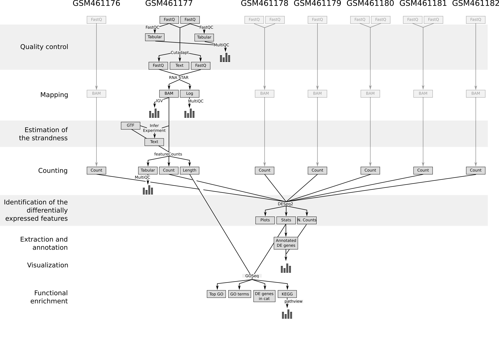
