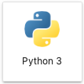

# Introduction
{:.no_toc}

You've done all the hard work of preparing a single cell matrix, processing it, plotting it, interpreting it, finding lots of lovely genes, all within the glorious Galaxy interface. Now you want to infer trajectories, or relationships between cells... and you've been threatened with learning Python to do so! Well, fear not. If you can have a run-through of a basic python coding introduction such as [this one](https://www.w3schools.com/python/), then that will help you make more sense of this tutorial, however you'll be able to make and interpret glorious plots even without understanding the Python coding language. This is the beauty of Galaxy - all the 'set-up' is identical across computers, because it's browser based. So fear not!

Traditionally, we thought that differentiating or changing cells jumped between discrete states, so 'Cell A' became 'Cell B' as part of its maturation. However, most data shows otherwise, that generally there is a spectrum (a 'trajectory', if you will...) of small, subtle changes along a pathway of that differentiation. Trying to analyse cells every 10 seconds can be pretty tricky, so 'pseudotime' analysis takes a single sample and assumes that those cells are all on slightly different points along a path of differentiation. Some cells might be slightly more mature and others slightly less, all captured at the same 'time'. We 'assume' or 'infer' relationships between cells.

We will use the same sample from the previous two tutorials, which contains largely T-cells in the thymus. We know T-cells differentiate in the thymus, so we would assume that we would capture cells at slightly different time points within the same sample. Furthermore, our cluster analysis alone showed different states of T-cell. Now it's time to look further!

> ### Agenda
>
> In this tutorial, we will cover:
>
> 1. TOC
> {:toc}
>
{: .agenda}

## Get data

We've provided you with experimental data to analyse from a mouse dataset of fetal growth restriction . This is the full dataset generated from [this tutorial](https://training.galaxyproject.org/training-material/topics/transcriptomics/tutorials/scrna-seq-basic-pipeline/tutorial.html#neighborhood-graph) (see the study in Single Cell Expression Atlas [here](https://www.ebi.ac.uk/gxa/sc/experiments/E-MTAB-6945/results/tsne) and the project submission [here](https://www.ebi.ac.uk/arrayexpress/experiments/E-MTAB-6945/)). You can find the final dataset in this [input history](https://humancellatlas.usegalaxy.eu/u/wendi.bacon.training/h/trajectories---input) or download from Zenodo below.

> ###  Hands-on: Data upload FIXME
>
> 1. Create a new history for this tutorial
> 2. Import the AnnData object from [Zenodo]({{ page.zenodo_link }})
>
>    ```
>    {{ page.zenodo_link }}/files/Mito-counted_AnnData
>    ```
>
>    
>
> 3. **Rename**  the datasets `Mito-counted AnnData`
> 4. Check that the datatype is `h5ad`
>
>    
>
{: .hands_on}

## Filtering for T-cells

One problem with our current dataset is that it's not just T-cells: we found in the previous tutorial that it also contains macrophages and red blood cells. This is a problem, because trajectory analysis will generally try to find relationships between all the cells in the sample. We need to remove those cell types to analyse the trajectory.

> ###  Hands-on: Removing macrophages and RBCs
>
> 1.  with the following parameters:
>    -  *"Annotated data matrix"*: `Final cell annotated object`
>    - *"Function to manipulate the object"*: `Filter observations or variables`
>    - *"What to filter?"*: `Observations (obs)`
>    - *"Type of filtering?"*: `By key (column) values`
>    - *"Key to filter"*: `cell_type`
>    - *"Type of value to filter"*: `Text`
>    - *"Filter"*: `not equal to`
>    - *"Value"*: `RBC`
>
> 2.  with the following parameters:
>    -  *"Annotated data matrix"*: (output of **Manipulate AnnData** )
>    - *"Function to manipulate the object"*: `Filter observations or variables`
>    - *"What to filter?"*: `Observations (obs)`
>    - *"Type of filtering?"*: `By key (column) values`
>    - *"Key to filter"*: `cell_type`
>    - *"Type of value to filter"*: `Text`
>    - *"Filter"*: `not equal to`
>    - *"Value"*: `Macrophages`
>
> 3. **Rename**  output h5ad `T-cell_object.h5ad`
>
{: .hands_on}

Take note of what # this dataset is in your history, as you will need that shortly!

## Launching Jupyter

JupyterLab is a bit like RStudio but for other coding languages. What, you've never heard of RStudio? Then don't worry, just follow the instructions!

 Please note: this is only currently available on the [usegalaxy.eu](https://usegalaxy.eu) site.

> ###  Hands-on: Launching JupyterLab
>
> 1. Click [here](https://live.usegalaxy.eu/?tool_id=interactive_tool_jupyter_notebook)
>
> 2. You may need to sign in again (it will be the same sign-in as whatever usegalaxy.eu instance you are on)
>
> 3. Click on the jupyter icon to active the 
> 
>
>    - *"Do you already have a notebook?"*: `Start with a fresh notebook`
>    - *"Include data into the environment"*: `T-cell_object.h5ad`
>
>  This may take a moment, but once the `Executed notebook` in your dataset is orange, you are up and running!
>
> 4. Either click on the blue `User menu`, or go to the top of the screen and choose `User` and then `Active InteractiveTools`
>
> 5. Click on the newest `Jupyter Interactive Tool`.
>
{: .hands_on}

Welcome!

 Do NOT delete or close this notebook dataset in your history. YOU WILL LOSE IT!

> ###  Hands-on: Creating a notebook
>
> 1. Click the *Python 3* icon under *Notebook*
> 
>
> 2. Save your file (*File*: *Save*, or click the  Save icon at the top left
>
> 3. If you right click on the file in the explorer window at the left, you can rename your file `whateveryoulike.ipynb`
>
{: .hands_on}

 You should  **Save** frequently, both for good practice and to protect you in case you accidentally close the browser. Your environment will still run, so it will contain the last saved notebook you have. You might eventually stop your environment after this tutorial, but ONLY once you have saved and exported your notebook (more on that at the end!) Note that you can have multiple notebooks going at the same time within this JupyterLab, so if you do, you will need to save and export each individual notebook. You can also download them at any time.

> ###  Woah, this is weird!
> Where did the `2262` come from? The quickest way to figure out how many highly variable genes you have, in my opinion, is to re-run  the **Scanpy FindVariableGenes** tool and select the parameter to *Remove genes not marked as highly variable*. Then you can Inspect your resulting object and you'll see only 2262 genes. I prefer to keep these in the object, just in case something is important (paranoia?), but you will get the same results whether you keep these or remove them. The following steps all use only highly variable genes.
{: .comment}

# Run the tutorial!

At this point, to save you having to switch back and forth between screens, the directions for the tutorial are all in the notebook you input! Go to `data` and double click `Trajectories_Instructions.ipynb` You may have to change certain numbers in the code blocks, so do read carefully. You will be able to run each step be clicking on the code block and pressing the  **Run the selected cells and advance** step. You will want to keep a tab open with your Galaxy history showing (so just launch another browser of your usegalaxy.eu instance), so that you can see when your files appear there.


# Conclusion
{:.no_toc}

 Congratulations! You've made it to the end! You might find this answer key [notebook](FIXME) useful.

In this tutorial, you moved from called clusters to inferred relationships and trajectories using pseudotime analysis. You found an alternative to PCA (diffusion map), an alternative to tSNE (force-directed graph), a means of identifying cluster relationships (PAGA), and a metric for pseudotime (diffusion pseudotime) to identify early and late cells. If you were working in a group, you found that such analysis is slightly more sensitive to your decisions that the simpler filtering/plotting/clustering previously. We are inferring and assuming relationships and time, so that makes sense!

To discuss with like-minded scientists, join our Gitter channel for all things Galaxy-single cell!
[](https://gitter.im/Galaxy-Training-Network/galaxy-single-cell?utm_source=badge&utm_medium=badge&utm_campaign=pr-badge)
